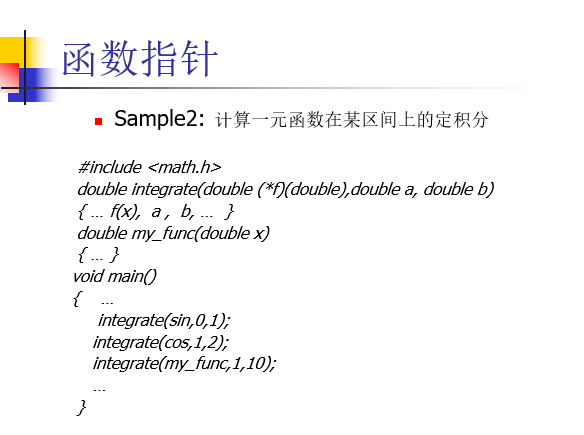
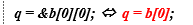

# 临时对象

临时对象的生命周期只有一条语句，（直接启用对象的构造函数），

现代编译器尽可能避开临时对象，实际工程开发中也尽可能避开临时变量（临时对象会减少性能）

# explicit

声明explicit的构造函数不可以隐式的使用

# 初始化

##### 构造函数

如果自己写了构造函数，那么就不会调用系统自动给的默认构造函数。

•它是类的特殊成员函数，名字与类名相同、无返回值类型。

•创建对象时，构造函数会被自动调用。例如：

构造函数可以**重载**，其中，不带参数的（或所有参数都有默认值的）构造函数被称为默认构造函数。

在创建对象时，

•如果没有指定调用对象类中哪一个构造函数，则调用默认构造函数初始化。

•也可以显式地指定调用对象类的某个构造函数。

```c++
A a1;    //调用默认构造函数。也可写成：A a1=A(); 
		   //但不能写成：A a1();
A a2=A(1) //相当于使用临时对象；
A a2=1; //这种也可以
A a2(1);    //调用A(int i)。也可写成：A a2=A(1); 或 A a2=1; 
A a3("abcd");    //调A(char *)。也可写成：A a3=A("abcd");
			     //或 A a3="abcd"; 
A a[4];    //调用对象a[0]、a[1]、a[2]、a[3]的默认构造函数。
A b[5]={A(),A(1),A("abcd"),2,"xyz"};     //调用b[0]的A()、
					//b[1]的A(int)、b[2]的A(char *)、
					//b[3]的A(int)和b[4]的A(char *)
a = A(10); //创建一个临时对象并把它赋值给a
A a;
......
a.A(1); //Error! 对象创建后，不能再调用构造函数！
```

#### 常量和引用数据成员的初始化

```c++
class A 
{		int x;
     const int y=1;   //Error
     int &z=x;     //Error
   public:
     A()
     { x = 0;    //OK
	     y = 1;    //Error  
		   z = &x;  //Error    
		   z = x;  //Error   
     }
};// 不能在说明它们时初始化，也不能采用赋值操作在构造函数中对它们初始化
//可以在构造函数的函数头和函数体之间加入一个成员初始化表来对常量和引用数据成员进行初始化
class A
 {  int x;
	  const int y;
	  int& z;
  public:
	  A(): z(x),y(1)  //成员初始化表
	  { x = 0;
	  }
};
```

初始化也可以在说明的时候初始化，先后顺序是显示说明时候初始化，然后是初始化列表，最后是函数里面的初始化

# 析构函数

析构函数记得归还所指向的空间

析构函数是可以显示调用的，n这时并不是让对象消亡，而是暂时归还对象额外申请的资源。（可以理解为 清空）

# 成员对象的初始化和消亡处理

在创建包含成员对象的对象时，除了会自动调用本身类的构造函数外，还会自动去调用成员对象类的构造函数。

•通常是调用成员对象类的默认构造函数。

•如果要调用成员对象类的非默认构造函数，需要在包含成员对象的**对象类的构造函数成员初始化表**中显式指出！

```c++
class A
{
	int a;
public: A(int x) {
	a = x;
}
};
class B
{
public: A a1;
	  B()
	  {
	  }//出问题，必须要初始化列表
};
```

#### 必须要用初始化列表解决的

​	引用，成员对象初始化，const修饰的

包含成员对象的对象消亡时，除了会自动调用本身类的析构函数外，还会自动去调用成员对象类的析构函数。

# 成员对象初始化和消亡处理的次序

##### 创建包含成员对象的对象时

•先执行成员对象类的构造函数，再执行本对象类的构造函数。

•若包含多个成员对象，这些成员对象的构造函数执行次序则按它们在本对象类中的说明次序进行。

> •从实现上说，
>
> 是先调用本身类的构造函数，但在进入函数体之前，会去调用成员对象类的构造函数，然后再执行本身类构造函数的函数体！
>
> 也就是说，构造函数的成员初始化表（即使没显式给出）中有对成员对象类的构造函数的调用代码。
>
> 注意：如果类中未提供任何构造函数，但它包含成员对象，则编译程序会隐式地为之提供一个默认构造函数，其作用就是调用成员对象类的构造函数！

##### 对象消亡时，

•先执行本身类的析构函数，再执行成员对象类的析构函数。

如果有多个成员对象，则成员对象析构函数的执行次序则按它们在本对象类中的说明次序的逆序进行

# 常成员函数

1. 为了防止在一个获取对象状态的成员函数中无意中修改对象的数据成员，可以把它说明成常成员函数。例如，

   ```c++
   class Date
   { 
    public:
    	void set(int y, int m, int d); 
     	int get_day() const; //常成员函数
      	int get_month() const; //常成员函数
      	int get_year() const; //常成员函数
   }; 
   
   int Date::get_year() const { return year; }
   int Date::get_day() const { return day; }
   int Date::get_month() const { return month; }
   void Date::set(int y, int m, int d) { year=y; month=m; day=d; }
   ```

   n编译器一旦发现在常成员函数中修改数据成员的值，将会报错！

2. n指出对常量对象能实施哪些操作，即，只能调用对象类中的常成员函数。例如：

   ```c++
   class Date
   
   { public:
   
      int set (int y, int m, int d);
      int get_day() const;
      int get_month() const;
      int get_year() const;
   }；
   
   void f(const Date &d) //d是个常量对象！
   { ... d.get_day() ... //OK
     ... d.get_month() ... //OK
     ... d.get_year() ... //OK
     d.set (2011,3,23); //Error
   }   
   ```

   常量对象只能调用常量函数。

# 静态成员对象

采用静态数据成员可以更好地实现同一个类的不同对象之间的数据共享。

##### 初始化

静态数据成员的初始化应在类外单独进行，并且应在定义对象之前进行。一般在主函数main之前。

初始化方式：数据类型 类名::静态数据成员名=初始化值；int A::x=0;

##### 访问

静态数据成员属于类，（准确的说是属于类对象的集合）而不像某一个数据成员那样属于一个对象，因此可以使用"类名::"，访问静态数据成员，用类名访问静态数据成员的格式如下：

但是private的话还是不可以访问

类名::静态数据成员名

```c++
cout<<classA::x<<endl;
```

例如

```c++
class A
{
	int y;
public:
	static int x; //静态数据成员声明
	void f() { y = x; x++; }
};
int A::x = 10;
int main()
{
	A a, b;
	a.f();
	b.f();
	cout << A::x;
	//上述操作对同一个x进行
}
```

类的静态成员对象只有一个拷贝

# 静态成员函数

## 静态成员函数只能访问类的静态成员。这个一直没注意！

```c++
class A 
{      static int obj_count;
        …...
   public:
       A()  //在所有构造函数中增加：obj_count++;
       { obj_count++; ...... }
       ~A()  //在析构函数中增加：obj_count--;
       { obj_count--; ...... }
       static int get_num_of_objects() 
       { return obj_count; 
	   }
       …...
};
int A::obj_count=0;
...... //其中创建了一系列A类对象
cout << A::get_num_of_objects(); //输出A类对象的个数//类对象

```

# 智能指针

智能指针未必方便，unique_ptr和shared_ptr用的比较多，没有从根本上解决内存安全的问题。

> RAII(Resource Acquisition Is Initialization）,也称为“资源获取就是初始化”，是C++语言的一种管理资源、避免泄漏的惯用法。C++标准保证任何情况下，已构造的对象最终会销毁，即它的析构函数最终会被调用。简单的说，RAII 的做法是使用一个对象，在其构造时获取资源，在对象生命期控制对资源的访问使之始终保持有效，最后在对象析构的时候释放资源。

智能指针会自动释放，但是每一个地方只能释放一次。

### 独占指针：unique_ptr

- 唯一指针管理内存，只能move，不能copy

可以通过裸指针，new和std::make_unique创建

- get（）来获得地主，可以用->,*操作符号

- ```c++
  std::unique_ptr<ClassA> u_P2=std::make_unique<ClassA>();
  //// 离开 uptr 的作用域的时候自动释放内存
      unique_ptr<int> u_ptr=make_unique<int>(100);
      unique_ptr<int> u_ptr_2=u_ptr;//编译错误。只能用move
      unique_ptr<int> u_ptr_2=move(u_ptr);// right
  ```

  ```c++
    std::unique_ptr<int[]> uptr = std::make_unique<int[]>(10);
      for (int i = 0; i < 10; i++) {
          uptr[i] = i * i;
      }   
      for (int i = 0; i < 10; i++) {
          std::cout << uptr[i] << std::endl;
      }   
  }//指向数组的方式。make_unique,类似的动态申请了内存
  ```

```c++
template <class T>
class auto_ptr{
    public:
        auto_ptr(T *p=0):ptr(p) {}
        ~auto_ptr() { delete ptr; }//结束时候会析构一下
        T* operator->()  const { return ptr;}//重载->
	    T& operator *()  const { return *ptr; }//重载取值
    private:
        T*  ptr;
};//智能指针的用法。
```

# vector和string的指针的兼容性

```c++
#include<iostream>
#include<vector>
#include<string>
using namespace std;
void something(int *arr,int length)
{
    cout<<arr[0]<<endl;
    return ;
}
void somestring(char *s,int length)
{
    cout<<s<<endl;
    return;
}
int main()
{
    vector<int>a;
    string s="adsad";
    cout<<&a[0]<<endl;//输出0，数组长度是0
    a.resize(1);
    if(!a.empty())
    {
        something(&a[0],a.size());//vector的指针和c语言的数组兼容
    }
    if(!s.empty())//防止空指针出问题
    {
        somestring((char*)s.c_str(),s.size());//string的指针和c语言兼容
        //c_str(),是返回string的const char*的类函数
    }
    return 0;
}
```

# 迭代器（iterator）

> 迭代器和容器是密不可分的、紧密相连的的关系。不同的容器，它们的迭代器也是不同的，但是它们的迭代器功能是一样的。假如没有迭代器，由于vector和list容器的存储特点，你需要两种算法去实现[遍历](https://so.csdn.net/so/search?q=遍历&spm=1001.2101.3001.7020)vector和list容器的功能，复杂且低效。有了迭代器，遍历容器的效率会大大提高。

迭代器（iterator）的使用
容器都有成员begin和end，其中begin成员复制返回指向第一个元素的迭代器（用*迭代器打印出元素值），而end成员返回指向容器尾元素的下一个位置的迭代器，它是一个不存在的元素位置。

```c++
for( it = vector.begin(); it != vector.end(); it++ )
	cout<<*it<<endl;
std::vector<int> ::iterator it;     //it能读写vector<int>的元素
std::vector<int>::const_iterator it;//it只能读vector<int>的元素，不可以修改vector<int>中的元素
```

#### 逆序迭代


```c++
    for(vector<int>::reverse_iterator it=a.rbegin();it!=a.rend();it++)
    {
        cout<<*it<<" ";
    }
```

迭代器都可以进行`++`操作。反向迭代器和正向迭代器的区别在于：

- 对正向迭代器进行`++`操作时，迭代器会指向容器中的后一个元素；
- 而对反向迭代器进行`++`操作时，迭代器会指向容器中的前一个元素。

#### 迭代器的功能分类

不同容器的迭代器，其功能强弱有所不同。容器的迭代器的功能强弱，决定了该容器是否支持 STL 中的某种算法。例如，排序算法需要通过随机访问迭代器来访问容器中的元素，因此有的容器就不支持排序算法。

常用的迭代器按功能强弱分为输入、输出、正向、双向、随机访问五种

\1) 正向迭代器。假设 p 是一个正向迭代器，则 p 支持以下操作：++p，p++，*p。此外，两个正向迭代器可以互相赋值，还可以用`==`和`!=`运算符进行比较。

\2) 双向迭代器。，`++p`，`p++`，`*p`,`--p`,`p--`

\3) 随机访问迭代器。`++p`，`p++`，`*p`,`--p`,`p--`。若 p 是一个随机访问迭代器，i 是一个整型变量或常量，则 p 还支持以下操作：

- p+=i：使得 p 往后移动 i 个元素。
- p-=i：使得 p 往前移动 i 个元素。
- p+i：返回 p 后面第 i 个元素的迭代器。
- p-i：返回 p 前面第 i 个元素的迭代器。
- p[i]：返回 p 后面第 i 个元素的引用。

- 
  此外，两个随机访问迭代器 p1、p2 还可以用 <、>、<=、>= 运算符进行比较。`p1<p2`的含义是：p1 经过若干次（至少一次）`++`操作后，就会等于 p2。其他比较方式的含义与此类似。
- 对于两个随机访问迭代器 p1、p2，表达式`p2-p1`也是有定义的，其返回值是 p2 所指向元素和 p1 所指向元素的序号之差（也可以说是 p2 和 p1 之间的元素个数减一）。

表1所示为不同容器的迭代器的功能。

| 容器           | 迭代器功能   |
| -------------- | ------------ |
| vector         | 随机访问     |
| deque          | 随机访问     |
| list           | 双向         |
| set / multiset | 双向         |
| map / multimap | 双向         |
| stack          | 不支持迭代器 |
| queue          | 不支持迭代器 |
| priority_queue | 不支持迭代器 |

## 迭代器的辅助函数

STL 中有用于操作迭代器的三个函数模板，它们是：

- advance(p, n)：使迭代器 p 向前或向后移动 n 个元素。
- dis[tan](http://c.biancheng.net/ref/tan.html)ce(p, q)：计算两个迭代器之间的距离，即迭代器 p 经过多少次 + + 操作后和迭代器 q 相等。如果调用时 p 已经指向 q 的后面，则这个函数会陷入死循环。
- iter_swap(p, q)：用于交换两个迭代器 p、q 指向的值。

#### 算法代替手写循环

有些算法里面内置循环

# 区间成员函数

- 一般来说使用区间成员函数可以输入更少的代码。
-  区间成员函数会导致代码更清晰更直接了当

insert函数

在loc位置前面插入val元素，返回这个元素的迭代器

在loc位置前面插入num个val元素

在loc前面插入区间[start，end）的所有元素

```c++
    a.insert(a.begin(),arr,arr+6);
    a.insert(a.begin(),1);
    a.insert(a.begin(),4,9);
    for(int &ele:a)
    {
        cout<<ele<<endl;
    }
```

# Lambda表达式各部分说明如下：


1	捕获列表，用来捕获Lambda子句的上下文变量，然后在Lambda的函数体中使用
2	形参列表，与函数的形参列表相似，C++14后允许使用auto作为类型说明符（可选参数）
3	用来说明是否可以修改捕获的变量（可选参数）
4	异常规范（可选参数）
5	返回类型，若没有指定会自动推断Lambda表达式的返回类型（可选参数）
6	Lambda正文，即函数体


```
[捕捉列表] (参数列表) mutable -> 返回值类型 {函数体}

```

捕捉列表
捕捉列表描述了父作用域哪些数据可以被lambda使用，以及传值还是传引用。
[var]：表示值传递方式捕捉变量var
[=]：表示值传递方式捕获所有父作用域中的变量(成员函数这样使用会捕获到this指针)
[&var]：表示引用传递捕捉变量var
[&]：表示引用传递捕捉所有父作用域中的变量(成员函数这样使用会捕获到this指针)

mutable：默认不能修改值捕获的变量 (下文介绍) ，当lambda要修改值捕获的变量时，必须添加mutable声明**使用该修饰符时，参数列表不可省略(即使参数为空)。**

函数体：在函数体内，可以使用参数、捕获到的变量。


# Placement  new

- placement new就是**在用户指定的内存位置上**（这个内存是已经预先分配好的）构建新的对象，因此这个构建过程不需要额外分配内存，只需要调用对象的构造函数在该内存位置上构造对象即可//需要new.h

##### 优点

- 在已分配好的内存上进行对象的构建，构建速度快
- 已分配好的内存可以反复利用，有效的避免内存碎片问题

```c++
//先分配一对内存
int* buff = new int;
memset(buff,0,sizeof(int));
 
//此处new的placement new，在buff的内存上构造int对象，不需要分配额外的内存
int *p = new (buff)int(3);
 
std::cout << *p << std::endl; //3
```

# 循环n次，stl简单实现

```c++
while(n--)
{
}
```

# C++模板

```c++
模板定义并不是真正的定义了一个函数或者类，而是编译器根据程序员缩写的模板和形参来自己写出一个对应版本的定义，这个过程叫做模板实例化。编译器成成的版本通常被称为模板的实例。编译器为程序员生成对应版本的具体过程。类似宏替换。

模板类在没有调用之前是不会生成代码的。

由于编译器并不会直接编译模板本身，所以模板的定义通常放在头文件中。
    //相当于宏替换，而宏替换不会跨文件，因为第4步链接才会跨文件
```

- 函数模板定义了一系列重载的函数。
- 要使用函数模板所定义的函数，首先必须要对函数模板进行实例化：
  - 给模板参数提供一个具体的类型，从而生成具体的函数。
- 函数模板的实例化通常是隐式的：
  - 由编译程序根据函数调用的实参类型自动地把函数模板实例化为具体的函数。
  - 这种确定函数模板实例的过程叫做模板实参推导（template argument deduction）。


```c++
//解决无法显示实例化的方法
显式类型转换
   max((double)x,m); //调用：double max(double a,double b)
   或
   max(x,(int)m); //调用：int max(int a,int b)

显式实例化
	max<double>(x,m); 
   或 
	max<int>(x,m);

```

#### 带非类型参数的函数模板

```c++
template <class T, int size> //size为一个int型的普通参数
void f(T a)
{	T temp[size];
	......  
}
这样的函数模板在使用时需要显式实例化。例如，

f<int,10>(1);  //调用模板函数f(int a)，其中的size为10 

```

#### 类模板

```c++

//不同类模板实例之间不共享类模板中的静态成员
template <class T>
class A
{		static int x;
		T y;
		......
};
template <class T> int A<T>::x=0;
......
A<int> a1,a2; //a1和a2共享一个x。
A<double> a3,a4; //a3和a4共享另一个x。 

```

#### 带非类型参数的类模板

```c++
template <class T, int size> 
class Stack
{		T buffer[size];
		int top;
	public:
		Stack() { top = -1; }
		void push(const T &x);
		void pop(T &x);
};
template <class T,int size> 
void Stack <T,size>::push(const T &x) { ...... }
template <class T, int size> 
void Stack <T,size>::pop(T &x) { ...... }
......
```

##### 模板类中的友元函数

```c++
template <class T> //类模板A的定义
class A
{ T x,y;
  ......
  friend void f(A<T>& a); //f是多个重载的函数，
			     //它们与A的实例是一对一友元！
};
void f(A<int>& a) { ...... } //该f仅是A<int>的友元，
void f(A<double>& a) { ...... } //该f仅是A<double>的友元
......
A<int> a1; //实例化A<int>
A<double> a2; //实例化A<double>
A<char *> a3; //实例化A<char *>
f(a1); //调用f(A<int>&)
f(a2); //调用f(A<double>&)
f(a3); //调用f(A<char *>&)，但连接时出错，该函数不存在！

```

```c++
template <class T> class A; //类模板A的声明（f的定义中要用到）
template <class T> void f(A<T>& a) { ...... } //f是函数模板

template <class T> //类模板A的定义
class A
{ T x,y;
  ......
  friend void f<T>(A<T>& a); //模板f的实例是友元，
				  //f的实例与A的实例是一对一友元
};
......
A<int> a1; //实例化A<int>
A<double> a2; //实例化A<double>
A<char *> a3; //实例化A<char *>
f(a1); //实例化f<int>并调用之，它仅是A<int>的友元
f(a2); //实例化f<double>并调用之，它仅是A<double>的友元
f(a3); //实例化f<char *>并调用之，它仅是A<char *>的友元

```

```c++
template <class T> class A; //类模板A的声明（f的定义中要用到）
template <class T> void f(A<T>& a) { ...... } //f是函数模板

template <class T> //类模板A的定义
class A
{ T x,y;
  ......
  template <class T1> friend void f(A<T1>& a); //整个模板f是友元，
					//f的实例与A的实例是多对多友元
};
......
A<int> a1; //实例化A<int>
A<double> a2; //实例化A<double>
A<char *> a3; //实例化A<char *>
f(a1); //实例化f<int>并调用之，它是A所有实例的友元
f(a2); //实例化f<double>并调用之，它是A所有实例的友元
f(a3); //实例化f<char *>并调用之，它是A所有实例的友元

```

#### 查看类型，使用is_same，type_traits头文件

```c++
#include <iostream>
#include <vector>
#include<algorithm>
#include<type_traits>
using namespace std;
template <class T1>
string type_name(T1 val)
{
    if(is_same<T1,int>::value)
        return "int";
    else if(is_same<T1,double>::value)
        return "double";
    else if(is_same<T1,bool>::value)
        return "bool";
}
int main(){   
  cout<<type_name(1.0);
}

```

#### getline()

```
#include<bits/stdc++.h>
using namespace std;

const int maxn=105;
char a[maxn];
int main(){
	cin.getline(a,20);//输入一个含有空格的字符数组
	return 0;
}
#include<bits/stdc++.h>
using namespace std;

string a;
int main(){
	getline(cin,a);//输入一个含有空格的字符串
	//int lena=a.length();  //求输入长度（包含空格）
	return 0;
}

```

```c++
#include <bits/stdc++.h> 
using namespace std; 
  
int main() 
{ 
    string S, T; 
  
    getline(cin, S); 
  
    stringstream X(S); 
  
    while (getline(X, T, ' ')) { 
        cout << T << endl; 
    } 
  
    return 0; 
}
使用stringstream！！！
    #include <cstdlib>
#include <iostream>
#include <sstream> 

using namespace std; 

int main(int argc, char * argv[])
{
    stringstream stream;
    int a,b;

    stream<<"80";
    stream>>a;
    
    stream.clear();
    
    stream<<"90";
    stream>>b;
    
    cout<<a<<endl;
    cout<<b<<endl;

    system("PAUSE ");
    return  EXIT_SUCCESS;
}

```

```
stringstream buff;
buff.str() 将buff里面的内容当做一个string返回
buff.str("....") 对buff赋值
buff.clear() 清空buff
可以使用流操作符>>和<<, 类比cin,cout.
```

建议在多次转换中重复使用同一个stringstream（而不是每次都创建一个新的对象）,而在中间使用clear()函数清空.stringstream对象的构造和析构函数通常是非常耗费CPU时间的.

## 函数

原则：

- 定义不允许嵌套

- 先定义后使用

函数执行机制

- 建立被调用函数的栈空间
- 参数传递
  - 值传递
  - 引用传递
- 保存调用函数的运行状态
- 将控制台转交给被调函数

**Compiler explorer**

### 函数栈帧

https://www.bilibili.com/video/BV1FY411J7s7/

ebp和sep表示当前栈帧的使用情况


MOV A，B，A的值会变成B；

> main函数中调用func
>
> 首先push ebp，main函数的ebp会被压入栈底，然后mov ebp esp，ebp的值会变成esp，然后sun esp 8，
>
> 给a,b分配内存
>
> 函数结束后，选mov esp ebp，esp的值返回为ebp，之后ebp的值就是栈顶的值，相当于返回了

### 函数调用轨迹

操作系统专门的内存用来记录函数调用轨迹，call指令会把下一条指令的地址存入内存，然后cpu跳转到func_1继续执行

ret指令会把水位线上的值付给rip，rip会引导CPU回到前面的函数

## C++函数的默认参数

C++规定，默认参数只能放在形参列表的最后，而且一旦为某个形参指定了默认值，那**么它后面的所有形参都必须有默认值。实参和形参的传值是从左到右依次匹配的**，默认参数的连续性是保证正确传参的前提。


## inline函数

目的，提高可读性，提高效率

编译系统将为inline函数创造一段代码，在调用点，用相同的代码替换，适用于频率高的简单小段的代码


# 注意

getline和cin连用

string.find() npos

区间重复问题用贪心算法

## 头文件

头文件中定义什么

常量定义，类型定义，变量函数声明，内联函数，编译预处理

[(19条消息) C++ namespace用法详细介绍_程序员草帽的博客-CSDN博客_c++ namespace](https://blog.csdn.net/Yifancoder/article/details/124127828)

## namespace

2种申明形式，declaration，directive，


namspace可以为对象申请别名，namespace只能在全局定义，namespace是开放的，可以随时添加，namespace是可嵌套的，namespace是可以重载的


同一个作用域中不建议使用2次using directive

## Cpp(编译**预**处理)

1.和作用域，类型，接口等概念格格不入

1. 潜伏于坏境:编译预处理，可以不写在程序中
2. 穿透作用域:在编译预处理的时候，忽略作用域。

设想:

1. 置换
2. 应用方式丰富,很难为其的找到具有更好的结构且高效的替代品

## #include

include会打开文件内容，然后将文件内容拷贝过来
保证接口的定义在本文件中有效
暴露源文本

## #define

### 3.1. 符号常量

#define pi 3.14
const pi = 3.14
不需要分号，因为他是编译预处理而不是代码

### 3.2. 开放子过程

使用inline函数

### 3.3. 过程函数泛型

#define max(a,b) (a) > (b) ? (a) : (b)这个max宏和函数有什么区别
double int等对函数重载
宏是定义和所有的同类型比较的泛型。
宏的严重缺陷，宏没有函数的类型检查
将int写成参数T(类型参数):T max(T,T)

### 3.4. Generic types

使用模板来替代大量重复的部分

### 3.5. 重命名vaou

namespace的形式

### 3.6. 字符串连接

不可以被替代

```
#define Conn(x,y) x ## y //x 和 y连接起来
//在编译之前进行替换
#define ToChar(x) #@x
#define ToString(x) #x
```

这个是为了帮助框架的实现

### 3.7. 特殊目的用法

不可以被替代
特殊语法:

```
#if //如果

#else //不然

#elif //不然如果

#endif //if结束

#ifdef //如果定义了

#ifndef //如果没有定义
```

例子:

```
#ifndef MY_PRINTF_VERSION //如果宏在之前没有被定义
　 #define MY_PRINTF_VERSION 1 //那么将这个宏定义为1

#endif
//选择编译，选择不同情况下，使用哪个源代码
#if MY_PRINTF_VERSION == 1
    void printf(*str) {}
#elif MY_PRINTF_VERSION == 2
    int printf(char* fmt, char* args, ...){}
#endif
```

有些程序的部分是保障机制，在不同形式下的保障是不同的
使用开关量的编译选择，用来在发布的时候对于不应该被发布的东西进行开关量的调整。(就可以不用删除)
有一些调试是不能通过断点调试的，所以我们就可以打开开关变量，用来记录更加清晰深刻的日志。

### 3.8. General macro processing

不可以被替代
我们可以将一些warning确认没有问题忽略掉
我们也可以通过将一些warning提高为error的高级别，这样子就可以更加清晰的发现问题(IDE集成)

```
once
warning(disable:4101)
warning(error:160)
```


## #ifdef

版本控制
注释代码

## #pragma

层间控制
告知编译器
#pragma pack()
在计算机内存空间中，我们往往是要进行数据的对齐，这样子可以提高内存数据的读取效率
我们可以通过传递预编译指令用来对于指定数据的对齐

### 程序组织

逻辑结构：相关联的函数/文件形成的抽象上的图结构
物理结构：考虑到每个函数f存储的位置，不一定存在同一个cpp
一个源程序不论有多少个源文件，只有一个源文件能包含main函数

1. 工程文件
   	外部函数
   	外部变量
2. 组织是物理层面

我们直接将一些头文件.h中写好函数原型

### 6.1. 头文件和cpp文件

我们要始终注意scope和lifetime

作用域
1. 程序级作用域(函数外定义的变量):一个程序可能有很多源文件，程序级就是说整个程序可见

2. 函数级作用域:在Stack中，同一个函数内可见

3. 块级作用域:在Stack中，同一个代码块内可见，比如while循环中定义的一个变量

4. 文件级作用域:在A和B中的process()是不同函数的，同一个文件中可见
    协同:B中使用A中的，需要标明extern，然后在编译前确认查找

  ```
  extern float salary;
  extern void show();
  ```

  将外部要用的，开发的，A把对应的放到a.h头文件中，而B就不需要进行读取A文件内容，B在使用时在文件头#include "a.h":功能就是直接复制粘贴过来，是preprocess命令

  如果有些服务不想要提供:将作用域限制到文件内:就是文件级作用域

  常量作用域默认是文件作用域，我们也将其抽象成为const.h文件来查看管理

  main是全生命周期的，活在栈中。

  ### 6.2. extern的另一个用法

  extern可以用来修饰变量或函数，用来说明此变量/函数是在别处定义的，要在此处引用，**而不会新开辟一块内存。**
  该变量或函数必须是唯一的，如果多个cpp文件中都有定义则会报错
  一般不用extern修饰常量，因为常量默认作用域是文件
  函数默认的生命是extern的，带有关键字仅仅是语义上这个函数可能在其他源文件里有定义。

  ### 6.3. 头文件的内容

  放置不占空间的部分
  放置常量定义
  放置变量/函数声明(为什么可以这么干？)
  a.cpp和a.h并没有联系，link时会从所有编译好的文件中找B需要的符号，如果几个不同文件中实现了同一个函数/定义了同一个全局变量，就会报错
  编译阶段，B虽然找不到该函数或变量(理解为符号表的信息不完整)，但连接时会从A生成的目标代码中找到此函数
  放置宏
  放置类型定义
  放置内联函数(必须写到头文件)

  ```
  为什么内联函数要放置到头文件中?因为不这么做，无法正常使用
  
  inline是基于源代码的复用，根据原型是不行的
  如果头文件中有inline，但是被拒绝了？如果头文件中的inline函数很复杂(loop等)，那么我们会将对应代码替换进去的时候，生成了多份的static(局部于文件作用域)
  相对的话:如果不是inline函数，那么函数只会有一份。
  ```

  //内联函数的函数体，对于编译器必须是可见的，以便能够在调用点展开该函数。以便能够在调用点展开该函数。保证了每个inline函数只有一个定义

  > 普通函数，在预处理阶段不需要让编译器知道函数体，只要有函数的声明就可以了

  ```
  //c.h
  inline int f(){
   return 1;
  }
  //c.app
  #include "c.h"//是可以inline的
  ```

  头文件可以再次放置头文件

## 常量指针

常量指针的值无法被修改




## 数组的升纬和降纬





二维数组的空间是连续的，所以可以

```c++
class Solution {
public:
    vector<int> inorderTraversal(TreeNode* root) {
        vector<int> nodes;
        stack<TreeNode*> todo;
        while (root || !todo.empty()) {
            while (root) {
                todo.push(root);
                root = root -> left;
            }
            root = todo.top();
            todo.pop();
            nodes.push_back(root -> val);
            root = root -> right;
        }
        return nodes;
    }
};
//中序遍历，LeetCode的做法
```

## 二叉搜索树

```
或者是具有下列性质的二叉树： 若它的左子树不空，则左子树上所有结点的值均小于它的根结点的值； 若它的右子树不空，则右子树上所有结点的值均大于它的根结点的值； 它的左、右子树也分别为二叉排序树。二叉搜索树作为一种经典的数据结构，它既有链表的快速插入与删除操作的特点，又有数组快速查找的优势；所以应用十分广泛，例如在文件系统和数据库系统一般会采用这种数据结构进行高效率的排序与检索操作
```

