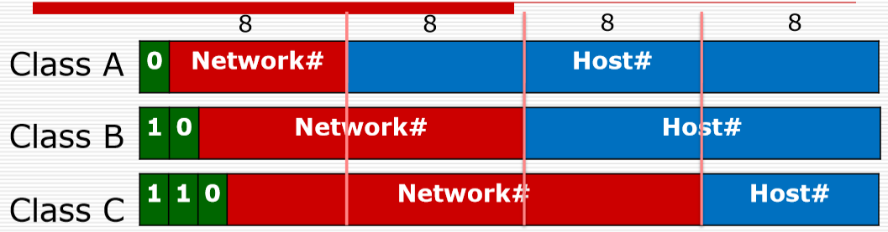

## IP地址的划分

1. IP地址主要通过第一个字节进行划分
2. 0–127 Class A address A类地址（0和127不可以指派）
3. 128-191 Class B address B类地址（0和全1不要指派）
4. 192–223 Class C address C类地址（0和全1不要指派）
5. 224–239 Class D – Multicast D类地址：多播：视频点播的原理也是组播(多播)（组播地址）
6. 240–255 Class E - Research E类地址：研究

私有（内网）IP地址范围：（private address）

A类：10.0.0.0-10.255.255.255
B类：172.16.0.0-172.31.255.255
C类：192.168.0.0-192.168.255.255

上述地址都是用作局域网的内部网段。

所谓私有地址就是在A、B、C三类IP地址中保留下来为企业内部网络分配地址时所使用的IP地址。

上面的数字都要记住