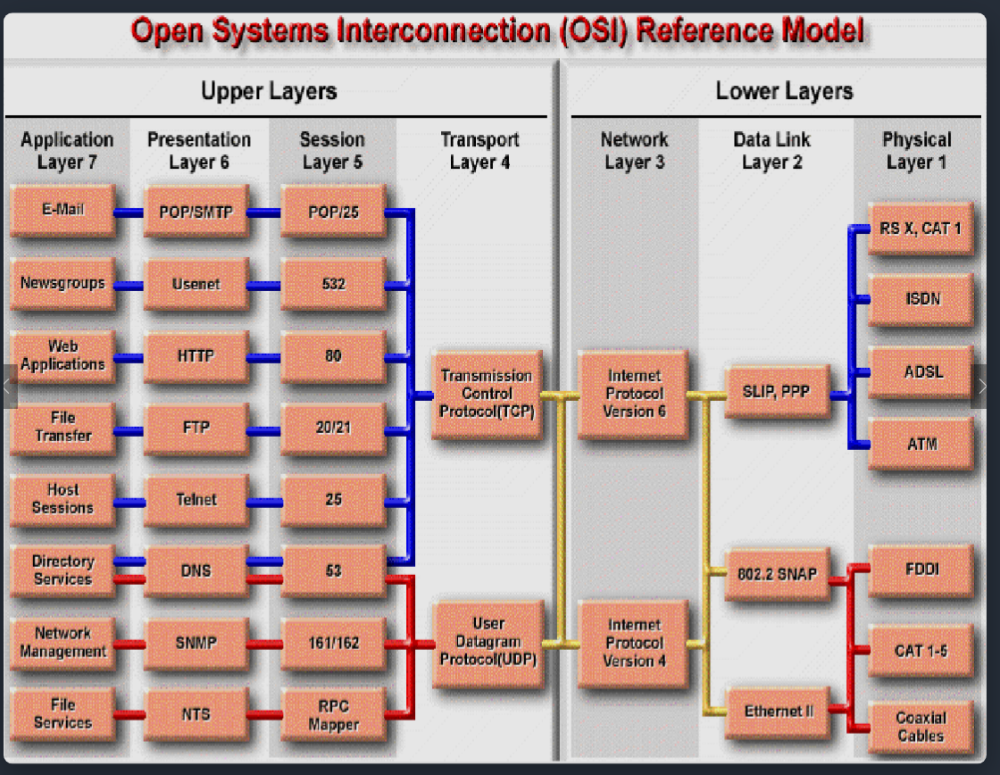
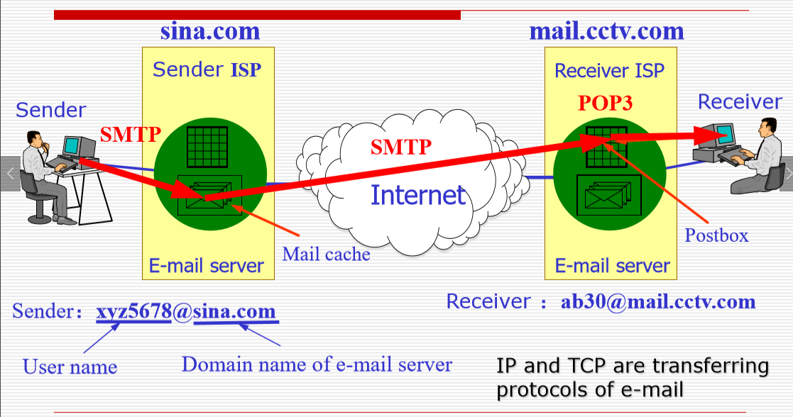
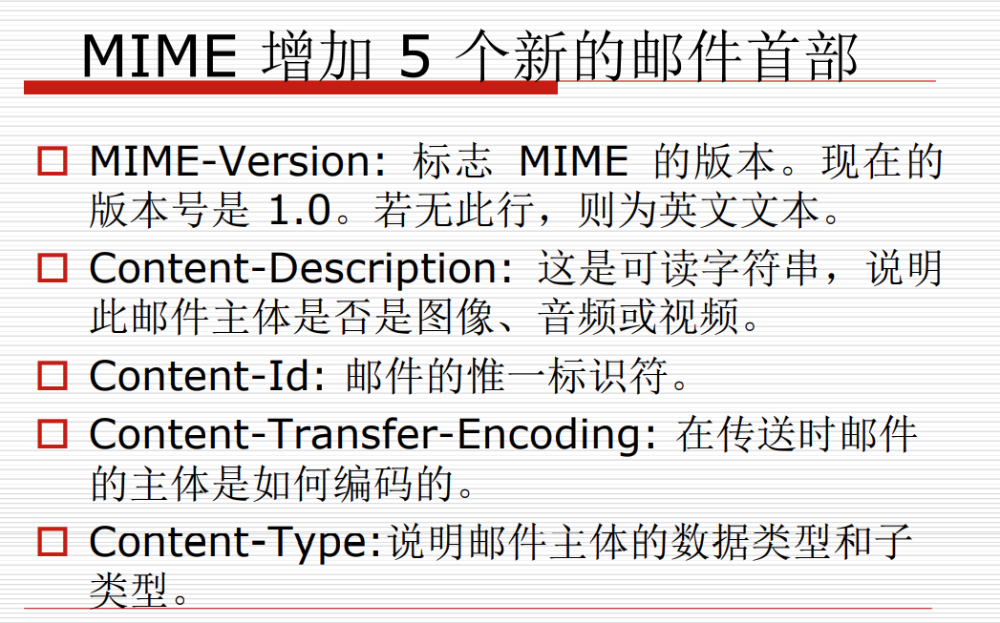

## 应用层

## Layer 6表示层

### 数据格式

第6层提供了这两种不同类型的代码之间的转换

#### 图像

1. 图形交换格式(GIF，Graphic Interchange Format)
2. 联合图像专家组(JPEG，Joint Photographic Experts Group)。

#### 多媒体

### 数据的加密与压缩

第6层负责数据加密：数据加密可在信息传输过程中保护信息

## Layer 7：The Application Layer应用层



实际上，上图的5,6层是在一起的。

1. 应用程序层(最接近用户)支持应用程序的通信组件。

## 应用层职责

1. 确定并确定预期的通信合作伙伴的可用性
2. 同步合作的应用程序
3. 同步协作的应用
4. 建立有关错误恢复程序的协议
5. 控制数据完整性
6. 通过网络应用(network applications)为OSI模型的其余部分提供一个直接接口，或是通过独立应用提供非直接接口，如文字处理，电子表格，演示管理器(presentation managers)，网络重定向器
7. 不同应用不同情况

## 超文本传输协议（HTTP，Hypertext Transfer Protocol）

每次通过URL的方式定位。找到下一个文件。

### 统一资源定位符 URL(Uniform Resource Locator)

1. 统一资源定位符 URL 是对可以从因特网上得到的资源的位置和访问方法的一种简洁的表示。

2. URL 给资源的位置提供一种抽象的识别方法，并用这种方法给资源定位。

3. 只要能够对资源定位，系统就可以对资源进行各种操作，如存取、更新、替换和查找其属性。

4. URL 相当于一个文件名在网络范围的扩展。因此 URL 是与因特网相连的机器上的任何可访问对象的一个指针。

5. ```
   <URL的访问方式>://<主机>:<端口>/<路径>
   ```

   1. 访问方式:协议HTTPS 或者 HTTP
   2. 主机:域名的方式
   3. 端口对应进程
   4. 路径对应具体的文件

### HTTP

面向事物的客户服务器协议。

HTTP 1.0 协议是无状态的（stateless）。

1. 每一次请求是独立的，不记录上一次请求信息。
2. Cookie是征求同意的存储(维持登录状态)，可以保证在多个应用之间维持登录状态。

HTTP 协议本身也是**无连接**的，虽然它使用了面向连接的 TCP 向上提供的服务。

万维网浏览器就是一个 HTTP 客户，而在万维网服务器等待 HTTP 请求的进程常称为HTTP daemon， 有的文献将它缩写为 HTTPD。

HTTP daemon 在收到 HTTP 客户的请求后，把所需的文件返回给 HTTP 客户。

## HTTP的报文结构


1. 报文由三个部分组成，即开始行、首部行和实体主体。
2. 在请求报文中，开始行就是请求行。
3. 请求报文和应答报文的应答结构都是一样的
4. 应答码：
   1. 2xx:成功
   2. 3xx:重定向
   3. 4xx:错误
   4. 5xx:服务器内部错误

### HTTP 请求报文的一些方法

| 方法(操作) | 意义                            |
| ---------- | ------------------------------- |
| OPTION     | 请求一些选项的信息              |
| GET        | 请求读取由URL所标志的信息       |
| HEAD       | 请求读取由URL所标志的信息的首部 |
| POST       | 给服务器添加信息(例如，注释)    |
| PUT        | 在指明的URL下存储一个文档       |
| DELETE     | 删除指明的URL所标志的资源       |
| TRACE      | 用来进行环回测试的请求报文      |
| CONNECT    | 用于代理服务器                  |

## HTML(Hypertext Markup Language)

1. 定义了许多用于排版的命令(标签)。
2. HTML 文档是一种可以用任何文本编辑器创建的 ASCII 码文件。
3. 仅当HTML文档是以.html或.htm为后缀时，浏览器才对此文档的各种标签进行解释。
4. 当浏览器从服务器读取HTML文档，针对HTML文档中的各种标签，根据浏览器所使用的显示器的尺寸和分辨率大小，重新进行排版并恢复出所读取的页面。
5. HTML用一对标签(一个开始标签和一个结束标签)或几对标签来标识一个元素。

## FTP（File Transfer Protocol）and  TFTP（Trivial File Transfer Protocol）

1. FTP是一种可靠的，面向连接的服务，它使用TCP传输文件。
   1. FTP首先在客户端和服务器(端口21)之间建立**控制连接**
   2. 然后，建立第二个连接，这是计算机之间通过其传输数据的链接。(端口20)

1. TFTP是使用UDP的无连接服务(简化的FTP)
   1. 体积小，易于实施。更加方便
   2. 例如。 TFTP在路由器上用于传输配置文件和Cisco IOS映像
   3. 不支持交互，没有目录浏览功能

### 主进程工作步骤

1. 打开熟知端口(端口号为 21)，使客户进程能够连接上。(可以修改熟知端口)(listening)

2. 等待客户进程发出连接请求。

3. 启动从属进程来处理客户进程发来的请求。从属进程对客户进程的请求处理完毕后即终止，但从属进程在运行期间根据需要还可能创建其他一些子进程。

   1. 控制连接

   2. 数据连接:数据通信

   3. 需要建立上面两个连接才能完成传输

4. 回到等待状态，继续接受其他客户进程发来的请求。主进程与从属进程的处理是并发地进行。

> 三次握手建立连接之后，起一个进程（从属进程）

SMTP and POP

## Telnet协议

远程控制web服务器

## SMTP(Simple Mail Transfer Protocol)

(简单邮件传输协议)邮件发送，登录发送等操作,

一是邮件从客户机传输到服务器；二是从某一个服务器传输到另一个服务器。SMTP是一个请求/响应协议，它监听25号端口，用于接收用户的Mail请求，并与远端Mail服务器建立SMTP连接。

## POP3(Post Office Protocol)

邮件接收，邮件到达邮件服务端，由客户端和服务端联系接收邮件。

将邮件从[邮件服务器](https://baike.baidu.com/item/邮件服务器/985736?fromModule=lemma_inlink)端送到个人终端机器上



> 发送者先登录到服务器，通过服务器根据SMTP传输到对应的服务器，然后用户登录后通过POP3协议收邮件到本地

发送者先登录到服务器，通过服务器根据SMTP传输到对应的服务器，然后用户登录后通过POP3协议收邮件到本地

## MIME(Multipurpose Internet Mail)


很多的文件(附件)并不是ASCII码的，我们需要用MIME将对应的文件进行转换(扩充)。过程如上图



## SNMP

The Simple Network  Management  Protocol 

简单网络管理协议(SNMP)是一种应用程序层协议，可简化网络设备之间的管理信息交换。

1. NMS(Network Management System):网管,通过下发请求对上网的所有的主机关于流量等等信息进行管理(监控)
2. 通过管理数据库(MIB)进行信息交流
3. 使用UDP通过广播进行实现。

##  域名系统(DNS, Domain Name System)

1. 域名系统(DNS)是网络上的服务，该服务管理域名并响应客户端将域名转换为关联IP地址的请求。

2. 早期是用IP地址以及Host文件来进行访问

域名管理（Domain Name）

1. 使用`.`将字符串进行分隔开，字符串不应该太长
2. 越靠后域名级别越高(左面是属于右边的)
3. www就是对应到主机群

## TLD顶级域（Top Level Domain）

