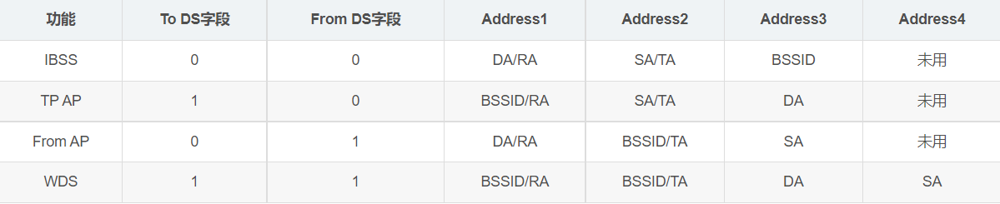

# 介质访问控制MAC

- 位数48，用16进制，12个16进制数。

> 公司申请OUI，（前24位），然后使用后24位。
>
> 电脑可以通过改注册表来改mac地址，硬件的没有改变

- 交换机不可分割广播域,对于冲突域，交换机可以根据MAC的地址，区分是不是同一个网段，同一个网段，就不去转发
- broadcast，广播域的mac地址是全1，0xffffffffffff.
  - 广播地址只有在下面2中情况下使用
    - 目的方的MAC的地址不知道的时候使用broadcast
    - 目的方就是所有的主机

## 一些名称

encapsulation,封装

protocol data unit，协议数据单元（frame，packet）

## CSMA/CD(半双工通信)

总线式的是广播的网络，每一个设备都可以看到frame（帧），是否这个栈是地址要看MAC地址，目的端接收，其他的discard（丢弃）

Assemble，组成帧

Broadcast jam signal，广播拥挤的信息

截断二进制指数退避（truncated binary exponential backoff）

上面的算法来确定碰撞重传的时机

如果传输次数太多的话，

## Wireless LAN,无线局域网

> 

cell？？？

Orthogonal Frequency Division Multiplexing(OFDM),正交频分复用

AP？？？？？？？

上图的那个长得像路由器的就是AP（Access Point（AP）），左右Base Station(BS).

## Frames in WLAN

无线网络的帧的结构

最大数据是2346bytes.,但是平时会限制在1518bytes

Data Frames in 802.11 WLAN

？？？？？？？？？？？？？？？？？？？？？？？？？？？？？？？？？？？？？？？？？序号控制，用于acknowledge

## WLAN中CSDA/CD的问题

802.11局域网

Hidden Station Problem

隐藏站的问题

Exposod Station Problem

暴露站的问题

无线信号的动态范围变化非常大，如果无线局域网的适配器检测实现检测到碰撞，成本比较大。

Carrier Sense Multiple Access/Collision detection

Carrier Sense Multiple Access/Collision Avoidance

协议的目的是减少碰撞发生的概率。

## CSMA/CA(Carrier Sense Multiple Access with Collision Avoidance)

RTS和CTS产生冲突之后，也有算法

A,B经过这样的通信之后，其他站点知道A,B是unavailable的

现在假定没有高优先级帧要发送，因而源站发送了自己的数据帧。目的站若正确收到此帧，则经过时间间隔SIFS后，向源站发送确认帧ACK。若源站在规定时间内没有收到确认帧ACK(由重传计时器控制这段时间)，就必须重传此帧，直到收到确认为止，或者经过若千次的重传失败后放弃发送。    

由此可见，802.11无线局域网采用的停止等待协议，是一种可靠传输协议。发送力一必须等待对力一的确认帧.   802.11标准还采用了一种叫做**虚拟载波监听**(Virtual Carrier Sense)的机制，这就是**让源站把它要占用信道的时间(包括目的站发回确认帧所需的时间)及时通知给所有其他站**，以便使其他所有站在这一段时间都停止发送数据，这样就大大减少了碰撞的机会。“虚拟载波监听”是表示其他站并没有监听信道，而是由于其他站收到了“源站的通知”才不发送数据。这种效果好像是其他站都监听了信道。所谓“源站的通知”就是源站在其MAC帧首部中的第二个字段“持续时间”中，填入了在本帧结束后还将要占用信道多少时间(以微秒为单位)，包括目的站发送确认帧所需的时间。  

> NAV相当于模拟有载波监听 

当一个站检测到正在信道中传送的MAC帧首部的“持续时间”字段时，就调整自己的**网络分配向量NAV（Network Allocation Vector)。** NAV指出了**必须经过多少时间才能完成数据帧的这次传输，才能使信道转入到空闲状态。**因此，某个站认为信道处于忙态就有两种可能，一种可能是**由于其物理层的载波监听检测到信道忙**，另一种可能就是**由于MAC层的虚拟载波监听机制指出了信道忙。**    

，当信道从忙态变为空闲时，任何一个站要发送数据帧时，不仅都必须等待一个DIFS的间隔，而且还要进入争用窗口，并计算随机退避时间，以便再次重新试图接入到信道。

CSMA/CD协议中，要发送数据的站，**在监听到信道变为空闲就立即发送数据**，同时进行碰撞检测。如果发生了碰撞，就执行退避算法。

CSMA/CA协议中，在信道从忙态转为空闲时，各站就要执行退避算法。这样做就减少了发生碰撞的概率。   

## CSMA/CA算法归纳如下:    

(1)若站点最初有数据要发送(而不是发送不成功再进行重传)，且检测到信道空闲，在等待时间DIFS后，就发送整个数据帧。    

(2)当有数据要发送但是信道不是空闲的时候，站点执行CSMA/CA协议的退避算法。一旦检测到信道忙，就冻结退避计时器。只要信道空闲，退避计时器就进行倒计时。    

(3)当退避计时器时间减少到零时(这时信道只可能是空闲的)，站点就发送整个的帧并等待确认。  

 (4)发送站若收到确认，就知道已发送的帧被目的站正确收到了。这时如果要发送第二帧，就要从上面的步骤(2)开始，执行CSMA/CA协议的退避算法，随机选定一段退避时间。    

若源站在规定时间内没有收到确认帧ACK(由重传计时器控制这段时间)，就必须重传此帧(再次使用CSMA/CA协议争用接入信道)，直到收到确认为止，或者经过若干次的重传失败后放弃发送。    

**应当指出，当一个站要发送数据帧时，仅在下面的情况下才不使用退避算法:检测到信道是空闲的，并且这个数据帧是它想发送的第一个数据帧。**  

 除此以外的所有情况，都必须使用退避算法。具体来说，以下几种情况都必须使用退避算法:  

(1)在发送第一个帧之前检测到信道处于忙态。    

(2)每一次的重传。    

(3)每一次的成功发送后再要发送下一帧。

规避算法？、？？？？？

SIFS（Short Interframe Space）

 SIFS，即短(Short)帧间间隔，长度为28 us。 S**IFS是最短的帧间间隔，用来分隔开属于一次对话的各帧。**在这段时间内，一个站应当能够从发送方式切换到接收方式。使用SIFS的帧类型有:ACK帧、CTS帧(在后面“对信道进行预约”中介绍)、由过长的MAC帧分片后的数据帧以及所有回答AP探询的帧和在PCF方式中接入点AP发送出的任何帧。

CTS

RTS

NAV**网络分配向量NAV（Network Allocation Vector)。** NAV指出了**必须经过多少时间才能完成数据帧的这次传输，才能使信道转入到空闲状态。**

DIFS（DCF interframe Space）

在DCF协议中，节点在开始发送数据之前需要监测信道是否空闲。如果信道已经空闲，则节点仍需等待DIFS段时间才开始发送数据；而如果在DIFS时间段内任一时刻信道被监测为忙，则节点不得不推迟它的数据发送。DIFS和SIFS间的计算关系如下：

ACK（acknowledge）

发RTS时候就发要多长持续时间，CTS的时候也发要多长时，发数据的时候也发要多长时间

The Actual Throughput

由于ACK，有50%的带宽浪费

## 802.11数据帧结构

1、Frame Control 帧控制字段，含有许多标识位，表示本帧的一些类型等信息。 该字段将在下文中详细介绍。
3、Address 与802.3以太网传输机制不同，802.11无线局域网数据帧一共可以有4个MAC地址，这些地址根据帧的不同而又不同的含义，**但是基本上第一个地址表示接收端MAC地址**，**第二个地址表示发送端MAC地址**，**第三个地址表示过滤地址**。关于Address字段的详解请见后文。
4、Seq-ctl 顺序控制位，该字段用于数据帧分片时**重组数据帧片段以及丢弃重复帧**。
5、Frame Body **帧所包含的数据包**。
6、**FCS 帧校验和**，主要用于检查帧的完整性。

>
> 2、Duration ID 持续时间和ID位，本字段一共有16bit，根据第14bit和15bit的取值，本字段有以下三种类型的含义：
> （1）当第15bit被设置为0时，该字段表示该数据帧所传输要使用的时间，单位为微秒。（这与无线局域网传输介质有关，详情我将在后续博客CSMD/CA篇章中介绍。）
> （2）当第15bit被设置为1，第14bit也为0时，该字段用于让没有收到Beacon新标帧（管理帧的一种）公告免竞争时间。
> （3）当第15bit被设置为1，第14bit为1时，该字段主要用于STA告知AP其关闭天线，将要处于休眠状态，并委托AP暂时存储发往该STA的数据帧。此时该字段为一种标识符，以便在STA接触休眠后从AP中获得为其暂存的帧。

To DS，是否向DS（Distribution System）发送。

From DS，看时候来自DS

IBSS是指发到以太网
