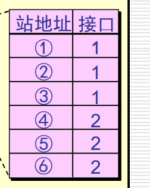
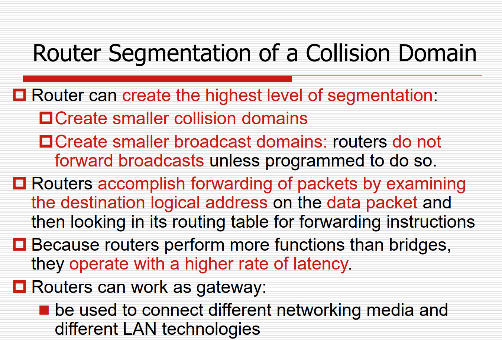
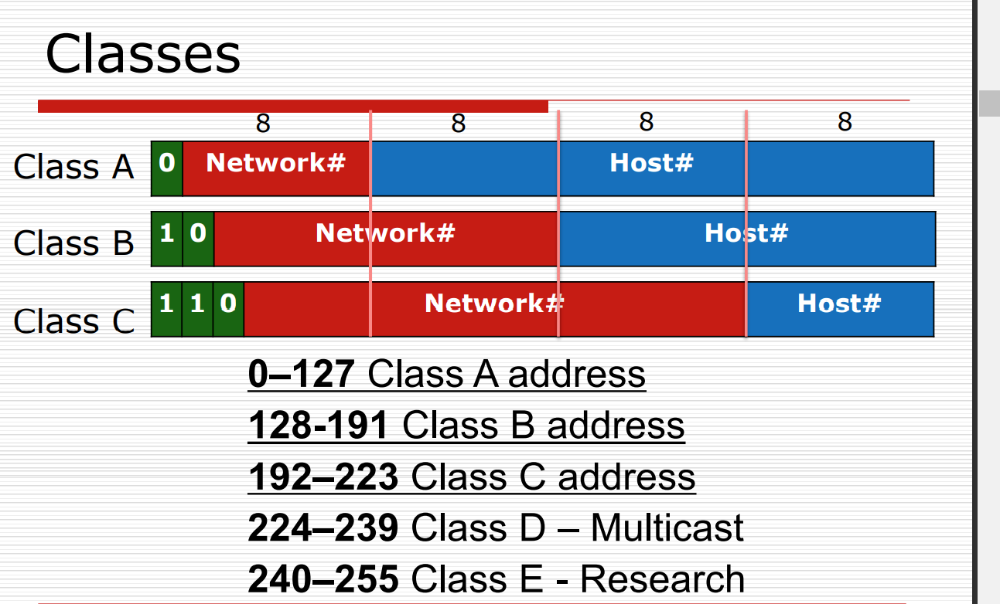
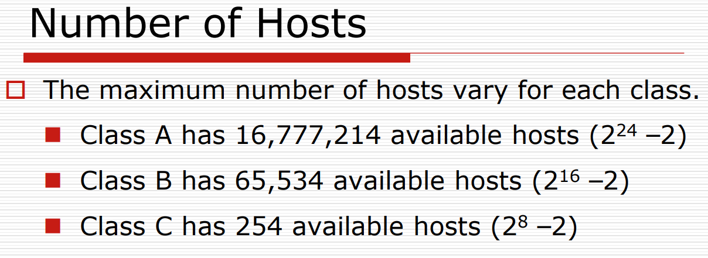
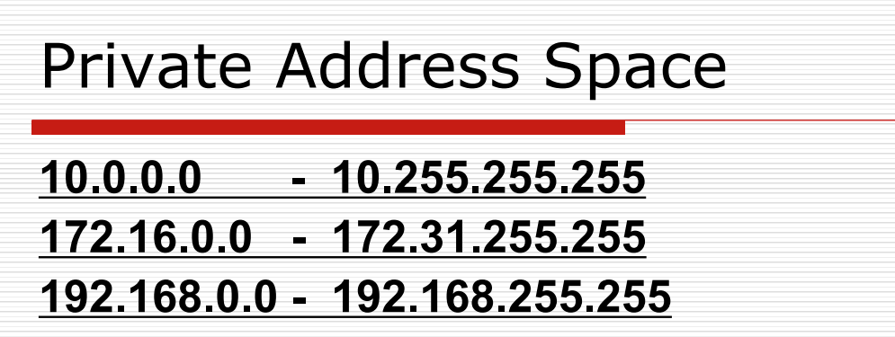
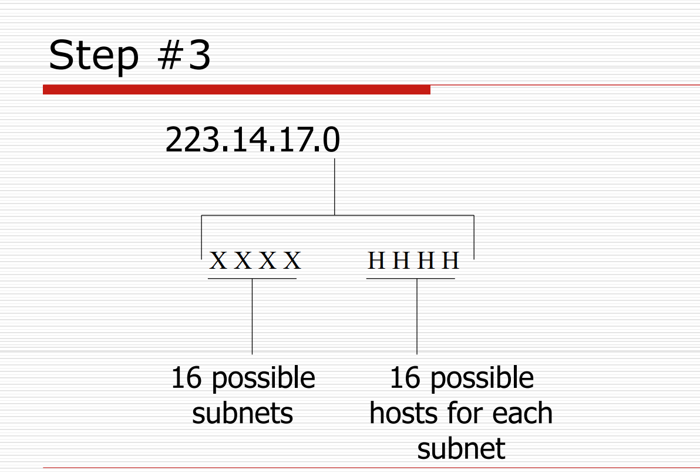

## 第二层设备

### 网卡

### 网桥

基于mac地址制作mac table，mac表，分割冲突域

透明网桥：局域网的站点并不知道所发送的帧将经过几个网桥。网桥对其他各站是不知道的，

通过学习：根据MAC地址的source地址建立一个

该表会刷新，记录没有使用会被删掉。

不可以隔离广播域（目的地址111111111），网桥和switch还是会广播。

## 交换机

和网桥功能几乎一致，

降低交通量，真假带宽

隔离冲突域，。

网桥是基于软件的，性能比较差，交换机是基于硬件的，速度好

路由器的隔离冲突域

每个网段，host全0，表示本网段，host全1表示广播地址、

私有网段。这些网段属于局域网。

相同network ID才可以直接交流

ip地址耗尽的方法

NAT

CIDR

IPV6

## Subnet

从Host为里面借若干位上面组成子网。

广播域的范围变小，广播域的数量增加。

最小也要借2位，

如果借1位的话，0表示网络地址，1broadcast 地址

最大也要留2位，给host留2位

确定子网掩码

确定是那种类型的网，然后得到子网掩码

要13个subnets，所有要记得去掉2个

借4位

计算新的子网掩码

有16个可能的subnets，去掉2个不可以使用的有14个可以使用的subnet

子网掩码和ip做 AND操作。

路由器基于Ip的network ID转发，不是同一个网段的不转发。

## Router function,路由功能

把报文放到帧里面

网关很重要
