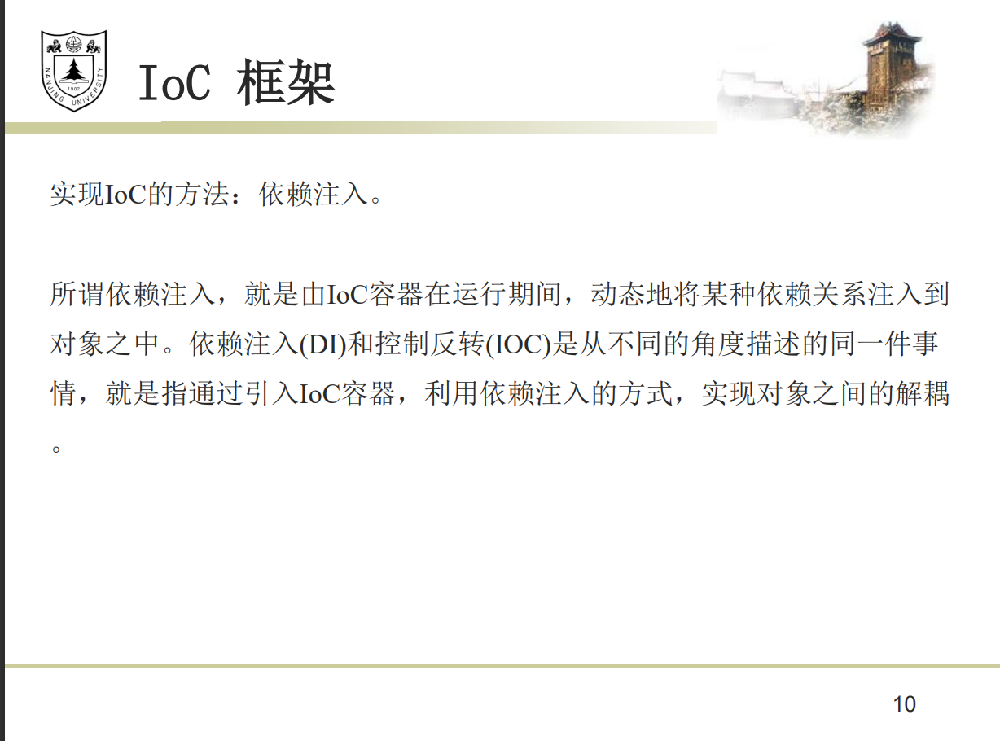

对象和数据库的Table进行字段和属性的映射

## Spring Boot框架


IoC容器：容器创建对象，把对象连接起来，配置他们，并管理他们整个生命周期。使用依赖注入（DI）来管理组成一个应用程序组件，对象被叫Spring Beans


面向切面编程(AOP)框架


## Spring Boot配置文件：

application.properties文件和application.yml文件。他们的作用都是修改Spring Boot 自动配置的默认值

### YAML

用空格缩进程度来控制层次关系（不能用tab代替空格，大小写敏感）

 字面值：字符串，布尔类型，数值，日期。字符串默认不加引号，单引号会转 义特殊字符。日期格式支持yyyy/MM/dd HH:mm:ss

  对象：由键值对组成，形如 key:(空格)value(空格必须要有)，每组键值对占用 一行，且缩进的程度要一致。也可以使用行内写法：{k1: v1, ....kn: vn}

数组：由形如 -(空格)value 的数据组成(空格必须要有)，每组数据占用一行 ，且缩进的程度要一致。也可以使用行内写法： [1,2,...n]

复合结构：上面三种数据结构任意组合.

[YAML 入门教程 | 菜鸟教程 (runoob.com)](ht

[[一文看懂 YAML - 知乎 (zhihu.com)](https://zhuanlan.zhihu.com/p/145173920)tps://www.runoob.com/w3cnote/yaml-intro.html)

后缀： .yml

- ## 基本语法

  ### 大小写敏感

  - 就是字面上的意思

  ```yaml
  One: 1
  one: 2
  ```

  ### 用缩进表示层级关系

  - 缩进**只能使用空格**，不能用 TAB 字符
  - 缩进的**空格数量不重要**，但是**同一层级的元素左侧必须对齐**

  ```yaml
  # YAML
  one:
    two: 2
    three:
      four: 4
      five: 5
  
  // 以上的内容转成 JSON 后
  "one": {
    "two": 2,
    "three": {
      "four": 4,
      "five": 5 
    }
  }
  ```

  ### 用 # 表示注释

  - 只支持单行注释

  ```yaml
  # 我是注释
  # 我也是注释
  ```

  ### 一个文件中可以包含多个文件的内容

  - 用“ **---** ”即**三个破折号**表示一份内容的**开始**
  - 用“ **...** ”即**三个小数点**表示一份内容的**结束**（非必需）

  ```yaml
  ---
  # 这是第一份内容
  one: 1
  # 其他内容...
  ...
  
  ---
  # 这是第二份内容
  two: 2
  # 其他内容...
  ```

  ## 数据结构与类型

  ### 对象（Mapping）

  表示以键值对（key: value）形式出现的数据

  - 使用“**冒号+空格**”来分开**键**与**值**

  ```yaml
  # YAML
  key: value
  
  // JSON
  "key": "value"
  ```

  - 支持多层嵌套（**用缩进表示层级关系**）

  ```yaml
  # YAML
  key:
    child-key1: value1
    child-key2: value2
  
  // JSON
  "key": {
    "child-key1": "value1",
    "child-key2": "value2",
  }
  ```

  - 支持**流式风格（ Flow style）**的语法（用花括号包裹，用逗号加空格分隔，类似 JSON）

  ```yaml
  # YAML
  key: { child-key1: value1, child-key2: value2 }
  
  // JSON
  "key": { "child-key1": "value1", "child-key2": "value2" }
  ```

  - 使用**问号“?”**声明一个复杂对象，允许你使用多个词汇（数组）来组成键

  ```yaml
  # YAML
  ?
    - keypart1
    - keypart2
  :
    - value1
    - value2
  ```

  ### 数组（Sequence）

  - 一组以**区块格式（Block Format）（即“破折号+空格”）**开头的数据组成一个数组

  ```yaml
  # YAML
  values:
    - value1
    - value2
    - value3
  
  // JSON
  "values": [ "value1", "value2", "value3" ]
  ```

  - 同时也支持**内联格式（Inline Format）**来表达（用方括号包裹，逗号加空格分隔，类似 JSON）

  ```yaml
  # YAML
  values: [value1, value2, value3]
  
  // JSON
  "values": [ "value1", "value2", "value3" ]
  ```

  - 支持多维数组（**用缩进表示层级关系**）

  ```yaml
  # YAML
  values:
    -
      - value1
      - value2
    -
      - value3
      - value4
  
  // JSON
  "values": [ [ "value1", "value2"], ["value3", "value4"] ]
  ```

  ### 标量（Scalars）

  表示 YAML 中最基本的数据类型

  ### 字符串（String）

  - 字符串**一般不需要用引号包裹**，但是如果字符串中**使用了反斜杠“\”开头的转义字符就必须使用引号包裹**

  ```yaml
  # YAML
  strings:
    - Hello without quote # 不用引号包裹
    - Hello
     world # 拆成多行后会自动在中间添加空格
    - 'Hello with single quotes' # 单引号包裹
    - "Hello with double quotes" # 双引号包裹
    - "I am fine. \u263A" # 使用双引号包裹时支持 Unicode 编码
    - "\x0d\x0a is \r\n" # 使用双引号包裹时还支持 Hex 编码
    - 'He said: "Hello!"' # 单双引号支持嵌套"
  
  // JSON
  "strings":
    [ "Hello without quote",
      "Hello world",
      "Hello with single quotes",
      "Hello with double quotes",
      "I am fine. ☺",
      "\r\n is \r\n",
      "He said: 'Hello!'" ]
  ```

  - 对于多行的文字，YAML 提供了两种特殊的语法支持

  **保留换行(Newlines preserved)**

  > 使用**竖线符“ | ”**来表示该语法，每行的缩进和行尾空白都会被去掉，而额外的缩进会被保留

  ```yaml
  # YAML
  lines: |
    我是第一行
    我是第二行
      我是吴彦祖
        我是第四行
    我是第五行
  
  // JSON
  "lines": "我是第一行\n我是第二行\n  我是吴彦祖\n     我是第四行\n我是第五行"
  ```

  **折叠换行(Newlines folded)**

  > 使用**右尖括号“ > ”**来表示该语法，只有空白行才会被识别为换行，原来的换行符都会被转换成空格

  ```yaml
  # YAML
  lines: >
    我是第一行
    我也是第一行
    我仍是第一行
    我依旧是第一行
  
    我是第二行
    这么巧我也是第二行
  
  // JSON
  "lines": "我是第一行 我也是第一行 我仍是第一行 我依旧是第一行\n我是第二行 这么巧我也是第二行"
  ```

  ### 布尔值（Boolean）

  - “true”、“True”、“TRUE”、“yes”、“Yes”和“YES”皆为**真**
  - “false”、“False”、“FALSE”、“no”、“No”和“NO”皆为**假**

  ```yaml
  # YAML
  boolean:
    - true # True、TRUE
    - yes # Yes、YES
    - false # False、FALSE
    - no # No、NO
  
  // JSON
  "boolean": [ true, true, false, false ]
  ```

  ### 整数（Integer）

  - 支持二进制表示

  ```yaml
  # YAML
  int:
    - 666
    - 0001_0000 # 二进制表示
  
  // JSON
  "int": [ 666, 4096 ]
  ```

  ### 浮点数（Floating Point）

  - 支持科学计数法

  ```yaml
  # YAML
  float:
    - 3.14
    - 6.8523015e+5 # 使用科学计数法
  
  // JSON
  "float": [ 3.14, 685230.15 ]
  ```

  ### 空（Null）

  - “null”、“Null”和“~”都是空，不指定值默认也是空

  ```yaml
  # YAML
  nulls:
    - null
    - Null
    - ~
    -
  
  // JSON
  "nulls": [ null, null, null, null ]
  ```

  ### 时间戳（Timestamp）

  - YAML 也支持 **ISO 8601** 格式的时间数据

  > 这里使用 JavaScript 对象进行对比

  ```yaml
  # YAML
  date1: 2020-05-26
  date2: 2020-05-26T01:00:00+08:00
  dete3: 2020-05-26T02:00:00.10+08:00
  date4: 2020-05-26 03:00:00.10 +8
  
  // JavaScript
  date1: Tue May 26 2020 08:00:00 GMT+0800 (中国标准时间),
  date2: Tue May 26 2020 01:00:00 GMT+0800 (中国标准时间),
  dete3: Tue May 26 2020 02:00:00 GMT+0800 (中国标准时间),
  date4: Tue May 26 2020 03:00:00 GMT+0800 (中国标准时间)
  ```

  ### 类型转换

  - YAML 支持使用**严格类型标签“!!”**（双感叹号+目标类型）来强制转换类型

  ```yaml
  # YAML
  a: !!float '666' # !! 为严格类型标签
  b: '666' # 其实双引号也算是类型转换符
  c: !!str 666 # 整数转为字符串
  d: !!str 666.66 # 浮点数转为字符串
  e: !!str true # 布尔值转为字符串
  f: !!str yes # 布尔值转为字符串
  
  // JSON
  "a": 666,
  "b": "666",
  "c": "666",
  "d": "666.66",
  "e": "true"
  "f": "yes"
  ```

  ### 其他高级类型

  YAML 也可以使用一些更高级的类型，但是并不一定兼容所有解析器，包括**集合（Sets）**、**有序映射（Ordered Map）**、**十六进制数据（Hexdecimal）**和**二进制数据（Binary）。**

  **本文将不会对这几种类型进行讲解，感兴趣的读者可以自行搜索研究。**

  ## 数据重用与合并

  - 为了保持内容的简洁，避免过多重复的定义，YAML 提供了由**锚点标签“&”**和**引用标签“\*”**组成的语法，利用这套语法可以快速引用相同的一些数据...

  ```yaml
  # YAML
  a: &anchor # 设置锚点
    one: 1
    two: 2
    three: 3
  b: *anchor # 引用锚点
  
  // JSON
  "a": {
    "one": 1,
    "two": 2,
    "three": 3
  },
  "b": {
    "one": 1,
    "two": 2,
    "three": 3
  }
  ```

  - 配合**合并标签“<<”**使用可以与任意数据进行合并，你可以把这套操作想象成面向对象语言中的继承...

  ```yaml
  # YAML
  human: &base # 添加名为 base 的锚点
      body: 1
      hair: 999
  singer:
      <<: *base # 引用 base 锚点，实例化时会自动展开
      skill: sing # 添加额外的属性
  programer:
      <<: *base # 引用 base 锚点，实例化时会自动展开
      hair: 6 # 覆写 base 中的属性
      skill: code # 添加额外的属性
  
  // JSON
  "human": { "body": 1, "hair": 999 },
  "singer": { "body": 1, "hair": 999, "skill": "sing" },
  "programer": { "body": 1, "hair": 6, "skill": "code" }
  ```


## **注解的定义**

注解通过 @interface 关键字进行定义。

```java
public @interface TestAnnotation {
}

@TestAnnotation
public class Test {
}
```

元注释

@Retention、@Documented、@Target、@Inherited、@Repeatable


## **@Retention**

- RetentionPolicy.SOURCE 注解只在源码阶段保留，在编译器进行编译时它将被丢弃忽视。

- RetentionPolicy.CLASS 注解只被保留到编译进行的时候，它并不会被加载到 JVM 中。

- RetentionPolicy.RUNTIME 注解可以保留到程序运行的时候，它会被加载进入到 JVM 中，所以在程序运行时可以获取到它们。

  用法

  ```
  @Retention(RetentionPolicy.RUNTIME)//把retention注释用在注释上，来设定生存时间
  public @interface TestAnnotation {
  }
  ```

  

## **@Documented**

顾名思义，这个元注解肯定是和文档有关。它的作用是能够将注解中的元素包含到 Javadoc 中去。

## **@Target**


Target 是目标的意思，@Target 指定了注解运用的地方。

你可以这样理解，当一个注解被 @Target 注解时，这个注解就被限定了运用的场景。

- ElementType.ANNOTATION_TYPE 可以给一个注解进行注解
- ElementType.CONSTRUCTOR 可以给构造方法进行注解
- ElementType.FIELD 可以给属性进行注解
- ElementType.LOCAL_VARIABLE 可以给局部变量进行注解
- ElementType.METHOD 可以给方法进行注解
- ElementType.PACKAGE 可以给一个包进行注解
- ElementType.PARAMETER 可以给一个方法内的参数进行注解
- ElementType.TYPE 可以给一个类型进行注解，比如类、接口、枚举

## **@Inherited**


Inherited 是继承的意思，但是它并不是说注解本身可以继承，而是说如果一个超类被 @Inherited 注解过的注解进行注解的话，那么如果它的子类没有被任何注解应用的话，那么这个子类就继承了超类的注解。

```text
@Inherited
@Retention(RetentionPolicy.RUNTIME)
@interface Test {}
@Test
public class A {}
public class B extends A {}
```


注解 Test 被 @Inherited 修饰，之后类 A 被 Test 注解，类 B 继承 A,类 B 也拥有 Test 这个注解。

## **@Repeatable**

```java
@interface Persons {
    Person[]  value();
}
@Repeatable(Persons.class)
@interface Person{
    String role default "";
}
@Person(role="artist")
@Person(role="coder")
@Person(role="PM")
public class SuperMan{
}
```

@Repeatable 注解了 Person。而 @Repeatable 后面括号中的类相当于一个容器注解。

## **注解的属性**

##### 注解的成员变量在注解的定义

中以“无形参的方法”形式来声明，其方法名定义了该成员变量的名字，其返回值定义了该成员变量的类型。

```text
@Target(ElementType.TYPE)
@Retention(RetentionPolicy.RUNTIME)
public @interface TestAnnotation {
    int id();
    String msg();
}
```

赋值的方式是在注解的括号内以 value=”” 形式，多个属性之前用 ，隔开。

```text
@TestAnnotation(id=3,msg="hello annotation")
public class Test {
}
```

##### 注解中属性可以有默认值，默认值需要用 default 关键值指定。比如：

```text
@Target(ElementType.TYPE)
@Retention(RetentionPolicy.RUNTIME)
public @interface TestAnnotation {
    public int id() default -1;
    public String msg() default "Hi";
}
```

有默认值，无需要再在 @TestAnnotation 后面的括号里面进行赋值了。

##### 注解内仅仅只有一个名字为 value 

，应用这个注解时可以直接接属性值填写到括号内。

```text
public @interface Check {
    String value();
}
```

##### 一个注解没有任何属性

```text
public @interface Perform {}
```

那么在应用这个注解的时候，括号都可以省略。

```text
@Perform
public void testMethod(){}
```

[java注解-最通俗易懂的讲解 - 知乎 (zhihu.com)](https://zhuanlan.zhihu.com/p/37701743)

下面看不懂


