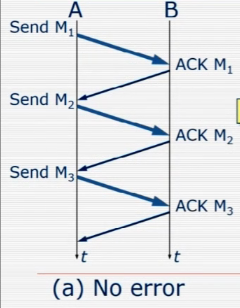
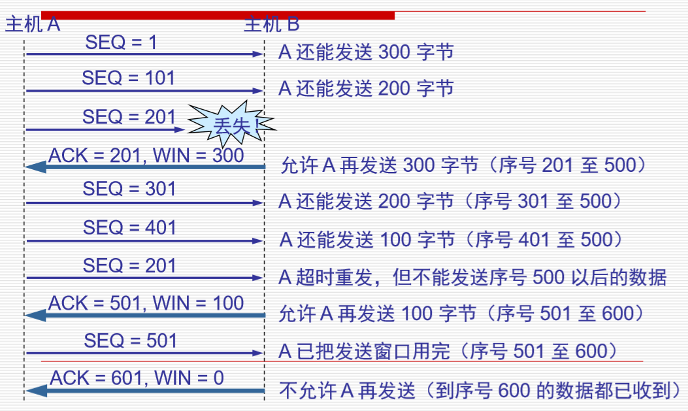
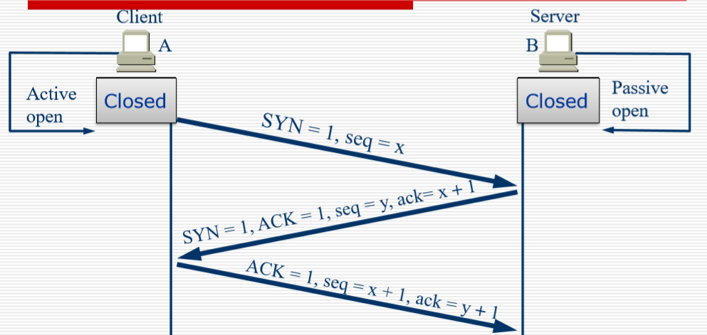
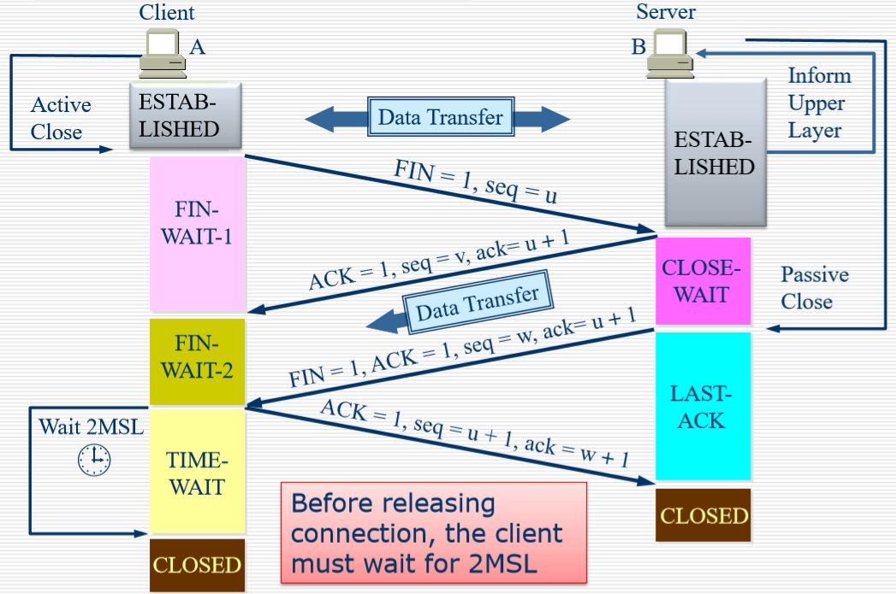
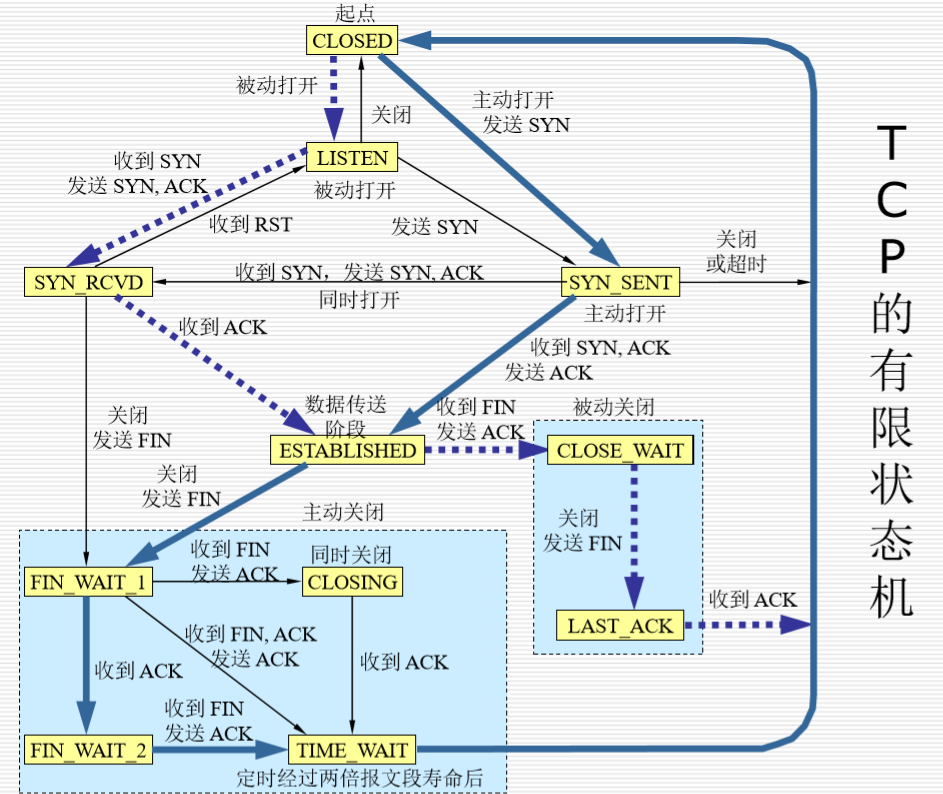

## 传输层

segmenting upper-layer

分割上层应用程序数据(新的数据单元-数据段)
建立端到端(end to end)的运营
从一个终端主机向另一个终端主机发送段
流量控制和可靠性

- 可以比喻为与外国人交谈:通常，您会要求外国人重复他/她的话(可靠性)并慢声说话(流量控制)
  双方主机的网络的处理能力不同，缓存能力不同

TCP和UDP协议

## TCP

可靠的

软件校验，保证数据正常的

会有应答（acknowledge）

如果没有应答或者错误，会进行重传

flow control，使用流控制，保证正确

## UDP

不可靠的

无线的，

没有应答

没有软件校验

没有流控制

## Service Model

端口来让不同进程之间不会产生冲突

0-65535（2个字节）0-255的端口是，分配给public application

0-1023的端口也有规范的分配

对于其他的应用也有登记使用

## Socket

- 源端口和目的端口---2个组合

端口是运输层和应用层的接口

传输层的复用和分用功能都要通过端口才能实现

- 确认号，期望收到对方的下一个报文段的数据的第一个字节的序号

- 数据偏移，指出TCP报文段的数据起始处距TCP报文段的起始处的长度

- 保留位没有使用

- URG=1，表示有紧急指针字段

- ACK，=1时候表示有效

- 

- RST复位，释放连接重新建立运输连接

  

## TCP的握手问题

Client和Serve

- 第一次握手(服务端起来，然后客户端发起请求)
  - 服务器：执行listen和accept，进行被动的监视
  - 客户端：执行connect原语，生成SYN=1和ACK=0的TCP段，表示连接请求

- 第二次握手（服务器检查是否存在监视端口的服务进程）

  - 如果没有任何进程，请使用RST = 1回答一个TCP段

  - 如果存在进程，则决定拒绝或接受请求

  - 如果接受连接请求，则发送SYN = 1和ACK = 1的网段

- 第三次

  - 客户端发送一个SYN = 0和ACK = 1的段以确认连接
  - 为了避免出现延时之类的情况(如果只有两次会浪费服务器资源)

## 停止等待协议

发送段后，**暂时保留备份**

1. 在发送后没有收到确认的时候，要保存备份来重传
2. 收到确认的时候，抛弃备份
3. 超时计时器:如果对方的应答超过一定时间后则直接进行重发(时间要比正常往返时间稍微长一点，每次发送一个数据之后等待一段时间，比传输时间多2倍，)

- 丢失确认：发过去没有应答或者丢失
- 确认延迟：应答超时（晚到的应答直接丢弃掉）

ARQ (Automatic Repeat reQuest) 自动重传请求：这表示"重新发送请求"为自动发送并且接收方无需请求发送方重新发送错误段

### Contiguous ARQ(Automatic Repeat-reQuest) Protocol 连续ARQ协议

- 多个数据一起发送，采用滑动窗口的方式，一次发送多个（窗口的动态调整）
- （接受方的一个确认可以确认多个）

发送窗口（多个字段），得到确认之后窗口就朝前移动

WIN:窗口的大小:双方动态协商，收到确认调整窗口

ACK:是指可以继续发送的数据的位置

SEQ：是序号的意思，表示了发送了序列的开头

为什么201在401后面发送？**超时重传(要超过两倍的平均传输时间后才进行重传)**

同步 SYN = 1:表示这是一个连接请求或连接接受报文(初始的时候才出现)

SEQ：是序号的意思，表示了发送了序列的开头

ACK = 1 时确认号字段有效;ACK = 0 时确认号字段无效

## TCP:释放链接

1. 发起断开连接请求FIN=1,seq=u,server进入CLose wait状态
2. Ack = 1:允许断开，但是此时并不是断开连接，而是说不在发送新的数据，此时我们需要完成之前未处理完成的数据的处理。(这里只是说我已经收到了你请求停止传输的请求)
3. FIN = 1:数据处理完成，注意需要的变化(此时表示所有的需要处理的数据已经处理完了，此时表示正式确认断开)，（进入time-wait状态，防止第三次握手失败，server又发送了一段的报文可以处理到）

## TCP中的计时器

1. 重传计时器:多长时间进行重传

2. 坚持计时器:避免死锁(WIN = 0的时候修改WIN但是没有办法发送过去)：收到WIN = 0 的时候，开始进行计时，到时间主动询问

   1. 保持计时器:

   1. 发送数据段后，刷新

3. 如果到达一定的时间，则再次询问是不是还要保持连接。

4. 时间等待计时器
