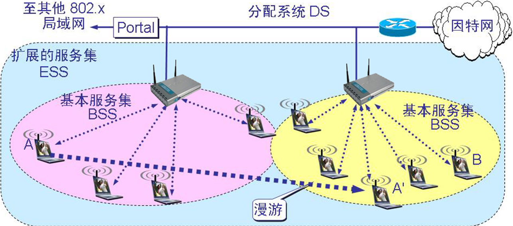
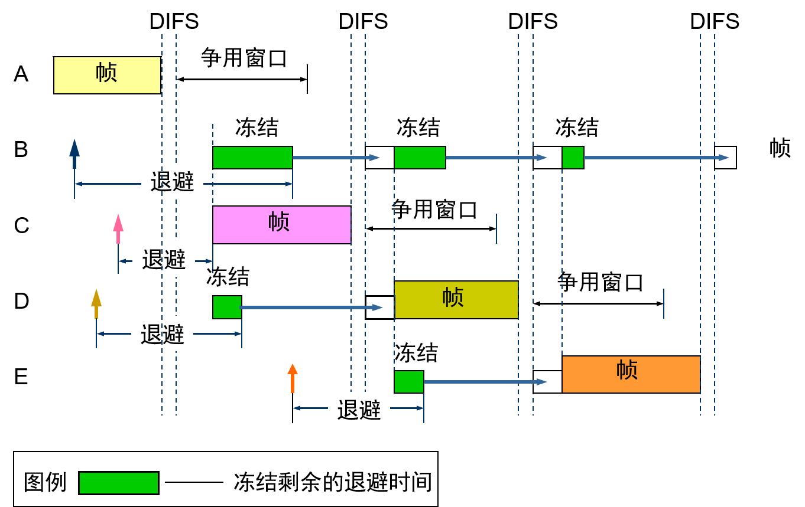

- Node: 节点
  - 网络中的主机和路由器
- Link: 链路
  - 邻接节点间的通道(channel)

* Data Link Layer: 数据链路层(OSI中)

  * 解决问题: 如何在不稳定的链路上正确的传输数据
  * 提供了
    * 对介质的访问
    * 提供通过介质进行的物理传输
  * 第二层协议定义了
    * 在线路上交换的数据的格式
    * 节点的行为
  * 主要目标
    * 错误通知
    * 流控制(Flow Control)
    * 网络拓扑
    * 物理寻址
    * 网络接入/访问(Network Access)
    * 帧有序传递(Ordered Frame Transmission)
  * 这一层中，“过程(procedure)" = "协议(protocol)"

* 第一层与第二层的区别

  | 第一层                  | 第二层          |
  | -------------------- | ------------ |
  | 无法与上层通信              | 通过LLC与上层通信   |
  | 无法确定哪台主机将会传输或接受二进制数据 | 通过MAC确定      |
  | 无法命名或标识主机            | 通过寻址或命名过程来实现 |
  | 仅仅能描述比特流             | 通过帧来组织/分组比特  |

* LAN标准(IEEE标准，和OSI的有一些不同)

  - 定义物理介质和连接至介质的连接器
  - 定义设备在数据链路层进行通信的方式
  - 数据链路层定义数据如何在物理介质上进行传输
  - 数据链路层定义如何封装不同上层协议的流量，使得不同协议的流量可以使用同样的通道到达协议栈上层
  - 传输方式
    - unicast: 单点传输
      - 单一个包从源发送至网络中唯一一个节点
    - multicast: 组播
      - 单一个包发送至网络中多个节点
    - broadcast: 广播
      - 单一个包发送至网络中所有节点
  - 将数字链路层划分为两个子层(与OSI不同)
    - MAC(802.3, 802.5): Media Access Control，介质访问控制子层，与下层通信
      - 实际上是跨第一层和第二层的接口
      - 是围绕特定技术构建的
    - LLC(802.2): Logical Link Control，逻辑链路控制子层，与上层通信
      - 可以独立工作，与已有的技术隔离。单一的LLC可以与不同的MAC兼容

* MAC

  - 定义了
    - 物理线路上传输帧的方式
    - 网络拓扑结构
    - 线路规则(line discipline)
  - 处理物理寻址
  - MAC地址
    - 48位
    - 高3字节为IEEE指定的，标识了生产商，包含了OUI(Organizational Unique Identifier, 组织唯一标识符)。生产商指定低三字节，包含接口序列号(interface serial number)。
    - 组播地址: FFFF.FFFF.FFFF

  * 组帧

    * 组帧是第二层封装过程

    * 帧是第二层PDU(protocol data unit，协议数据单位)

      | 7        | 1    | 6                   | 6              |
      | -------- | ---- | ------------------- | -------------- |
      | Preamble | SFD  | Destination Address | Source Address |

      ​

      | 2                        | 可变   | 4    |
      | ------------------------ | ---- | ---- |
      | Length/Type(Ethernet II) | Data | FCS  |

    Preamble: 前导码，0x55。用来提示接受者一个帧正在到来。

    SFD Start of Frame Delimiter: 帧起始界定符

    Destination Address: 目标地址。在单播、组播、广播时有不同的格式。

    Source Address: 源地址。始终是单播格式的地址。

    Length: 长度。指示数据的字节数。以太网中46~1500。

    ​	原因: 不小于46是为了帧总长度不小于64，以保证有足够的传输时间用于以太网卡精确的检测冲突，这一时间是根据网络的最大电缆长度和帧沿电缆传输所要的时间来决定的。

    ​		不大于1500是因为1500字节是以太网最大传输单元(Maximum Transmission Unit)

    ​	所以，802.3帧大小在64~1518字节之间。

    Data: 数据。

    FCS Frame Check Sequence: 帧校验序列。CRC值。

  * 介质访问控制方式

    * 争用式(Non-deterministic)
      * ALOHA(好像就叫这个名字，不是缩写)
        * 70年代，Norman Abramson设计
        * Pure ALOHA: 纯ALOHA协议
          * 主机任何时候都可以发送数据
          * 如果发生冲突，延迟一段时间再发送
        * Slotted ALOHA: 分段ALOHA协议
          * 把信道在时间上分段。主机任何时候都发送数据，但是必须等待下一个时间分段的开始才开始发送
          * 如果发生冲突，延迟一段时间再发送
      * CSMA: Carrier Sense Multiple Access，载波侦听多路访问。侦听信道来确定是否空闲
        * 下面的都是基于Slotted ALOHA，也是分段的！
      * 1-persist CSMA: 1坚持CSMA
        * 如果信道空闲，则发送数据; 如果不空闲则持续侦听直到空闲
        * 如果发生冲突，等待一段时间再发送
      * non-persist CSMA: 非坚持CSMA
        * 如果信道空闲，则发送数据; 如果不空闲则等待一段时间再次侦听
        * 如果发生冲突，等待一段时间再发送
      * p-persist CSMA: p坚持CSMA
        * 如果信道空闲，则以p的概率在这一个slot发送数据，如果不发送，则在下一个slot发送; 如果不空闲则等待到下一个slot再次侦听
        * 如果发生冲突，等待一段时间再发送
      * CSMA/CD: CSMA with Collision Detection，带有冲突检测的CSMA
        * 使用CSMA机制来决定是否发送数据
        * 当发送数据时也同时侦听信道，如果发现冲突，所有传输被立即取消，并广播拥塞(jam)信号。然后根据推迟算法决定推迟多久再重新发送。
      * CSMA/CA: CSMA with Collision Avoidance，带有冲突避免的CSMA
        * 发送站点在发送数据前，以特殊的控制帧来刺激接受站点发送应答帧，使得接受站点周围的站点监听到该帧，从而在一定时间内避免数据发送
        * 基本过程
          * A向B发送RTS(Request To Send，请求发送)帧，A周围的站点在一定时间内不发送数据，以保证CTS返回给A
          * B向A应答CTS(Clear To Send，清除发送)帧，B周围的站点在一点时间内不发送数据，以保证A发送完数据。
          * A开始发送
          * 若RTS与CTS发生冲突，采用二进制指数后退算法等待随机时间，再重新开始
    * 确定式(Deterministic)
      * 一个特殊的令牌帧在环中传递(circulate)
      * 某一台主机获得令牌后，就允许传输数据。称为占有了令牌
      * 当传输的帧回到了在环中绕了一圈回到了传输者这里，则这个帧将会被从环中删去(strip)，新的令牌将会从这个主机重新开始传递。
    * 例子
      * CSMA/CD
        * Ethernet: 以太网
          - 逻辑总线拓扑，物理星型拓扑或拓展星型拓扑
      * CSMA/CA
        * WLAN: 无线局域网	
      * 令牌环网
        - Token Ring: 令牌环
          - 逻辑环状拓扑，物理星型拓扑
        - FDDI: Fiber Distributed Data Interface，光纤分布式数据接口
          - 逻辑环状拓扑，物理双环拓扑

* LLC

  * 维护单一链路上设备间的通信

  * 使用SAP(Service Access Point，服务访问点)在逻辑上标识不同的(上层)协议种类并且封装它们

    - 添加两个寻址部分来标识每个端点(end)的上层协议

      - DSAP: Destination Service Access Point，目标服务访问点
      - SSAP: Source Service Access Point，源服务访问点

    - LLC帧类型依赖于上层协议期望什么标识符(identifier)

      |      | LLC头 | 包    |      |
      | ---- | ---- | ---- | ---- |
      | MAC头 | LLC头 | 包    | MAC尾 |

    * 提供了

      * 无确认的无连接服务，被使用在
        * 可靠链路(上层来保证数据正确性)
        * 实时任务
        * 大多数的局域网内
      * 有确认的无连接服务，被使用在
        * 不可靠链路，比如无线网
      * 有确认的有链接服务

* Ethernet 以太网

  * 广播网络，每个节点都能看到所有帧。是否接受由帧头的Destination Address和本机MAC地址决定。

  * 使用CSMA/CD介质访问控制方式

    ```flow
    st0=>start: 开始
    st1=>operation: 主机有数据要传输
    testSensed=>condition: 载波是否空闲
    asm=>operation: 组帧
    trans=>operation: 开始传输
    testCollision=>condition: 是否发生冲突
    keep=>operation: 继续传输
    testComplete=>condition: 是否传输完成
    complete=>end: 传输完成
    jam=>operation: 广播JAM信号
    atpAcc=>operation: 尝试次数计数器自增
    testAtpOverflow=>condition: 是否尝试过多
    abort=>end: 放弃传输
    backoff=>operation: 根据算法计算推迟时间t
    wait=>operation: 等待t秒
    st0->st1->testSensed
    testSensed(yes)->asm
    testSensed(no)->st1
    asm->trans->testCollision
    testCollision(yes)->jam->atpAcc->testAtpOverflow
    testAtpOverflow(yes)->abort
    testAtpOverflow(no)->backoff->wait->trans
    testCollision(no)->keep->testComplete
    testComplete(yes)->complete
    testComplete(no)->keep
    ```

    ​

* WLAN(IEEE 802.11 b, a, g, n): Wireless LAN 无线局域网

  * 基于蜂窝状网络通信
  * 近距离传输
  * 802.11
    * DSSS: Direct Sequence Spread Spectrum，直接序列扩频。关键技术
    * 1 ~ 2 Mbps
    * DSSS可以最高工作在11 Mbps，但是2 Mbps上就不稳定了
  * 802.11b
    * 大名鼎鼎的Wi-Fi
    * 通过使用与802.11不同的编码方式，将传输能力提高到11 Mbps
    * 向后兼容802.11
    * 工作在2.4GHz
  * 802.11a
    * 5GHz
    * 54 Mbps，利用速率倍增技术(rate doubling)可以达到108 Mbps
    * 实际使用中，一般在20-26 Mbps
  * 802.11g
    * 速率与802.11a一样，不过向后兼容了802.11b
    * 使用了OFDM(Orthogonal Frequency Division Multiplexing，正交频分复用)技术
  * 802.11n: next generation WLAN
    * 提供双倍于802.11g的带宽，即108 Mbps，理论上可以达到500 ~ 600 Mbps
  * 拓扑
    * Infrastructure Mode(基础模式)

      

    * Ad-hoc Mode(点对点模式)
  * BSS: Basic Service Set，基础服务集
    * 包括基站(Base Station)和许多无线主机
    * 在同一个BSS中的主机间直接通信
    * BSS可以通过DS(Distribution System，分布式系统)连接至另一个BSS，构成一个ESS(Extended Service Set，拓展服务集)
  * AP: Access Point，接入点
    * 基础模式下，AP和BS作用一样
    * AP用有线方式连接到LAN以获得互联网接入
    * AP拥有自己的SSID(Service Set Identifier，服务集标识)和信道
    * 范围300 ~ 500英尺
  * Scanning 扫描
    * Active Scanning 主动扫描
      * 主机发出一个包含了AP的SSID的探测请求(probe request)，当具有这个SSID的AP接受到这个请求后，会发布一个探测回复(probe response)。主机接受到回复之后开始完成认证和连接过程。
    * Passive Scanning 被动扫描
      * 主机监听AP(在基础模式下)或对等节点(peer node)(在点对点模式下)发出的信标管理帧，一旦收到，主机开始尝试加入网络的过程。
      * 被动扫描会一直持续。连接也会随着AP信号的强弱变化建立或断开
  * 帧
    * WLAN中不使用标准的802.3帧

    * 控制帧

      * RTS, CTS, ACK

    * 管理帧

    * 数据帧

    * 管理帧和数据帧有自己独特的帧格式。只有数据帧和802.3帧相似，但是最大可以到2346字节，载荷2328字节。不过通常仍然限制到1518字节，因为通常WLAN是连接到Ethernet的。

    * |  2   |  2   |  6   |  6   |  6   |  2   |
      | :--: | :--: | :--: | :--: | :--: | :--: |
      | 帧控制  | 持续期  | 地址1  | 地址2  | 地址3  | 序号控制 |

      |  6   |  变长  |  4   |
      | :--: | :--: | :--: |
      | 地址4  |  数据  | FCS  |

      帧控制部分(比特)

      | 2    | 2    | 4    | 1    | 1    | 1    |
      | ---- | ---- | ---- | ---- | ---- | ---- |
      | 协议版本 | 类型   | 子类型  | 去往AP | 来自AP | 更多分片 |

      | 1    | 1    | 1    | 1    | 1    |
      | ---- | ---- | ---- | ---- | ---- |
      | 重试   | 功率管理 | 更多数据 | WEP  | 顺序   |

    * 最特殊的地方是有四个地址字段。其中地址4用于自组网络。

      另外三个地址，用于通过AP进行转发数据: 当站点A发送数据帧给AP时，帧控制部分中的`去往AP` = 1 而`来自AP` = 0。`地址1` 是AP的MAC 地址( 接收地址)，`地址2` 是A 的MAC 地址(源地址)，`地址3` 是B 的MAC 地址(目的地址)。"接收地址"与"目的地址"并不等同。

      当AP把数据帧发送给站点B 时，帧控制宇段中的`去往AP` = 0而`来自AP` = 1。因此`地址1` 是B 的MAC 地址(目的地址)，`地址2` 是AP 的MAC 地址(发送地址)，`地址3` 是A 的MAC 地址(源地址)。"发送地址"与"源地址"也不相同。

      | 去往AP | 来自AP | 地址1  | 地址2  | 地址3  | 地址4  |
      | :--: | :--: | :--: | :--: | :--: | :--: |
      |  0   |  1   | 目的地址 | AP地址 | 源地址  | ———— |
      |  1   |  0   | AP地址 | 源地址  | 目的地址 | ———— |

      ​

      AP的MAC 地址在802.11 标准中叫做BSSID(Basic Service Set Identifier，基本服务集标识符)。这一地址从一个46位的任意编码中产生，并在最后附加二进制10，形成48位的地址。即这个MAC地址中(个体/组位)置为0，而最低第2位(通用/本地地址位)置为1。

    * 访问控制

      * 采用CSMA/CA方式

      * 原因

        * 隐藏站点问题(Hidden Station Problem)
          * A在向B传输时，C无法检测到这一传输，所以C可能会决定发起传输，这将导致冲突
        * 暴露站点问题(Exposed Station Problem)
          * A在向B传输时，C检测到这一传输，所以C将不会向D发起传输，这会造成不必要的浪费

        | Ethernet           | WLAN                     |
        | ------------------ | ------------------------ |
        | 信号被传输到连接在线缆上的所有站点上 | 信号只被传输到接近发送站点的站点         |
        |                    | 接受站点检测冲突                 |
        | 只会有一个有效帧在信道上传播     | 会有多个有效帧同时在信道上传播          |
        |                    | MAC协议必须尽可能保证只有发送站点接近接收站点 |

      * Virtual Carrier Sense 虚拟载波监听

        源站把它要占用信道的时间(包括目的站发回确认帧所需的时间)写入到所发送的数据帧中(即在首部中的`持续时间`中写入需要占用信道的时间，以微秒为单位，一直到目的站把确认帧发送完为止)，以便使其他所有站在这一段时间都不要发送数据。

        当站点检测到正在信道中传送的帧中的`持续时间`时，就调整自己的(Network Allocation Vector，NAV网络分配向量)。NAV 指出了信道处于忙状态的持续时间。

        为什么信道空闲还要再等待呢?就是考虑可能有其他站点有高优先级的帧要发送。如有，就让高优先级帧先发迭。等待的时间就是IFS(Inter-Frame，帧间间隔)。

        SIFS(Short Inter-Frame Space，短帧间间隔)最短，PIFS(Point Inter-Frame Space，点协调功能帧间间隔)其次，DIFS(Distributed Inter-Frame Space，分布协调功能帧间间隔)最长。

        

      * 实际吞吐量

        * 因为源站点发出帧后，接收节点需要返回确认帧(ACK)。这将导致吞吐量降到带宽的一半
        * 还受到信号强度的影响
          * 当信号变弱之后，将会发起ARS(Adaptive Rate Selection，自适应速率选择)，传输单元会将传输速率从11 Mbps降到5.5 Mbps，或5.5到2，或2到1

* 第二层设备

  * NIC Network Interface Card 网络接口卡

    * 逻辑链路控制LLC  与上层通信
    * 介质访问控制MAC   提供对共享介质的结构化访问
    * 命名  提供唯一的MAC地址标识
    * 组帧  封装过程的一部分，将bits包装起来以传输
    * 信号  通过内置的收发器发出信号，与物理介质交互

  * Bridge 网桥

    * 根据MAC地址(而不是协议)，通过软件方式分割网络

    * 通过隔离冲突域来提升网络的性能

    * 导致延迟提高10 ~ 30%

    * 适合域间传输较少的情形，否则反而会成为瓶颈

    * 是一种储存转发(store-and-forward)设备，因为它必须接受整个帧并在转发前校验CRC(事实上这必要性不大)

    * Transparent Bridge 透明网桥(IEEE 802.1D)

      * “透明”指局域网中的站点并不知道所发送的帧将经过哪几个网桥，因为网桥对各站来说是看不见的

      * 即插即用

      * 以太网中使用得最多的网桥

      * 原理

        ​	从A发出的帧从接口x进入了网桥，则从这个接口发出帧就一定能达到A。网桥每收到一个帧，就记下其源地址和进入网桥的接口，写入转发表。

        ​	在收到一个新的帧时，在转发表中匹配此帧的目的地址，找到对应的接口并转发。

        ​	在网桥的转发表中写入的信息除了地址和接口外，还有帧进入网桥的时间，因为

        * 拓扑可能经常变化

        * 站点也可能会更换适配器（这就改变了站点的地址）

        * 站点并非总是处于工作状态

          把每个帧到达网桥的时间登记下来，就可以在转发表中只保留网络拓扑的最新状态信息，使得网桥中的转发表能反映当前网络的最新拓扑

      

      * 问题

        设备发送数据时如果不知道目的地址，就会发送一个广播，而网桥总是转发广播。但是太多的广播会导致广播风暴(broadcast storm)，会导致超时，吞吐量下降等性能问题

    * Source routing Bridge 源路由网桥

      * 发送帧时将详细的路由信息放在帧的首部中,从而使每个经过的网桥都了解帧的路径

      * 在令牌环网络中被广泛使用

      * 原理

        ​	源站以广播方式向目的站发送一个发现帧，每个发现帧都记录所经过的路由。发现帧到达目的站时就沿各自的路由返回源站。源站在得知这些路由后，从所有可能的路由中选择出一个最佳路由。凡从该源站向该目的站发送的帧的首部，都必须携带源站所确定的这一路由信息。

    * Switch 交换机

      * 作用

        * 交换数据帧  数据帧从输入介质传入从输出介质传出，硬件方式，因此比网桥快得多
        * 维护交换操作  维护交换表

      * 通过减少数据交换量和提高带宽来减少以太网中的拥塞

        * 通过虚拟线路(virtual circuit)可以创建专用的网络段，或点到点的连接。被称为虚拟线路，是因为只有在两个节点需要通信时才会创建。
        * 可以把每个端口都看做微型的网桥，这一过程称为微分段(micro-segmentation)，每个端口都可以为主机提供介质所能提供的全部带宽。

      * 隔离冲突域(但不能隔离广播域，除非使用VLAN)

      * 可以连接不同速率的网络

      * 带宽利用率可以接近100%

      * 网络整体负载30 ~ 40%时性能最佳，因为CSMA/CD

      * 一些交换机支持直通交换(cut-through switching)以降低延迟，即不进行校验。

        ​