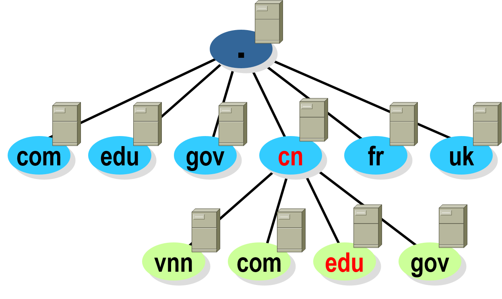

## 会话层

* #### 作用

  * 建立，维护和终止应用间的会话
    * 包括开始，停止和重新同步两台主机间的临时会话(rap session)
  * Checkpoint 检查点
    * 用来分割会话的各个部分，各个部分被称为对话(dialog)
    * 对话的分割是通信有序地初始化、终止和维护的过程

* #### 应用

  * NFS: Network File System，网络文件系统
  * SQL: Structured Query Language，结构化查询语言
  * RPC: Remote Procedure Call，远程过程调用
  * X Window System，X视窗系统
  * ASP: AppleTalk Session Protocol，AppleTalk会话协议
  * SCP: DNA Session Control Protocol，DNA(Digital Network Architecture，数字网络架构) 会话控制协议

  ​

## 表示层

* #### 作用

  * 负责将数据表示成接受设备可以理解的格式，有以下三个主要功能

    * 数据格式化

      如编码转换，图片格式，多媒体格式

    * 数据压缩

    * 数据加密

    ​

## 应用层

* #### 作用

  * 支持与具体应用的通信组件
  * 标识并建立目标通信对象的可用性
  * 同步协作的应用
  * 建立错误恢复协议
  * 负责数据完整性
  * 通过网络应用(network applications)为OSI模型的其余部分提供一个直接接口，或是通过独立应用提供非直接接口，如文字处理，电子表格，演示管理器(presentation managers)，网络重定向器

* HTTP: Hyper-Text Transfer Protocol，超文本传输协议

* FTP: File Transfer Protocol，文件传输协议

  * FTP是可靠的，面向连接的服务。基于TCP。
  * 21端口
  * 工作流程
    * 首先通过套接字建立控制连接
    * 然后建立数据连接，通过数据连接传输数据

* TFTP: Trivial File Transfer Protocol，一般文件传输协议

  * 无连接的服务。基于UDP。
  * 小且易于实现

* Telnet: 远程登录服务

  * 允许远程登录，然后通过命令行方式执行指令

* SMTP: Simple Mail Transfer Protocol，简单邮件传输协议

* POP3: Post Office Protocol 3，邮局协议3

  * SMTP和POP3都是通过TCP/IP来传输邮件的

  

* SNMP: Simple Network Management Protocol，简单网络管理协议

* DNS: Domain Name System，域名系统/Domain Name Server，域名服务器

  * 提供域名向IP转换的服务

  * 域名服务器是分层的，树状的结构

  * 如果当前DNS可以转换域名则返回结果，如果不行则向上层DNS发送请求

    

  

* TLD: Top Level Domain，顶级域名

  * 国家TLD

    .cn .us .uk

  * 通用TLD

    .com .net .org .edu .gov .mil .int .aero .biz .cat .coop .info .jobs .mobi .museum .name .pro .travel

  * 基础TLD

    .arpa 提供域名反查服务

* 应用层的传输方式

  * 一小段传输完成后自动断开连接
  * 维持连接直到用户手动断开