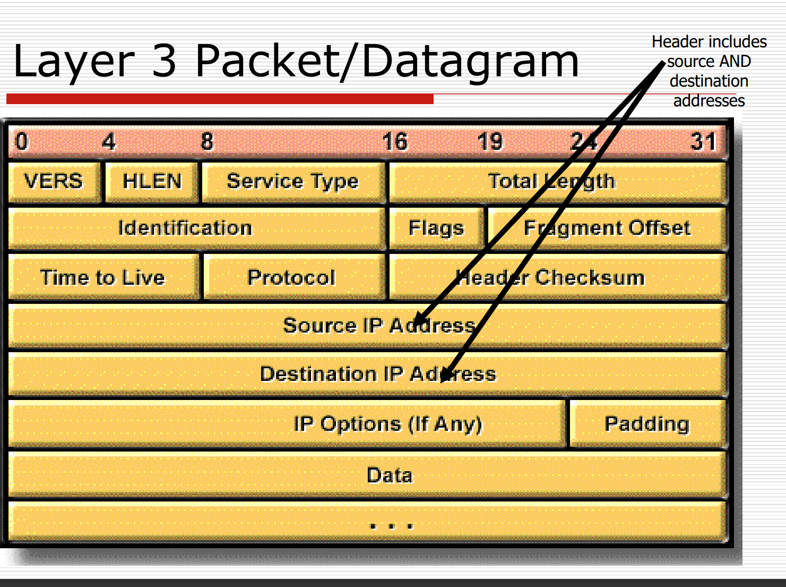
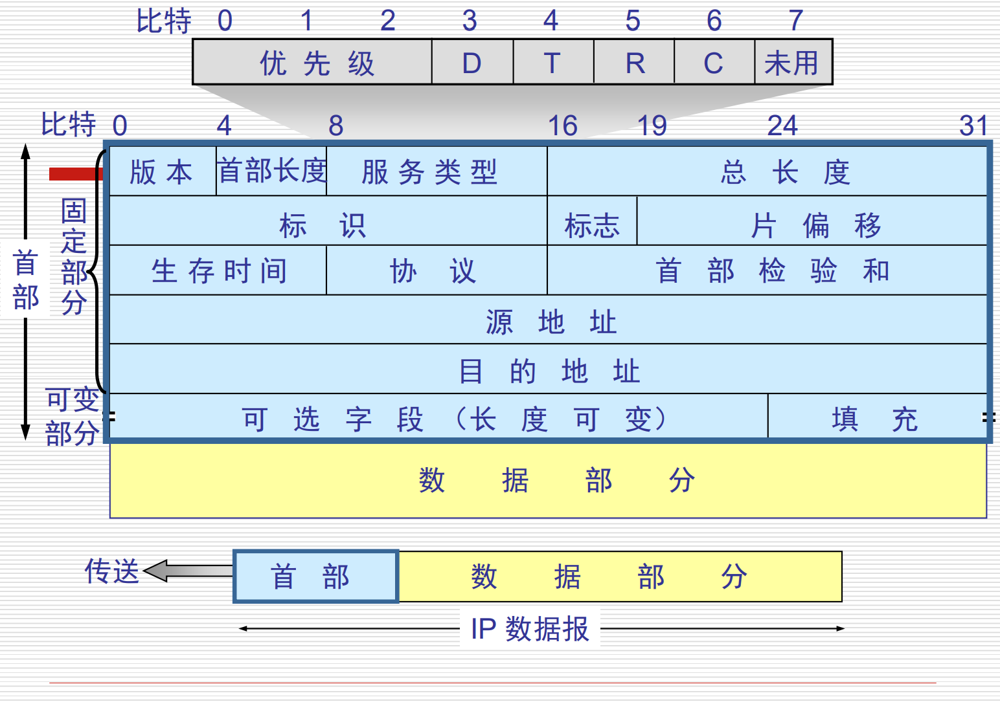
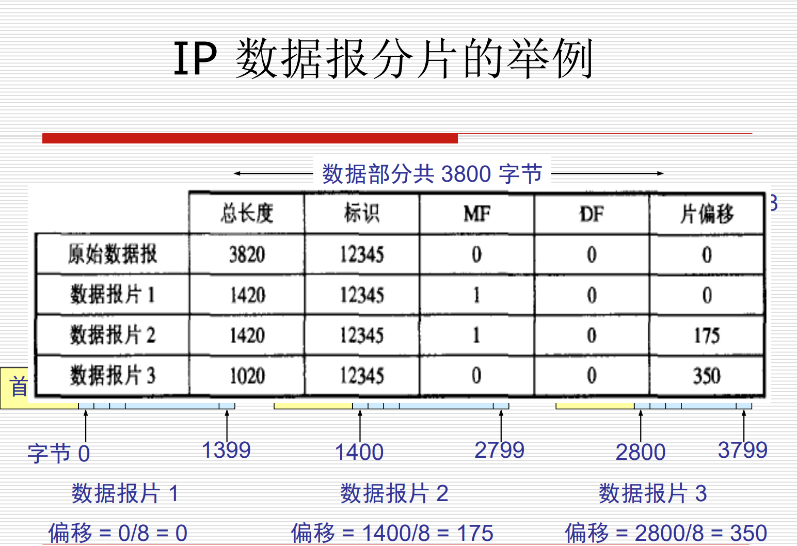

Layer#：Network Layer

Routing and  Addressing ...IP??

## 要做的事

 在不同的网段里面传输数据

采用分层寻址的方式，

分段网络和控制交通流

减少拥堵

和其他的网络进行交流

## 路由器

连接网段和网络

基于ip做出逻辑决策

确定最优路径

把数据报从传入接口切换到传出接口

## Packet

上面的背下来，有考试的要求。（注意先是源地址，后是目的地址）

- 版本，占4bit，指IP协议的版本

- 目前的IP协议版本号为4（IPv4）

- 首部长度4字节，表示ip报头的长度，一个单位是4字节，左右ip首部最大是60个字节

- 服务类型，8bit，目前没有被使用

- 总长度：16bit，指的是首部和数据的长度之和，单位是字节，所有最多是65535字节。总长度必须不超过最大传送单元MTU。

标识，16bit，是一个计数器，用来产生数据包的标识，802.3有标识，802.11有标识（有ack，所有要有标识）。。标识符（Identifier）——字段长度为16位，通常与标记字段和分段偏移字段一起用于数据包的分段。如果数据包原始长度超过数据包所要经过的数据链路的最大传输单元（MTU），那么必须将数据包分段为更小的数据包。
  > 例如，一个大小为5000字节的数据包在穿过网络时，如果遇到一条MTU为1500字节的数据链路，即数据帧最多容纳大小为1500字节的数据包。路由器需要在数据成帧之前将数据包分段成多个数据包，其中每个数据包长度不得超过1500字节；然后路由器在每片数据包的标识字段上打上相同的标记，以便接收设备可以识别出属于一个数据包的分段。

- 标志3biy最高位0，MF为0最后一个分片

- 片偏移，以8个bit为偏移单位，

用于指明分段起始点相对于报头起始点的偏移量。头字节报片除以2

•　生存时间（Time To Live，TTL）——字段长度为8位，在最初创建数据包时TTL即被设置为某个特定值。当数据包逐个沿路由器被传输时，每台路由器都会降低TTL的数值。当TTL值减为0时，路由器将会丢弃该数据包并向源点发送错误信息。这种方法可以防止数据包在网络上无休止地被传输。

- 协议，就是制定是哪种协议

•　报头校验和（Header Checksum）——是针对IP报头的纠错字段。校验和不计算被封装的数据，UDP、TCP和ICMP都有各自的校验和。报头校验和字段包含一个16位二进制补码和，这是由数据包发送者计算得到的。接收者将连同原始校验和重新进行16位二进制补码和计算。如果数据包传输中没有发生错误，那么结果应该16位全部为1。回忆前面所述内容，由于每台路由器都会降低数据包的TTL值，所以每台路由器都必须重新计算校验和。

## IP地址

有network和host

### Classfull routing&VLSM（变长子网掩码）

### VLSM（Variable Length Subnet Mask）

经典路由的无子网掩码，会有浪费，所有有变长子网掩码

1. VLSM允许组织在同一网络地址空间内使用多个子网掩码。(使用路由器使用的子网掩码)
2. 实施VLSM通常被称为"子网划分"，可用于最大化寻址效率。
3. VLSM是有助于缩小IPv4和IPv6之间差距的修改(modifications)之一。

> 如果我的子网段的主机数比较多，就可以使用多一点的子网掩码，如果网段的主机数目比较少，可以使用稍大一点的子网掩码。
>
> IOS ver12.0是可以使用的，因为不同的子网掩码可以进行区分本网段

斜杠表示前面有多少的网络位，

## VLSM

先满足大的要求

只能分配没有使用的划分

###  VLSM的优点

1. 高效使用IP地址
2. 更好的路由聚合(aggregation):构建超网

### VLSM的缺点

会导致地址空间的浪费:广播地址和网络号都无法被使用。
过去，建议不要使用第一个和最后一个子网。但是我们可以使用Cisco IOS ver12.0中的子网0。
从IOS ver12.0起，Cisco路由器默认使用零子网。
如果想要禁止零子网，使用该指令:router(config)#no ip subnet-zero()

## 路由聚集

把多个netword 的信息聚集成一个信息

把相同前面的聚集成一个子网，

好处：可以隔离拓扑，降低路由表的条数
