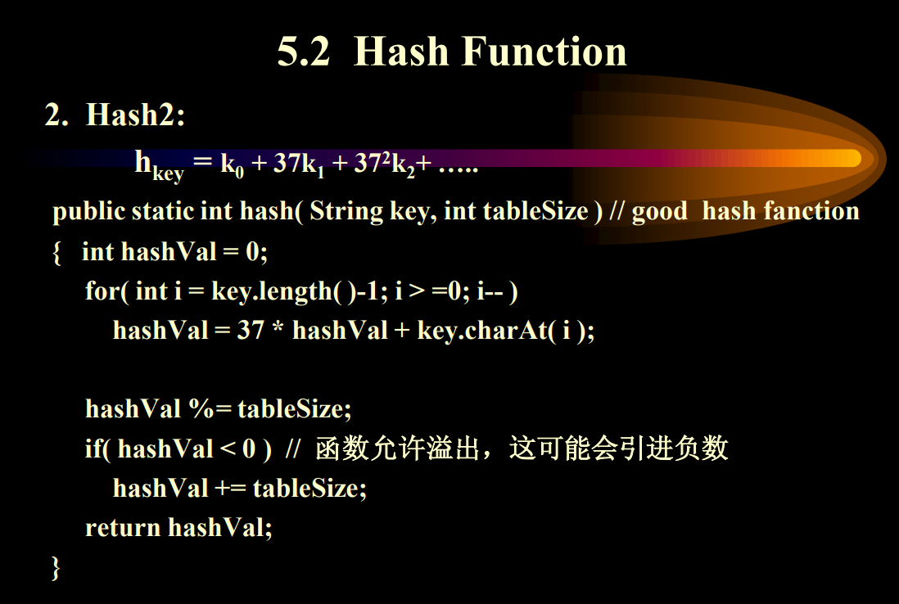

# 哈希表

## 概念

散列函数（Hash function）

-Address=hash(key)

散列表（Hash Table）

碰撞频率:α=n/b

n哈希表的元素的数量

n哈希表的槽位

## 常用的哈希函数

### 

	

## 如何解决冲突

线性探测开放地址法Open address

[(27条消息) 哈希查找算法之线性探测法（开放地址法）_玖尾猫的博客-CSDN博客_线性探测法](https://blog.csdn.net/m0_45901455/article/details/126148985)

如果位置被占了，看后面的位置有没有位置。	下面是一些例子。

问题1：堆积：不同的同义词表合围1张，增加了插入查找的事件。

不能直接删除线性表的数据，而是删除标记

代码实现：

有2个数组：ht数组和empty数组

empty数组用来表示删除情况

