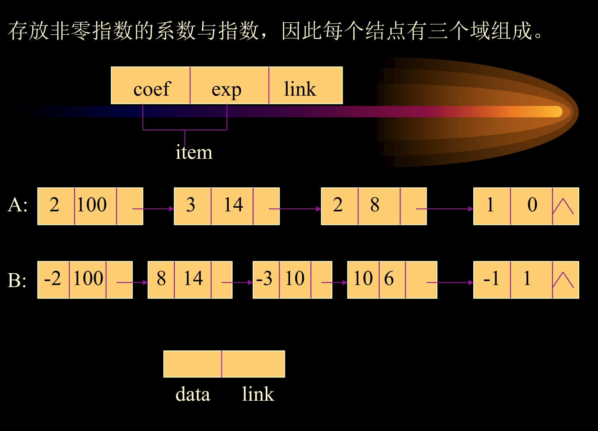
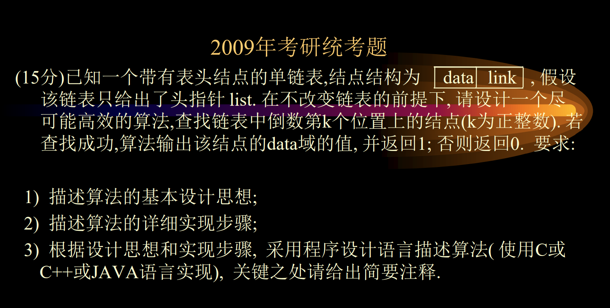
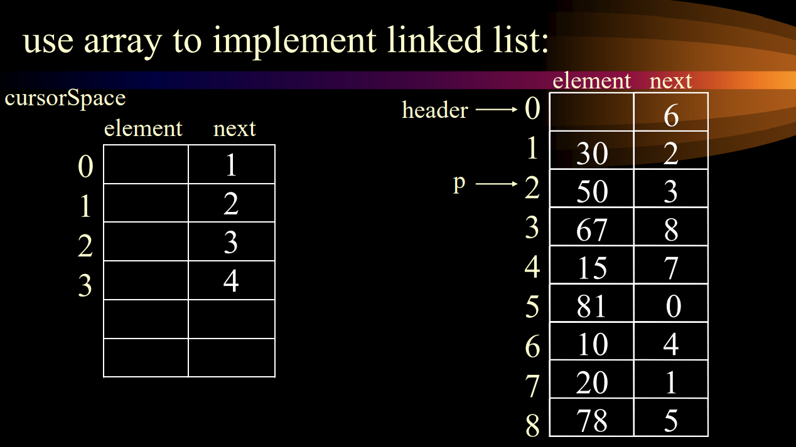
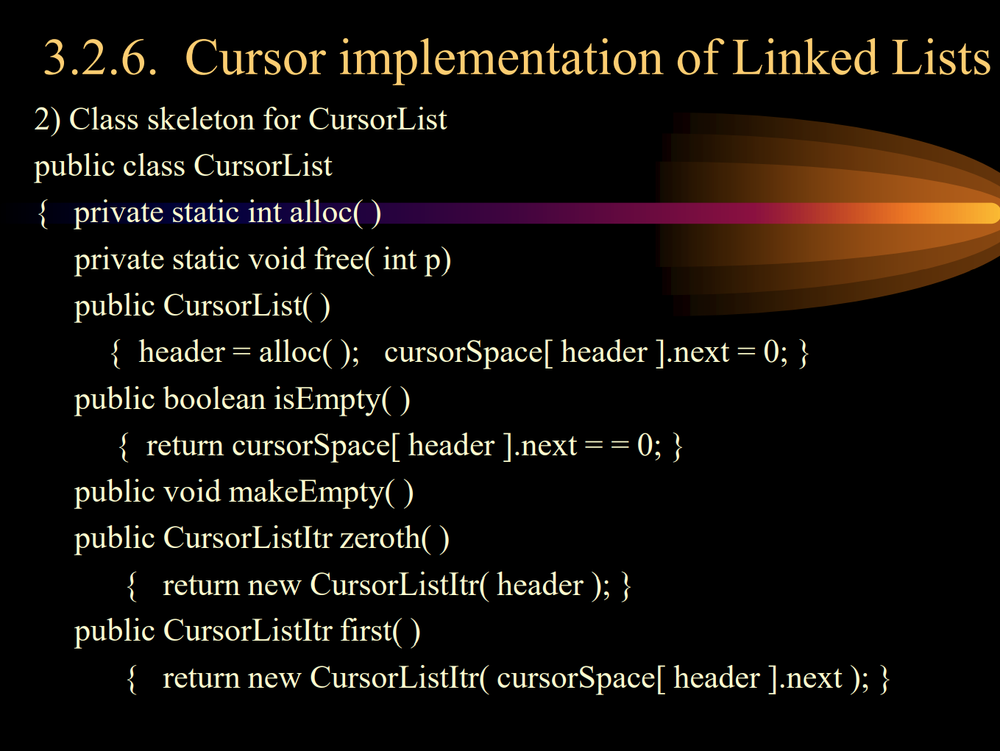
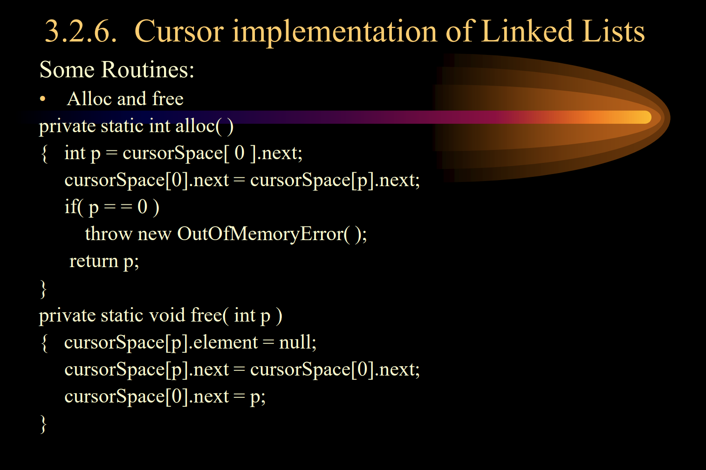
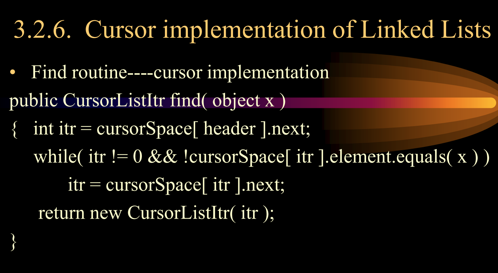
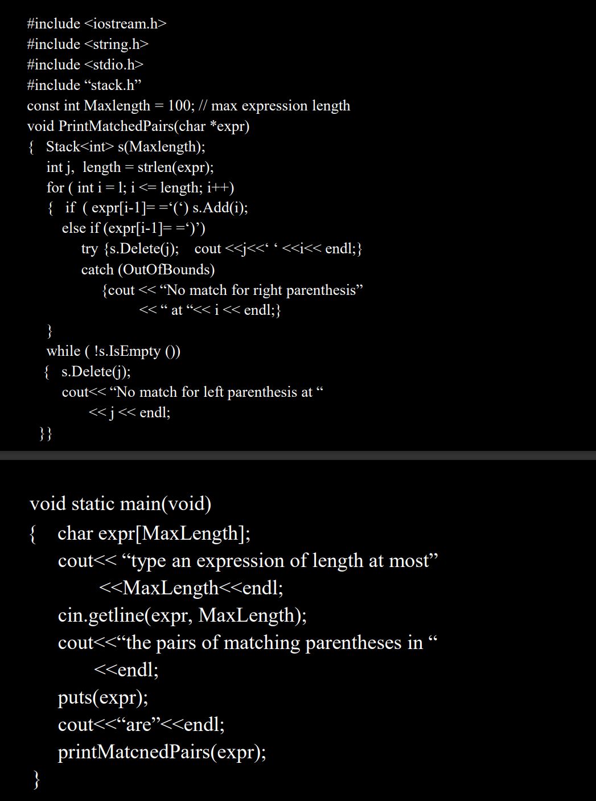

## ADTS

物理层和逻辑层

数据结构：数据集，数据之间的关系

线性逻辑层：

学习：Java标准库，set，

#### 头结点，

第一个表头节点，是不放元素的，

表头节点的next是空，表示该链表是null节点，坏处浪费一个节点，好处会减少代码量，可以让所有算法的结构都是一样的。

使得代码跟加清晰


节点的类，

代表表本本身的


游标类，可以有单链表的各种操作

最后的节点是个NULL，开头是一个表头节点。

线性表逻辑层的，

> 使用库的方法
>
> 先猜逻辑层有多少逻辑层，然后看一下自己猜的和实际的库有哪些区别

顺序查找，查找前一个，插入

## 单链表的变形

### doubly  Linked Lists


本质是2个双链表

```java
class DoublyLinkdedList{
	DoublyLinkedList next;
	DoublyLinkedList previous;
	Object element;
}
//双链表的删除操作不需要知道previousNode
p=firstNode;
firstNode=p.right;
firstNode.left=null;//只需要改fitstNode.left;
//删除双链表非头节点代码
p.left.right=p.rigth;
p.right.left=p.left;
//insert(0,f)
firstNode.left=newNode;
newNode.rigth=firstNode;
newNode.left=null;
firstNode=newNode;
//insert(2,f),插到第二个位置，相当于插到，2的前面，让自己成为2
newNode.left=beforeNode;
newNode.right=beforeNode.right;
beforeNode.rigth.left-newNode;
beforeNode.right=newNode;
```


## Doubly Linked Circular Lists循环双向表头列表


## 多项式处理

用数组来储存，2种情况，一种是数组的下标就是次数，一种是记录下表和数组




多项式加法链表实现

A,B单链表一直往后面走，pc指向C链表的最后的一个节点


指数不等时候，把结果大的放到末尾。、

当有链表为空，另一个链表结果之间连接到结果链表上面。



data link记录变量的名字。倒数第k上的节点。

算法的设计思想：一个指针走k步，然后第二个指针开始走，然后一起走。

描写算法的详细过程：

写程序：

## 数组，单链表

数组好根据下表来访问对象，单链表好插入删除操作

可以将数组和单链表结合起来。（**静态链表**）



next是数组的下表，element是值。优点，可以用数组的下表来拿数据

## 内存的管理

用户的代码，应用程序的代码，类方法（加static只有一个）

当分配内存时候，内存不归系统管



//应用系统启动，向系统要一块内存，

//isEmpty()内存清空

//zeroth，拿取应用程序的表头节点

//first,带表头节点链表的第一关数据节点。



系统的代码

```
alloc()把系统的空内存取一个出来。返回给用户的节点的下表。
```



Radix Sort（基数排序）

看多少进制，10进制有10个桶，

1.根据个位数放到指定的位置。（链表连接的方式）

把每个桶的数值串起来，再根据十位数排一遍

往下推

## 栈的操作

栈的应用



数组实现的话用圈来实现

数值写在前面
