## JDBC快速入门

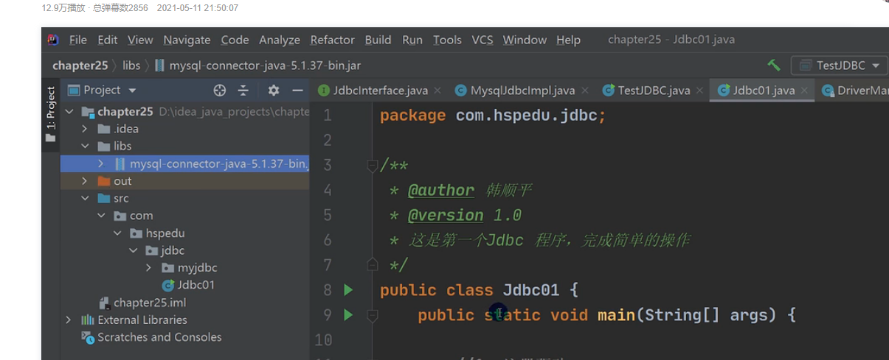

前置项目，创造一个文件夹，将mysql。jar放到文件夹里面，并且选择add to proje

- 注册驱动

  ```java
  Driver diver=new Driver();//创建一个driver对象
  ```

- 获取连接

```java
String url="xxxxxxxxxxxxxxxxxx";//表示是哪个数据库
```

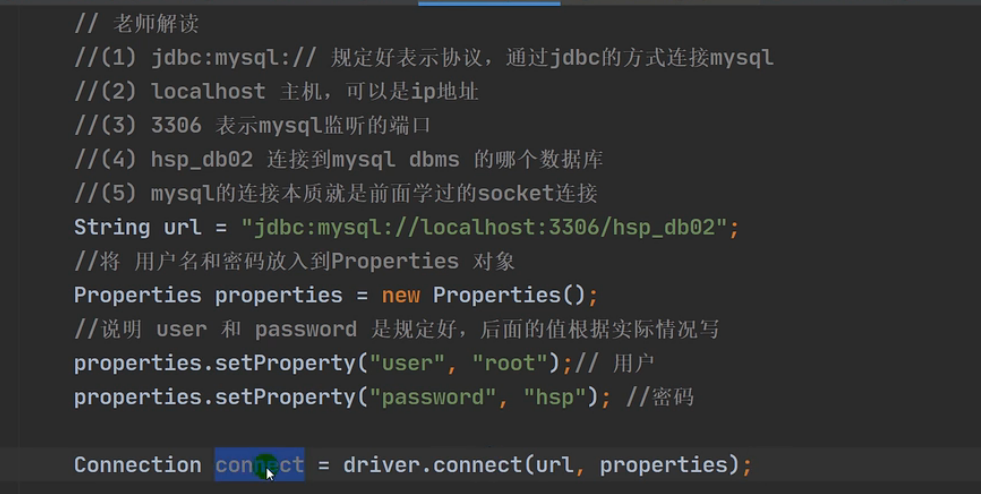

URL加上有用户和密码的properties对象

可以来连接数据库

`driver.connect`返回一个c`onnection`对象

connection对象调用`creatStatement`可以返回一个Statement对象，

Statement对象可以用来执行静态的SQL语句并返回其生成的结果的对象

- 执行增删改查

- 释放资源

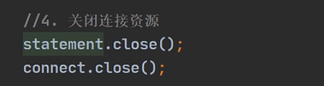

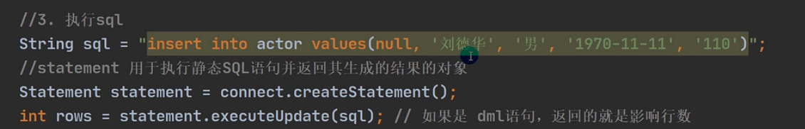

### 方式2用反射加载的方式更加的方便

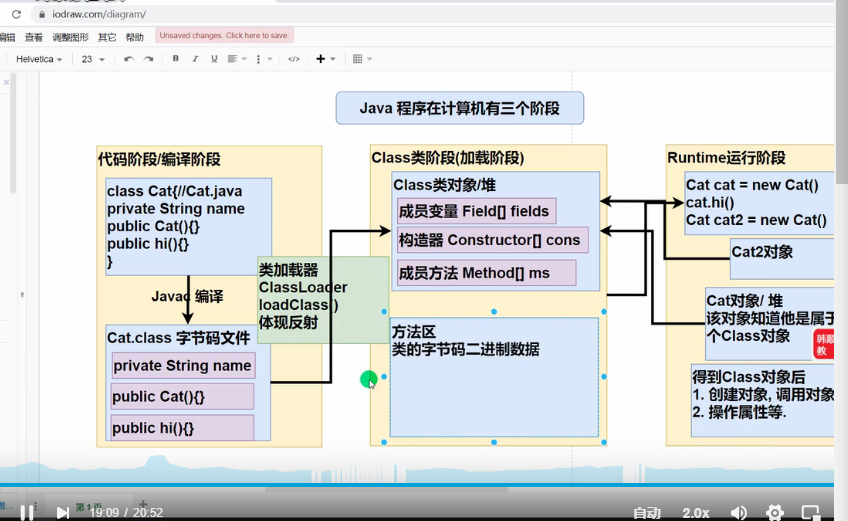

Class是系统的classLoader创建的，在堆里面了

所有都经过ClassLoader加载Class类，对于每个类的Class对象，内存只有一份，每个类只加载一次

每一个对象都知道自己是属于那一个class对象

Class类可以完整得到一个类的完整结构。


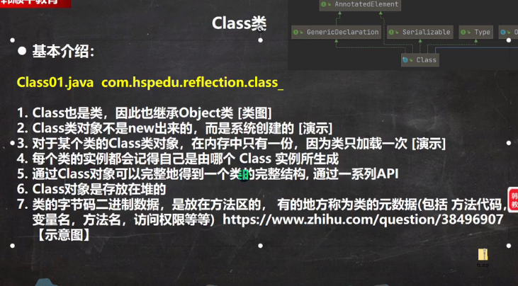

```
ClassNotFoundException//如果Class.forName(cls)cls没有这个类
//getClass()得到类的名字
//getPackage得到类的名字
Cls.newInstance()通过cls创造对象实例
Field brand=cls.getField("brand");
brand.get(car);//就可以得到一个值
brand.set(car,"sdadsadsa");//可以设置一个值
Field[] fields=cls.getFields();//得到所有的字段属性
```

```
//反射的方式，动态的加载类，
```

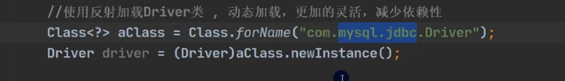

### 第三种方式，使用driverMannger，可以少使用一个对象

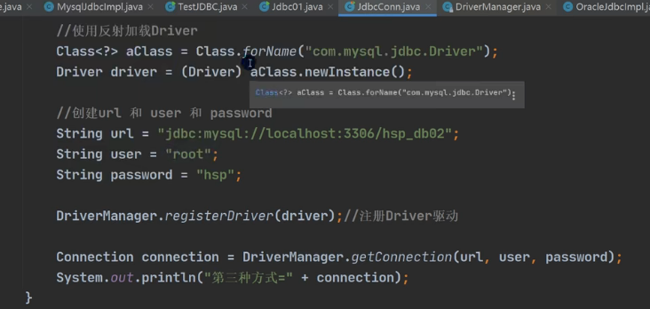

### 第四种

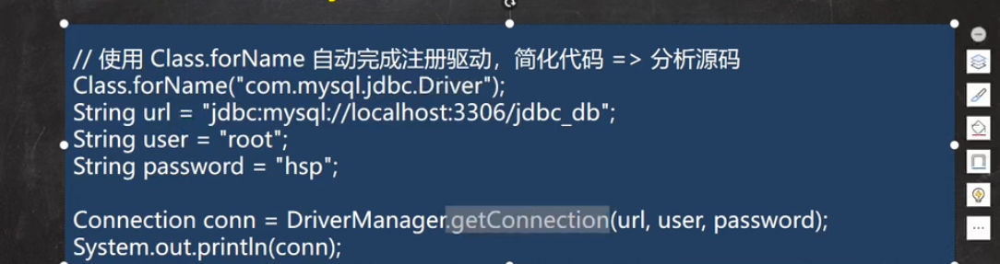

Class.forName会自动注册驱动代码

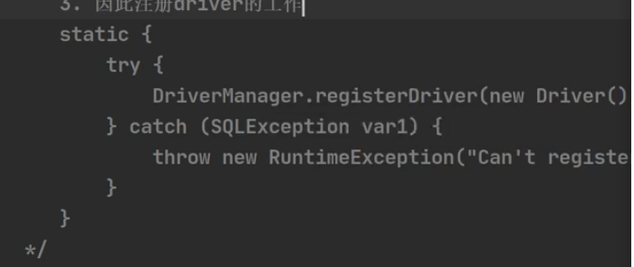

底层有一个静态加载块，直接就好了

Class.forName会创造一个new

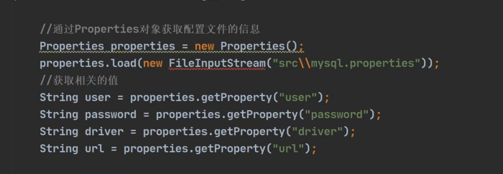

配置文件的加载方式

1. 

```
statement.executeQuery顾名思义，执行查询
会返回一个ResultSet的类型
```

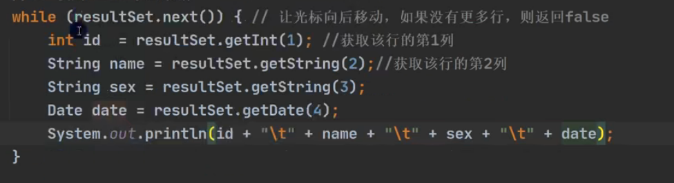

一开始resultSet指向表头的前一行，next会往后移动一行，如果没有就不移动，

resultSet.getDate（）用来取resultSet的多少列

为了防止SQL注入、


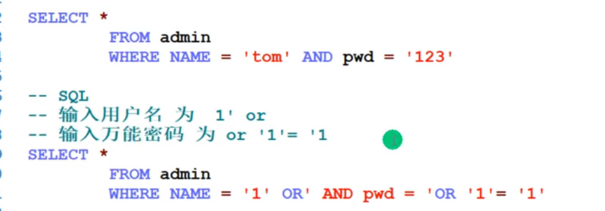

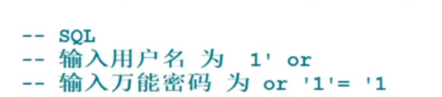

```
上面的注入的方式
```

使用prepareStatement

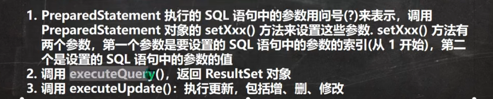

、