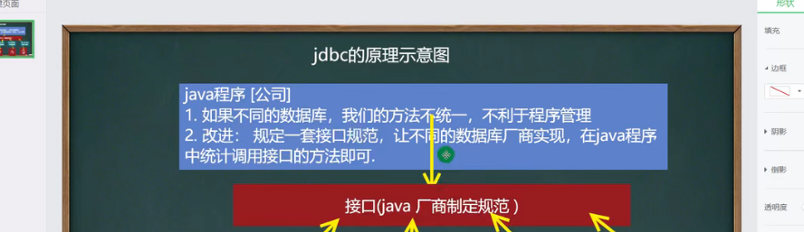

---

title: Spring

abstract: (可以为空)

url: （可以为空，自动提取默认的title的拼音，个人建议为空）

date: （可以为空，默认为上传的时间）

category:
- Note

tags:
- bala（或者为空）

---

```xml
<!-- https://mvnrepository.com/artifact/org.springframework/spring-webmvc -->
<dependency>
    <groupId>org.springframework</groupId>
    <artifactId>spring-webmvc</artifactId>
    <version>5.2.22.RELEASE</version>
</dependency>
<!-- https://mvnrepository.com/artifact/org.springframework/spring-webmvc -->
<dependency>
    <groupId>org.springframework</groupId>
    <artifactId>spring-jdbc</artifactId>
    <version>5.2.22.RELEASE</version>
</dependency>
```

- 创建 ApplicationContext 对象时使用了 ClassPathXmlApplicationContext 类，这个类用于加载 Spring 配置文件、创建和初始化所有对象（Bean）。
- ApplicationContext.getBean() 方法用来获取 Bean，该方法返回值类型为 Object，通过强制类型转换为 HelloWorld 的实例对象，调用其中的 getMessage() 方法。

```java
package com.mikumifa;

import org.springframework.context.ApplicationContext;
import org.springframework.context.support.ClassPathXmlApplicationContext;

public class test {
    public static void main(String[] args) {
        ApplicationContext context = new ClassPathXmlApplicationContext("beans.xml");
        hello h = context.getBean("hello",hello.class);
        System.out.println(h.getStr());
    }
}

```

## 控制反转（IoC）

## 依赖注入（DI）

我们知道，控制反转核心思想就是由 Spring 负责对象的创建。在对象创建过程中，Spring 会自动根据依赖关系，将它依赖的对象注入到当前对象中，这就是所谓的“依赖注入”。

IoC 底层通过工厂模式、Java 的反射机制、XML 解析等技术，将代码的耦合度降低到最低限度，其主要步骤如下。

1. 在配置文件（例如 Bean.xml）中，对各个对象以及它们之间的依赖关系进行配置；
2. 我们可以把 IoC 容器当做一个工厂，这个工厂的产品就是 Spring Bean；
3. 容器启动时会加载并解析这些配置文件，得到对象的基本信息以及它们之间的依赖关系；
4. IoC 利用 Java 的反射机制，根据类名生成相应的对象（即 Spring Bean），并根据依赖关系将这个对象注入到依赖它的对象中。

## spring 框架为我们提供了两种不同类型 IoC 容器，它们分别是 BeanFactory 和 ApplicationContext。

BeanFactory 采用懒加载（lazy-load）机制，容器在加载配置文件时并不会立刻创建 Java 对象，只有程序中获取（使用）这个对对象时才会创建。


```
public static void main(String[] args) {
    BeanFactory context = new ClassPathXmlApplicationContext("Beans.xml");
    HelloWorld obj = context.getBean("helloWorld", HelloWorld.class);
    obj.getMessage();
}
```

### ApplicationContext

ApplicationContext 是 BeanFactory 接口的子接口，是对 BeanFactory 的扩展。ApplicationContext 在 BeanFactory 的基础上增加了许多企业级的功能，例如 AOP（面向切面编程）、国际化、事务支持等。

ApplicationContext 接口有两个常用的实现类，具体如下表。


| 实现类                          | 描述                                                         | 示例代码                                                     |
| ------------------------------- | ------------------------------------------------------------ | ------------------------------------------------------------ |
| ClassPathXmlApplicationContext  | 加载类路径 ClassPath 下指定的 XML 配置文件，并完成 ApplicationContext 的实例化工作 | ApplicationContext applicationContext = new ClassPathXmlApplicationContext(String configLocation); |
| FileSystemXmlApplicationContext | 加载指定的文件系统路径中指定的 XML 配置文件，并完成 ApplicationContext 的实例化工作 | ApplicationContext applicationContext = new FileSystemXmlApplicationContext(String configLocation); |

由 Spring IoC 容器管理的对象称为 Bean，Bean 根据 Spring 配置文件中的信息创建。

Spring 配置文件支持两种格式，即 XML 文件格式和 Properties 文件格式。

- Properties 配置文件主要以 key-value 键值对的形式存在，只能赋值，不能进行其他操作，适用于简单的属性配置。
- XML 配置文件采用树形结构，结构清晰，相较于 Properties 文件更加灵活。但是 XML 配置比较繁琐，适用于大型的复杂的项目。

，该元素包含了多个子元素 <bean>。每一个 <bean> 元素都定义了一个 Bean，并描述了该 Bean 是如何被装配到 Spring 容器中的。

```xml
<?xml version="1.0" encoding="UTF-8"?>
<beans xmlns="http://www.springframework.org/schema/beans"
       xmlns:xsi="http://www.w3.org/2001/XMLSchema-instance"
       xsi:schemaLocation="http://www.springframework.org/schema/beans
   http://www.springframework.org/schema/beans/spring-beans-3.0.xsd">
    <bean id="helloWorld" class="net.biancheng.c.HelloWorld">
        <property name="message" value="Hello World!"/>
    </bean>
</beans>
```

| 属性名称        | 描述                                                         |
| --------------- | ------------------------------------------------------------ |
| id              | Bean 的唯一标识符，Spring IoC 容器对 Bean 的配置和管理都通过该属性完成。id 的值必须以字母开始，可以使用字母、数字、下划线等符号。 |
| name            | 该属性表示 Bean 的名称，我**们可以通过 name 属性为同一个 Bean 同时指定多个名称**，每个名称之间用逗号或分号隔开。Spring 容器可以通过 name 属性配置和管理容器中的 Bean。 |
| class           | 该属性指定了 Bean 的具体实现类，它必须是一个完整的类名，即类的全限定名。 |
| scope           | 表示 Bean 的作用域，属性值可以为 singleton（单例）、prototype（原型）、request、session 和 global Session。默认值是 singleton。 |
| constructor-arg | <bean> 元素的子元素，我们可以通过该元素，将构造参数传入，以实现 Bean 的实例化。该元素的 index 属性指定构造参数的序号（从 0 开始），type 属性指定构造参数的类型。 |
| property        | <bean>元素的子元素，用于调用 Bean 实例中的 setter 方法对属性进行赋值，从而完成属性的注入。该元素的 name 属性用于指定 Bean 实例中相应的属性名。 |
| ref             | <property> 和 <constructor-arg> 等元素的子元索，用于指定对某个 Bean 实例的引用，即 <bean> 元素中的 id 或 name 属性。 |
| value           | <property> 和 <constractor-arg> 等元素的子元素，用于直接指定一个常量值。 |
| list            | 用于封装 List 或数组类型的属性注入。                         |
| set             | 用于封装 Set 类型的属性注入。                                |
| map             | 用于封装 Map 类型的属性注入。                                |
| entry           | <map> 元素的子元素，用于设置一个键值对。其 key 属性指定字符串类型的键值，ref 或 value 子元素指定其值。 |
| init-method     | 容器加载 Bean 时调用该方法，类似于 Servlet 中的 init() 方法  |
| destroy-method  | 容器删除 Bean 时调用该方法，类似于 Servlet 中的 destroy() 方法。该方法只在 scope=singleton 时有效 |
| lazy-init       | 懒加载，值为 true，容**器在首次请求时才会创建 Bean 实例**；值为 false，容器在启动时创建 Bean 实例。该方法只在 scope=singleton 时有效 |

## 构造函数注入

我们可以通过 Bean 的带参构造函数，以实现 Bean 的属性注入。

使用构造函数实现属性注入大致步骤如下：

1. 在 Bean 中添加一个有参构造函数，构造函数内的每一个参数代表一个需要注入的属性；

2. 在 Spring 的 XML 配置文件中，通过 <beans> 及其子元素 <bean> 对 Bean 进行定义；

3. 在 <bean> 元素内使用 <constructor-arg> 元素，对构造函数内的属性进行赋值，Bean 的构造函数内有多少参数，就需要使用多少个 <constructor-arg> 元素。 

   

   

   src 目录下创建 Spring 配置文件 Beans.xml，配置如下。

   ```
   <?xml version="1.0" encoding="UTF-8"?>
   <beans xmlns="http://www.springframework.org/schema/beans"
          xmlns:xsi="http://www.w3.org/2001/XMLSchema-instance"
          xsi:schemaLocation="http://www.springframework.org/schema/beans
      http://www.springframework.org/schema/beans/spring-beans-3.0.xsd">
       <bean id="student" class="net.biancheng.c.Student">
           <constructor-arg name="id" value="2"></constructor-arg>
           <constructor-arg name="name" value="李四"></constructor-arg>
           <constructor-arg name="grade" ref="grade"></constructor-arg>
       </bean>
       <bean id="grade" class="net.biancheng.c.Grade">
           <constructor-arg name="gradeId" value="4"></constructor-arg>
           <constructor-arg name="gradeName" value="四年级"></constructor-arg>
       </bean>
   </beans>
   ```

   

##  setter 注入(先构造注入后set注入)

使用 setter 注入的方式进行属性注入，大致步骤如下：

1. 在 Bean 中提供一个默认的无参构造函数（在没有其他带参构造函数的情况下，可省略），并为所有需要注入的属性提供一个 setXxx() 方法；
2. 在 Spring 的 XML 配置文件中，使用 <beans> 及其子元素 <bean> 对 Bean 进行定义；
3. 在 <bean> 元素内使用 <property> 元素对各个属性进行赋值。


```
<?xml version="1.0" encoding="UTF-8"?>
<beans xmlns="http://www.springframework.org/schema/beans"
       xmlns:xsi="http://www.w3.org/2001/XMLSchema-instance"
       xsi:schemaLocation="http://www.springframework.org/schema/beans
   http://www.springframework.org/schema/beans/spring-beans-3.0.xsd">
    <bean id="student" class="net.biancheng.c.Student">
        <!--使用 property 元素完成属性注入
            name: 类中的属性名称，例如 id,name
            value: 向属性注入的值 例如 学生的 id 为 1，name 为张三
        -->
        <property name="id" value="1"></property>
        <property name="name" value="张三"></property>
        <property name="grade" ref="grade"></property>
    </bean>
    <bean id="grade" class="net.biancheng.c.Grade">
        <property name="gradeId" value="3"></property>
        <property name="gradeName" value="三年级"></property>
    </bean>
</beans>
```

## 短命名空间注入

```xml
xmlns:p="http://www.springframework.org/schema/p"
```

配置文件里面导入

| 短命名空间 | 简化的 XML 配置                        | 说明                                     |
| ---------- | -------------------------------------- | ---------------------------------------- |
| p 命名空间 | <bean> 元素中嵌套的 <property> 元素    | 是 setter 方式属性注入的一种快捷实现方式 |
| c 命名空间 | <bean> 元素中嵌套的 <constructor> 元素 | 是构造函数属性注入的一种快捷实现方式     |

简化

```
<bean id="Bean 唯一标志符" class="包名+类名" p:普通属性="普通属性值" p:对象属性-ref="对象的引用">
```

```
<beans xmlns="http://www.springframework.org/schema/beans"
       xmlns:xsi="http://www.w3.org/2001/XMLSchema-instance"
       xmlns:p="http://www.springframework.org/schema/p"
       xsi:schemaLocation="http://www.springframework.org/schema/beans
   http://www.springframework.org/schema/beans/spring-beans-3.0.xsd">
    <bean id="employee" class="net.biancheng.c.Employee" p:empName="小李" p:dept-ref="dept" p:empNo="22222"></bean>
    <bean id="dept" class="net.biancheng.c.Dept" p:deptNo="1111" p:deptName="技术部"></bean>
</beans>
```

#### c 命名空间注入

```
xmlns:c="http://www.springframework.org/schema/c"
```

```
<bean id="Bean 唯一标志符" class="包名+类名" c:普通属性="普通属性值" c:对象属性-ref="对象的引用">
```

```
<beans xmlns="http://www.springframework.org/schema/beans"
       xmlns:xsi="http://www.w3.org/2001/XMLSchema-instance"
       xmlns:c="http://www.springframework.org/schema/c"
       xsi:schemaLocation="http://www.springframework.org/schema/beans
   http://www.springframework.org/schema/beans/spring-beans-3.0.xsd">
    <bean id="employee" class="net.biancheng.c.Employee" c:empName="小胡" c:dept-ref="dept" c:empNo="999"></bean>
    <bean id="dept" class="net.biancheng.c.Dept" c:deptNo="2222" c:deptName="测试部"></bean>
</beans>	
```

## Spring父工程

```xml
<parent>
    <groupId>org.springframework.boot</groupId>
    <artifactId>spring-boot-starter-parent</artifactId>
    <version>2.7.5</version>
</parent>
```

```xml
<dependencies>
    <dependency>
        <groupId>org.springframework.boot</groupId>
        <artifactId>spring-boot-starter-web</artifactId>
    </dependency>
</dependencies>
```

写一个controller和引导类

Spring的引导类是项目的入口，运行main方法就可以启动项目

使用SpringBoot和Spring构建的项目，业务代码的编写方式一致

@RestController注解，代表返回的是json格式的数据



```java
// @RequestMapping注解：处理请求和控制器方法之间的映射关系
// @RequestMapping注解的value属性可以通过请求地址匹配请求，/表示的当前工程的上下文路径
// localhost:8080/springMVC/
@RequestMapping("/")
public String index() {
    //设置视图名称
    return "index";
}
```

## **1、dao层：**数据访问层

dao层属于一种比较底层，比较基础的操作，具体到对于某个表的增删改查，也就是说某个DAO一定是和数据库的某一张表一 一对应的，其中封装了增删改查基本操作，建议DAO只做[原子操作](https://so.csdn.net/so/search?q=原子操作&spm=1001.2101.3001.7020)，增删改查。

负责与数据库进行联络的一些任务都封装在此，dao层的设计首先是设计dao层的接口，然后在Spring的配置文件中定义此接口的实现类，然后就可以再模块中调用此接口来进行数据业务的处理，而不用关心此接口的具体实现类是哪个类，显得结构非常清晰，dao层的数据源配置，以及有关数据库连接参数都在Spring配置文件中进行配置。

## **2、service层：服务层**

粗略的理解就是对一个或多个DAO进行的再次封装，封装成一个服务，所以这里也就不会是一个原子操作了，需要事物控制。

service层主要负责业务模块的应用逻辑应用设计。同样是首先设计接口，再设计其实现类，接着再Spring的配置文件中配置其实现的关联。这样我们就可以在应用中调用service接口来进行业务处理。service层的业务实，具体要调用已经定义的dao层接口，封装service层业务逻辑有利于通用的业务逻辑的独立性和重复利用性。程序显得非常简洁。

## **3、controller层**

Controler负责请求转发，接受页面过来的参数，传给Service处理，接到返回值，再传给页面。

controller层负责具体的业务模块流程的控制，在此层要调用service层的接口来控制业务流程，控制的配置也同样是在Spring的配置文件里进行，针对具体的业务流程，会有不同的控制器。我们具体的设计过程可以将流程进行抽象归纳，设计出可以重复利用的子单元流程模块。这样不仅使程序结构变得清晰，也大大减少了代码量。

## 关系

Service层是建立在DAO层之上的，建立了DAO层后才可以建立Service层，而Service层又是在Controller层之下的，因而Service层应该既调用DAO层的接口，又要提供接口给Controller层的类来进行调用，它刚好处于一个中间层的位置。每个模型都有一个Service接口，每个接口分别封装各自的业务处理方法。 
