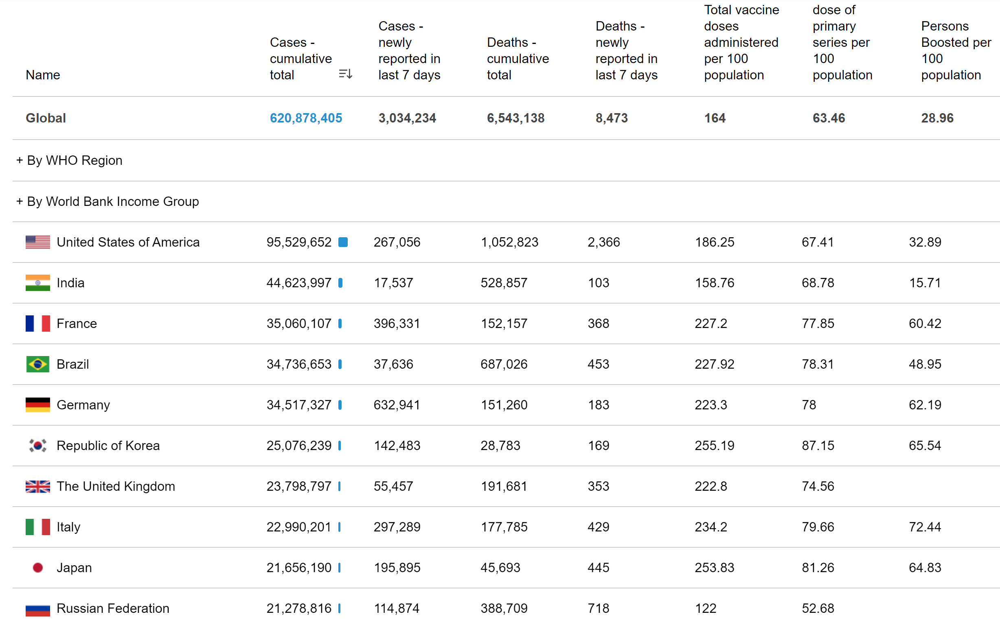
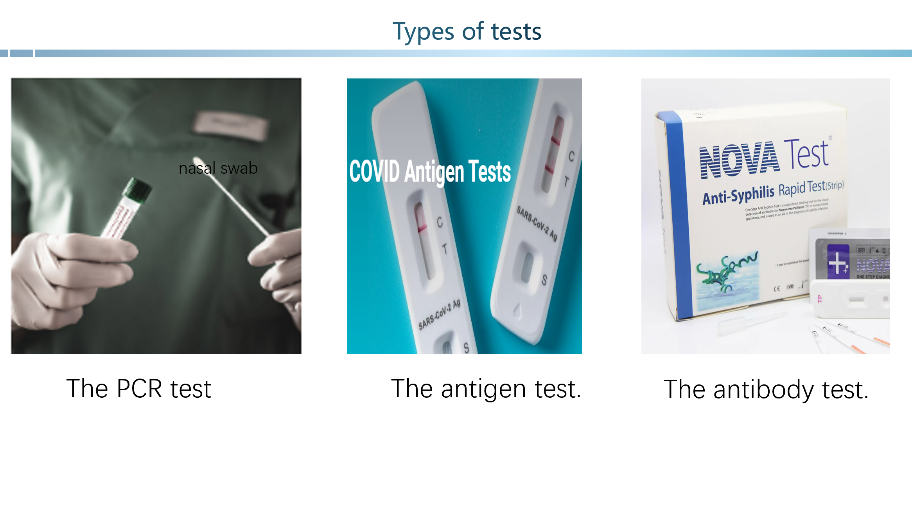
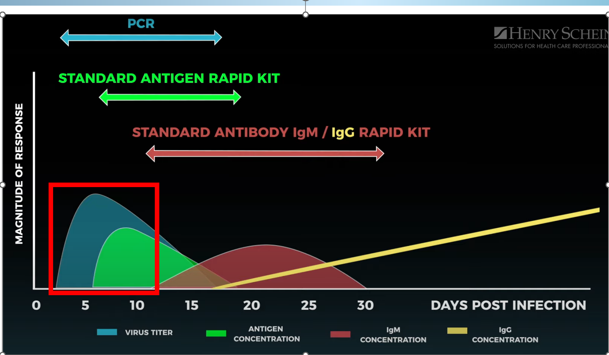
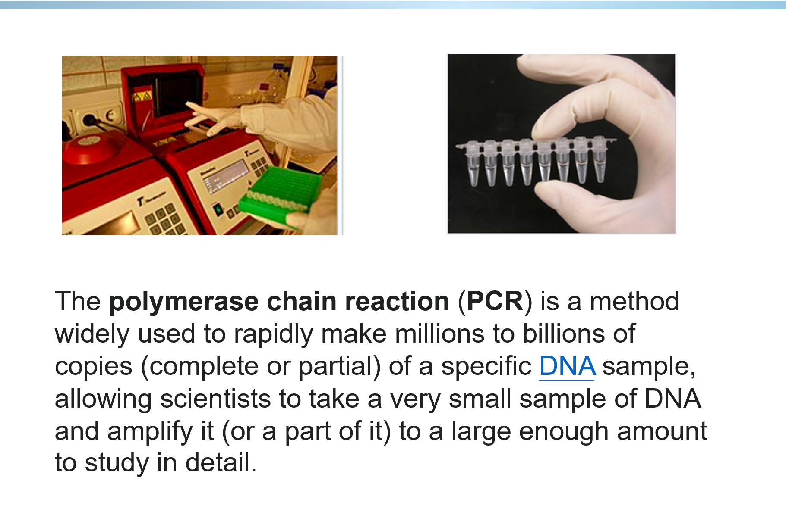
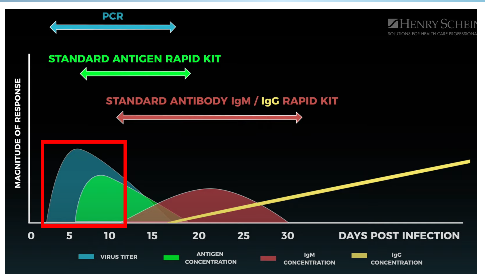

**Coronavirus disease 2019** (**COVID-19**) is a [contagious disease](https://en.wikipedia.org/wiki/Contagious_disease) caused by a [virus](https://en.wikipedia.org/wiki/Virus), the [severe acute respiratory syndrome coronavirus 2](https://en.wikipedia.org/wiki/Severe_acute_respiratory_syndrome_coronavirus_2) (SARS-CoV-2). The first known case was [identified in Wuhan](https://en.wikipedia.org/wiki/COVID-19_pandemic_in_Hubei), China, in December 2019.[[7\]](https://en.wikipedia.org/wiki/COVID-19#cite_note-WSJ-20210226-7) The disease quickly spread worldwide, resulting in the [COVID-19 pandemic](https://en.wikipedia.org/wiki/COVID-19_pandemic).

the truth is we don't know how to properly treat, diagnose or screen the patients that we're dealing with at the frontline. It creates a lot of anxiety, concern and uncertainty about where things are going and how we're going to be able to treat them to make them get better. The most important thing for us is accurate and reliable.

 **There are three types of tests the PCR test, the antigen test.** 

  The PCR test, that's where you take a nasal swab, deep into the nose or the throat and then you process looking for a molecular evidence. Antigen test, also nose swab or throat. 

 Look this grape, we can find that the level of virus titer the highest. As a result, It is the best choice to detect its level to judge who is ill or not.

 what's the PCR? We all learn it two years ago, when we are in high school. let's review it. The **polymerase** **chain reaction** (**PCR**) is a method widely used to rapidly make millions to billions of copies (complete or partial) of a specific [DNA](https://en.wikipedia.org/wiki/DNA) sample, allowing scientists to take a very small sample of DNA and amplify it (or a part of it) to a large enough amount to study in detail.

 The processes of denaturation, annealing and elongation constitute a single cycle. Multiple cycles are required to amplify the DNA target to millions of copies. 

 By two weeks into the illness, the PCR test is going down. The antigen test is really not reliable until you start to have symptoms. 

 let's come back to this grape, we know that PCR test is best before you even have symptoms, you can detect the virus with PCR, and it's still there and easily detectable in the first week to 10 days of illness.

 And by the third or fourth or fifth days, as the symptoms are going up. That's when the antigen test really works best. 

 the antigen is a molecular structure that can bind to a specific antibody or T-cell. The presence of antigens in the body may trigger an immune response

 And the third test antibody test, this is looking for immunity to the virus. Takes about 10 days for your body to make the first response of immunity that we can detect in your blood, and that's called the IgM test.

 And then about two weeks or three weeks later, we can detect it even better with another antibody test called IgG. 

 IgM is the first antibody response, we normally can detect that somewhere between 10 and 14 days after the onset of an infection. So the next window of time we look at is maybe around day 21 to day 30. 

 Now the IgG is much higher than the IgM. At that point, you probably won't detect any IgM, but you'll see a sky high IgG level that tells you okay, the maximum immunity response has now been measured. - 

 

 

 

\> Generally, when you build up an antibody resistance, it means that you are protected from getting the worst case scenario of that illness again. 

 

 For the PCR test, doctors cannot do that in their office, it has to go to a hospital or to a laboratory. 

 

Whereas the antigen test and the antibody tests, those tests may be possible in a doctor's office or in an emergency room or urgent care setting. 

 