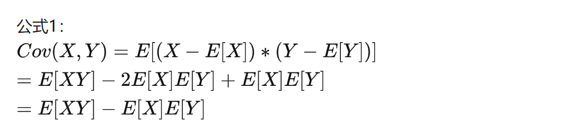
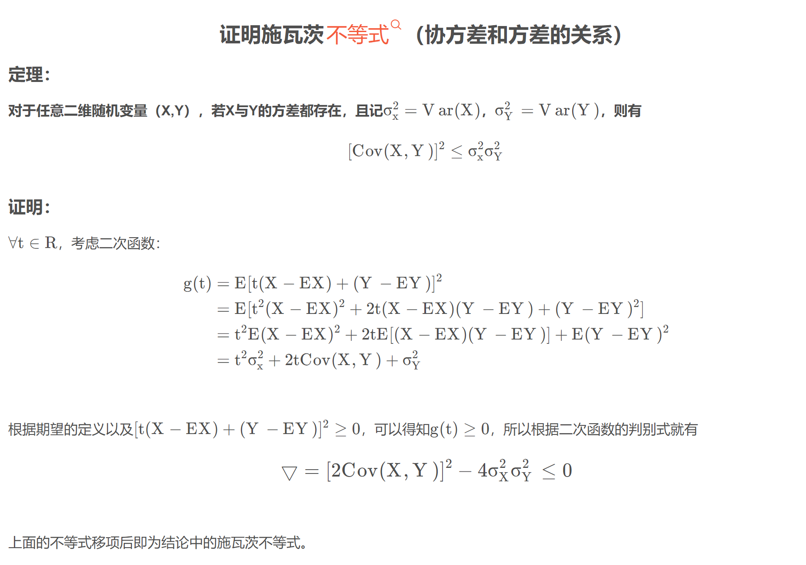
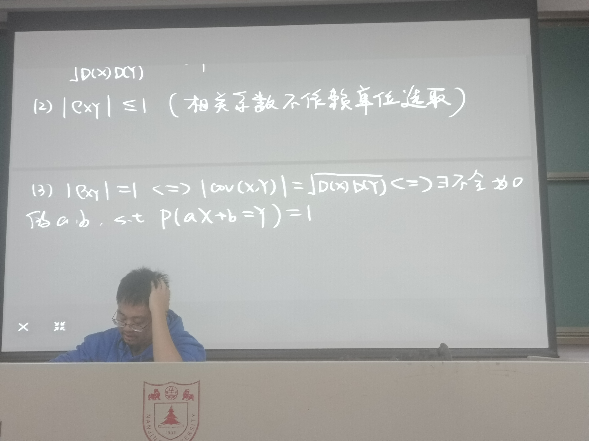
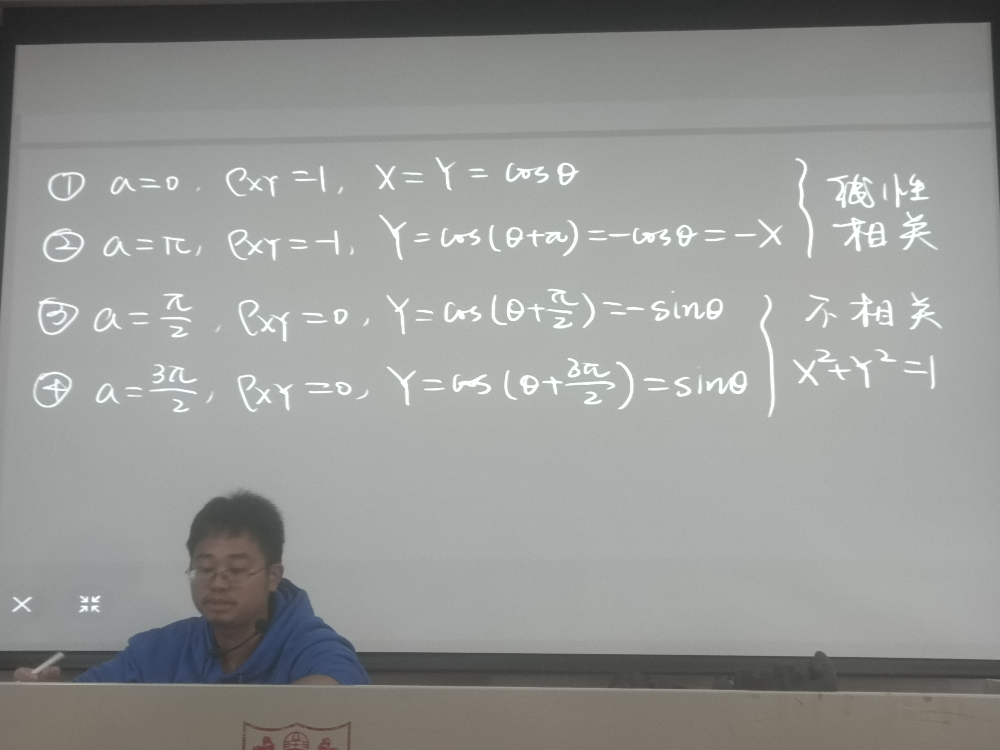
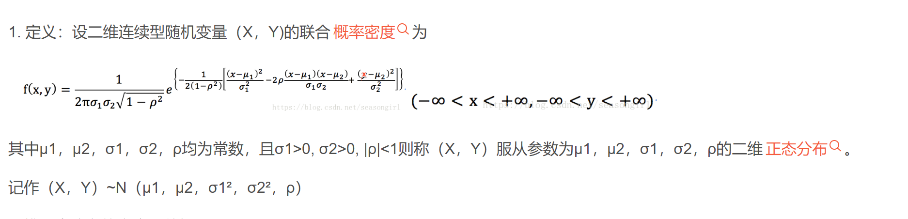

柯西不等式可以通过上面证明

标准化的数学期望是0，标准差是1

相关系数：

相关系数为0表述xy毫不相关。独立的一定不相关。但是相关系数为0，不一定独立。

证明用期望可拆来做，独立退出不相关。

协方差：

积分用到积化和差和和差化积

例：

正太分布的相关系数是p

定理：二维正太分布的性质

x,y独立和不相关是等价的。

矩协和方差矩阵

汉堡包定理

标准化后随机变量的三阶矩阵是偏度，不傲视分布左尾更长，可以取跟大的负数，4阶矩阵是峰度

证明版正定

习题4

