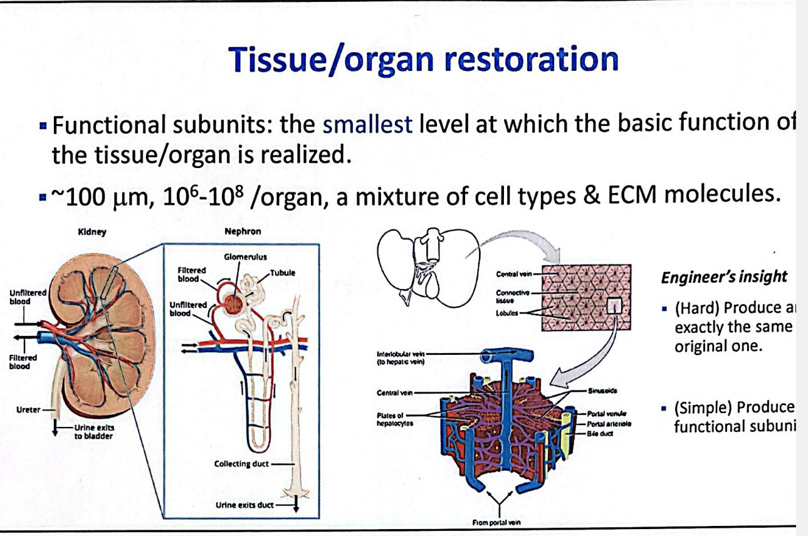
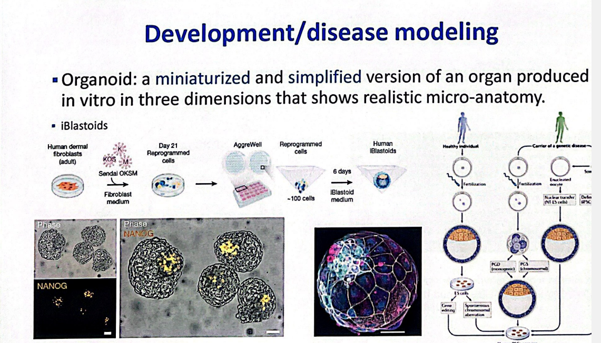
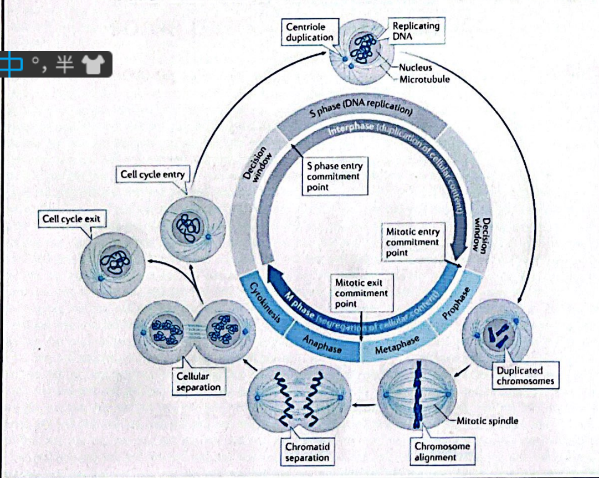
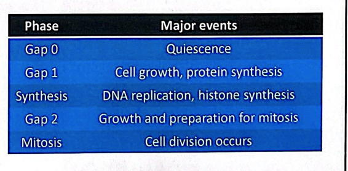
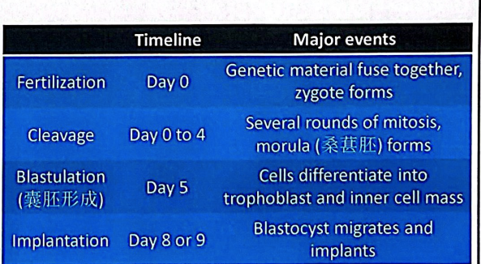
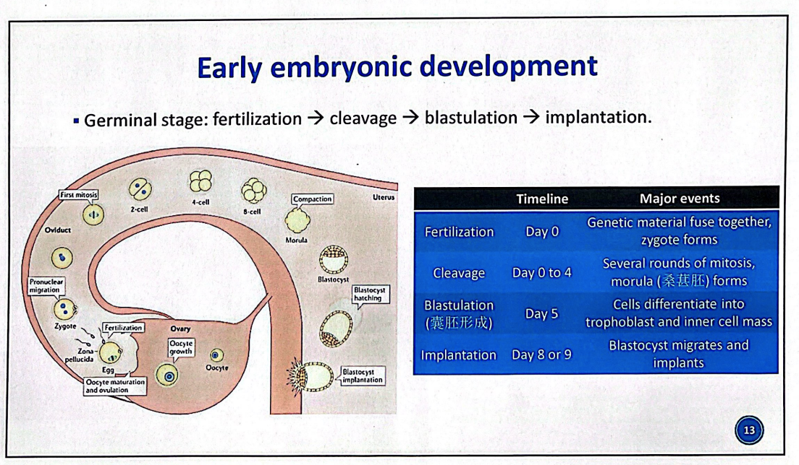

组织工程

Axolotl

身体具有再生能力，受伤后，干细胞回到涌入的部位

development of biological substitutes that restore,maintain,or improve tissue function or a whole organ.//

生成细胞，细胞组成组织。

langer，体外血管的构建，

Vacant，用mouse来培养耳朵

in vitro

ex vivo组织从体内移出来进行研究

in vivo体外，在体内研究

组织工程过程：

Isolation，seeding，proliferation，differentiation，implantation

生物骨架，细胞生物活性的因子。

## 细胞的染色

Immunohistochemistry（IHC）

免疫足化蛋白

CIH和IF

免疫荧光没有很少的背景信号

免疫荧光在太阳光下会慢慢消失

功能单元体：实现组织功能的最小的单位。

对于组织器官的模拟

Organoid：类器官，一个器官的小的缩影，简化的形式，、在体外，在三维，展示现实。

干细胞：
细胞命运的过程，细胞周期

有一个检查点，

G0，细胞增值，蛋白质表达，

分裂过程中端粒会缩短，干细胞有端粒所以可以无限增值

细胞的迁移cell migration

细胞迁移，细胞分化会产生细胞迁移，组织的再生和修复，老细胞被迁移的新生成的细胞

细胞死亡，Apoptosis凋亡，细胞坏死（细胞膜的通透性增加，渗透压改变，细胞会死亡），Autophagy细胞自噬

干细胞：

self-renewal，自我增殖分化

Potency效了

immunogenicity免疫原性

Tumorigenicity致瘤性

Ethical issue

胚胎干细胞：自我更新，

造血干细胞

成体组织干细胞，

诱导多能干细胞

多功能变成寡能

胚胎会破坏滋养层。

胚胎干细胞共同培养

有成为肿瘤的可能

有免疫原性，基因型的不同，提前过程会对早期胚胎的破坏，会造成伦理的问题。

人类对哺乳动物来克隆、

获得多能干细胞，

干细胞，诱导干细胞
