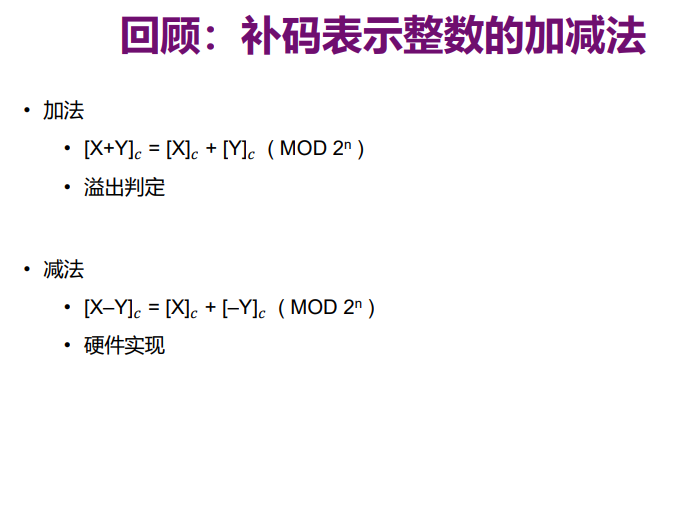
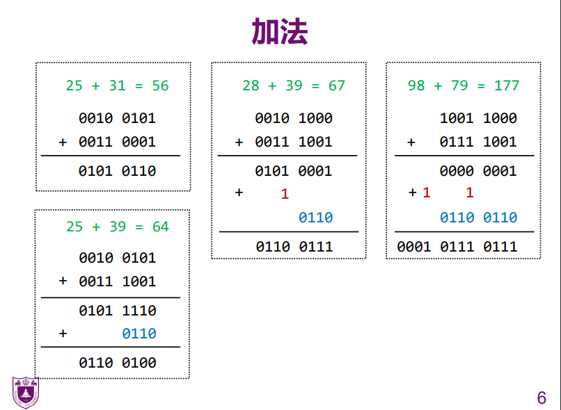
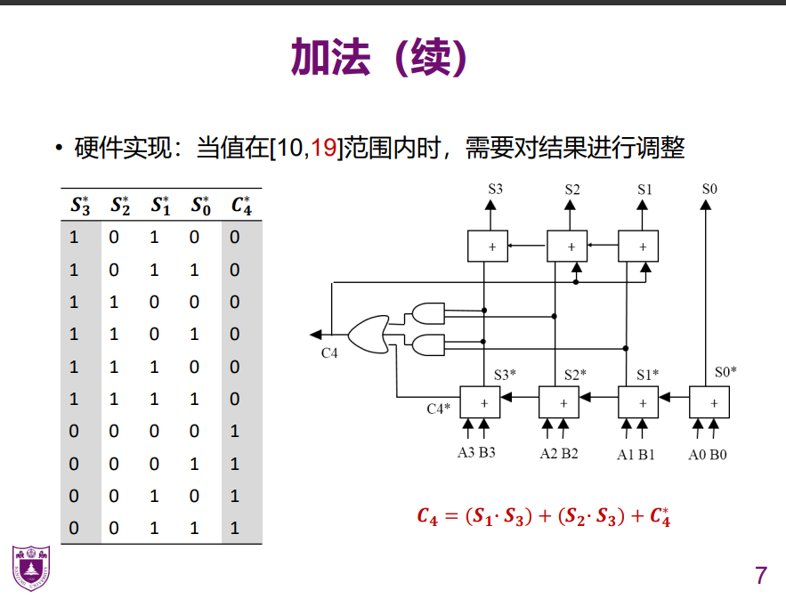
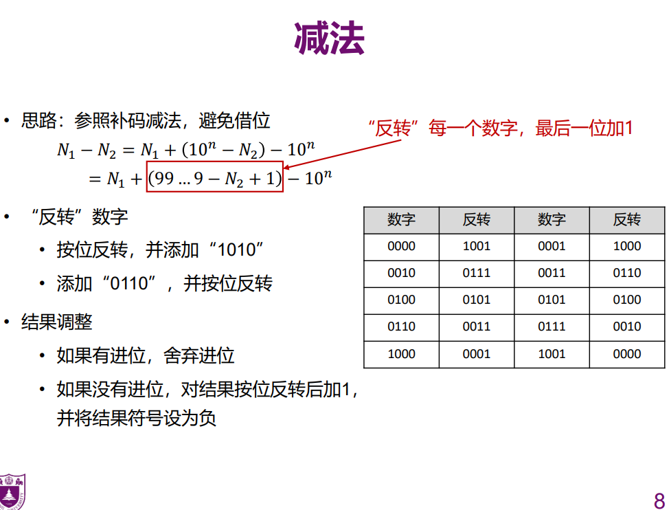
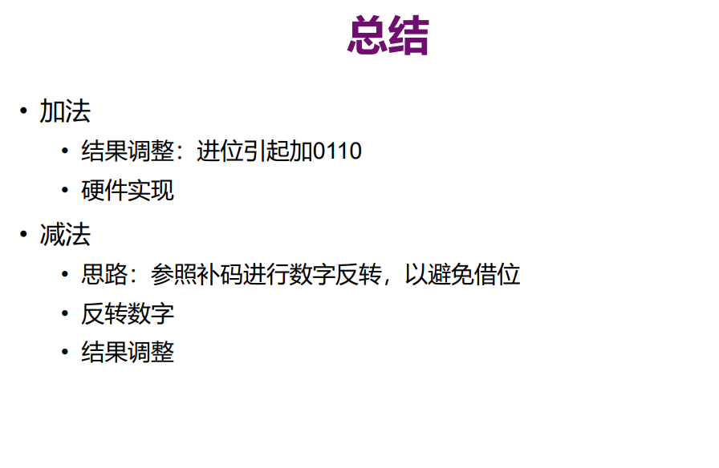

- 溢出判断

  - ###### Cn^Cn-1来进行判断

- 硬件实现

  - 用一个信号，即作为C0的进位，又作为Y和Y取反的选择的信号。

调整加法的值，上面的所有情况都要有进位。然后变成逻辑表达式，写到程序里面。对于那些超了的加上0110（6），然后就进位了，相当于减去了9；

补码的思路

效果是取反加1

**关键：进位引入0110**

反转字符，结果调整：

（结果反转（2->8,3->7））;