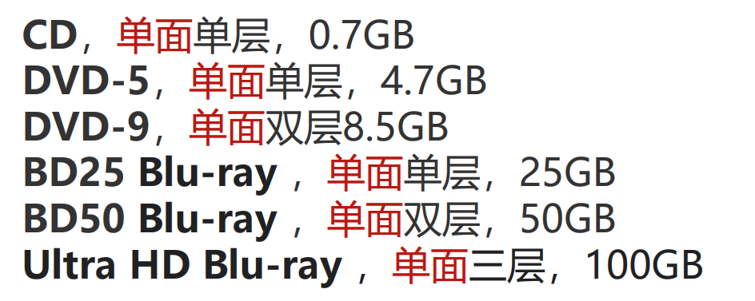
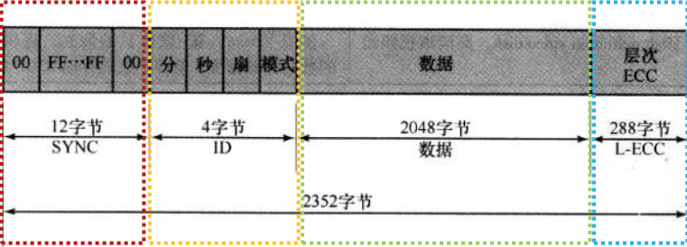
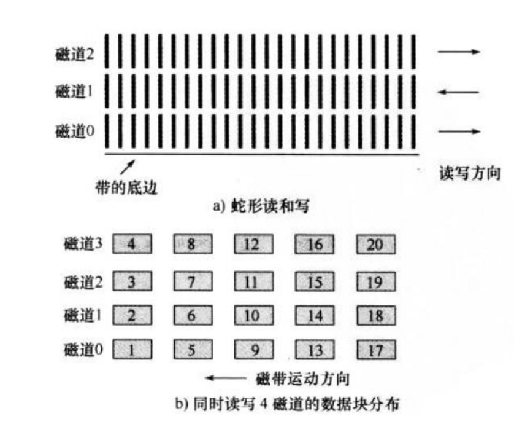

## 磁盘存储器

磁盘是由涂有可磁化材料的非磁性材料（基材）构成的圆形盘片

材料：铝，铝合金，玻璃

### 玻璃基材的优势（稳定可靠、为存储更多信息提供基础） 

• 改善磁膜表面的均匀性，提高磁盘的可靠性 

• 显著减少整体表面瑕疵，以帮助减少读写错误 

• 能够支持（磁头）较低的飞行高度

 • 更高的硬度，使磁盘转动时更加稳定 

• 更强的抗冲击和抗损伤能力

## 光存储器

### CD 和CD-ROM

使用高强度激光制作一个母盘

以母盘为模板压印出复制品

在凹坑的表面上堵上一层高反射的材料。

### 读取方式

如果激光束照在凹坑（pit）上，由于凹坑表面有些不平，因此光被散 射，反射回低强度的激光

如果激光束照在台（land）上，台的表面光滑平坦，反射回来的是高 强度的激光

CD是单螺旋的轨道，轨道上的所有扇区长度相同

盘片是变速的，轨道上扇区的长度相同，扇片是变速的（从内圈到外圈，逐渐变慢），凸槽被相同的线速度读出

### 优缺点

优：储存有信息的光盘可以廉价的进行大量的复制，光盘更换方便

缺点：他是只读的，不能更改，存取时间比磁盘存储器长得多

### 高清晰光盘

通过使用更短波长的激光（在蓝-紫光范围），可以实现更高的位密度（数据 凹坑相对更小）

## 磁带

### 记录

介质是柔韧的聚脂膜带，外涂磁性材料

### 读取

- 磁带只能顺序读取
- 磁盘可以直接读取
- 

上面是蛇型，下面是并行

便宜，寿命长，适合数据的重型冷备份

## 快闪

快闪存储器（Flash EEPROM）可随机寻址，应用于内部存储。电子可擦除可编程只读存储器

（内部存储器的名称要记忆，哪种方式擦除，擦除的什么类型）