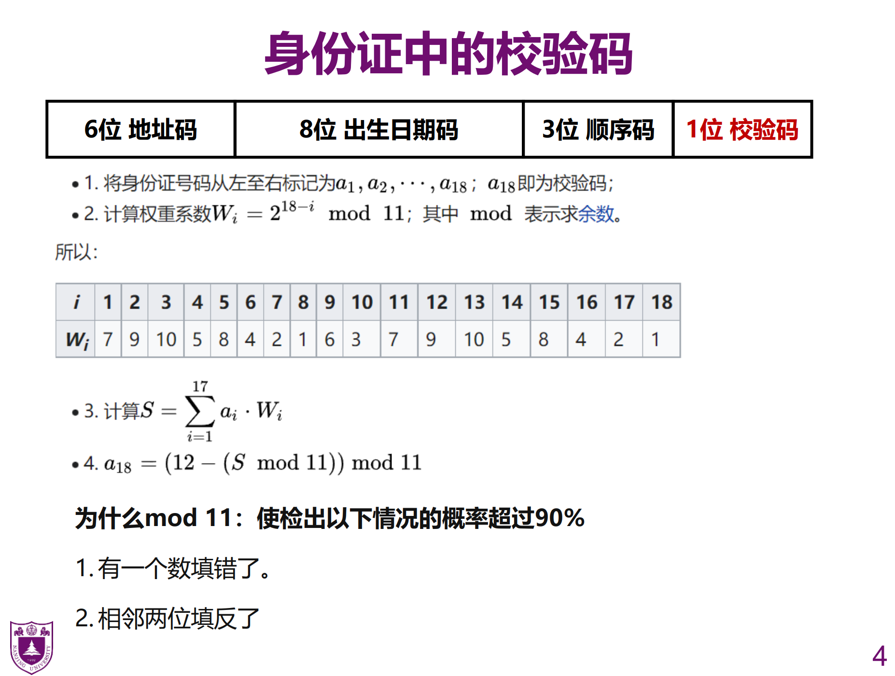
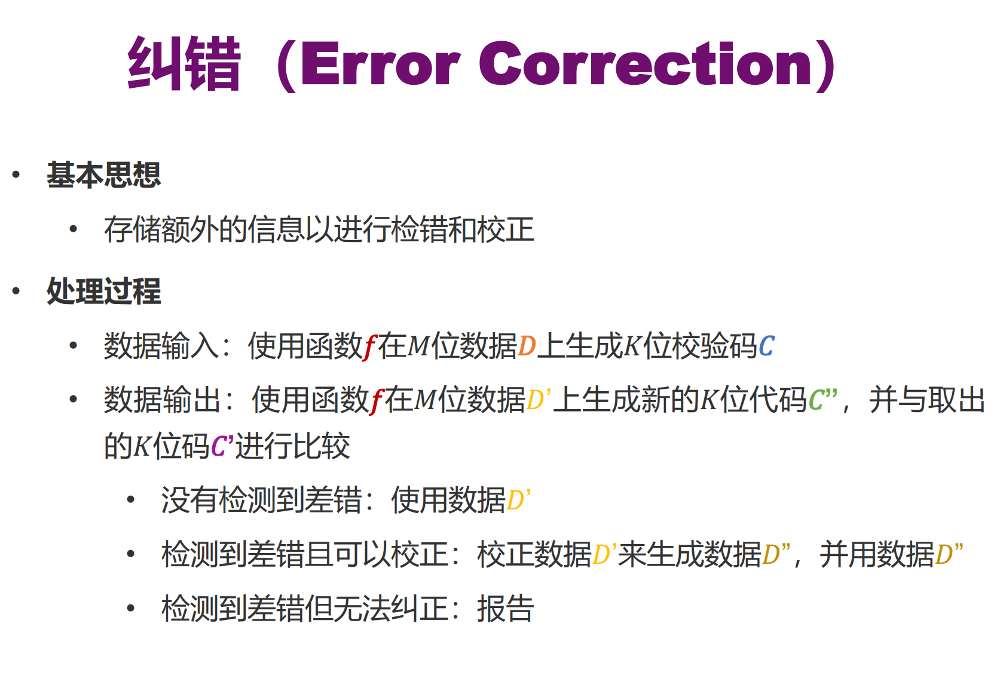
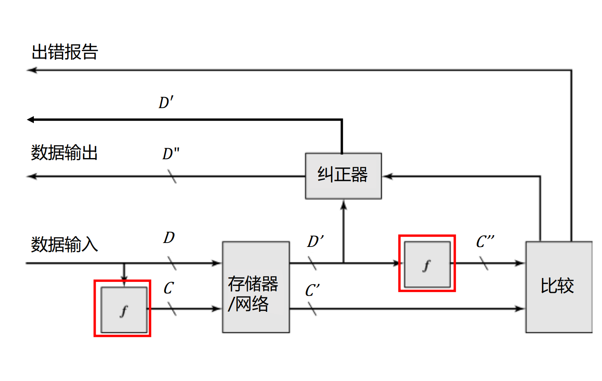
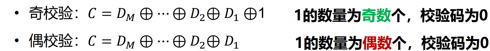
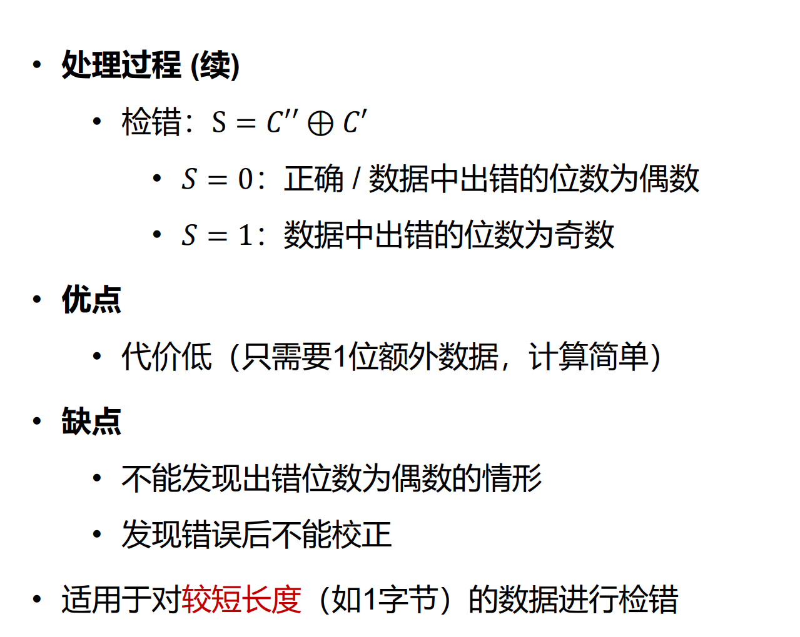
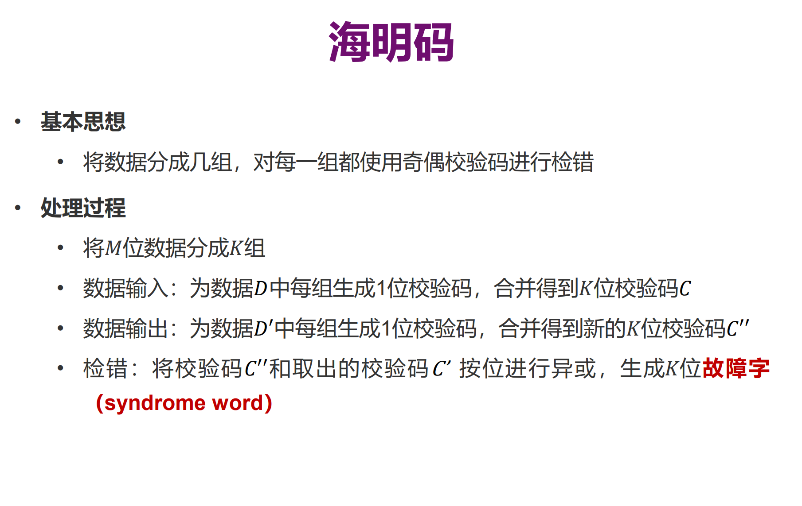

# 数据校验码

## 差错（ERROR）

数据在计算机内部计算，存取和传送的过程中会由于元器件的故障和噪音干扰原因出现差错

### 存储为例

硬故障

永久的物理故障，手影响的存储单元不可以可靠的存储数据，成为固定的“1“或者”0“之间不稳定的跳变。

软故障

随机非破坏性的事件，他改变了某个或者某些存储单元的内容，但是没有损坏机器

### 解决办法

发送端

D：C

发送的数据

D‘：C’

接受端使用f函数

D‘：C’‘

## 奇偶校验码

最后一个不一样的话，说明是出错位数是奇数

最后一个一样的话，说明出错的位数是偶数，或者没出错

优点，代价低

缺点，不能发现出错的位数为偶数的情形

发现错误后不能矫正，

## 海明码

异或产生校验字