# 浮点数

### 加减法：

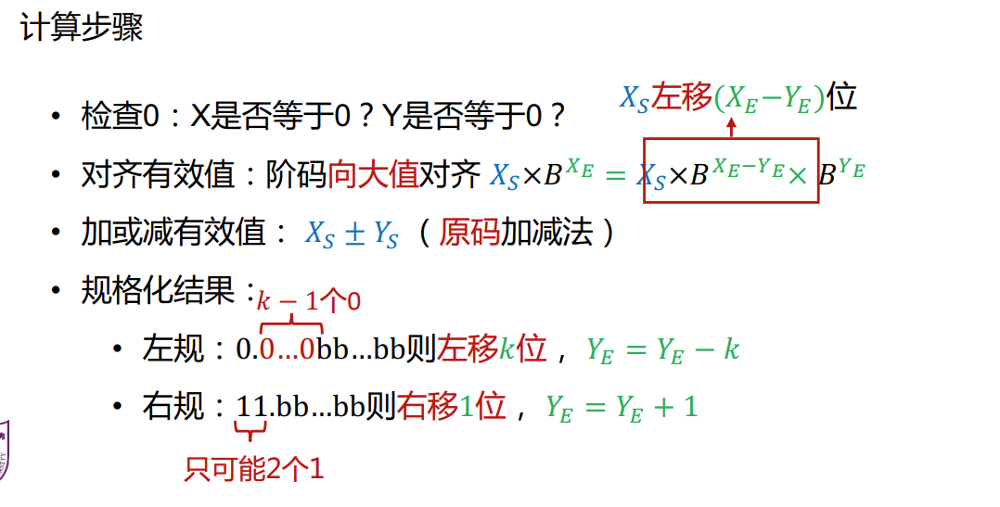

### 乘法：

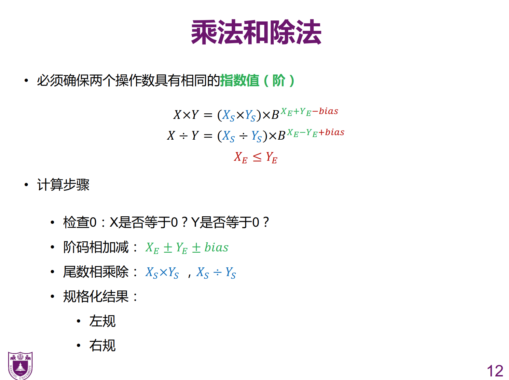

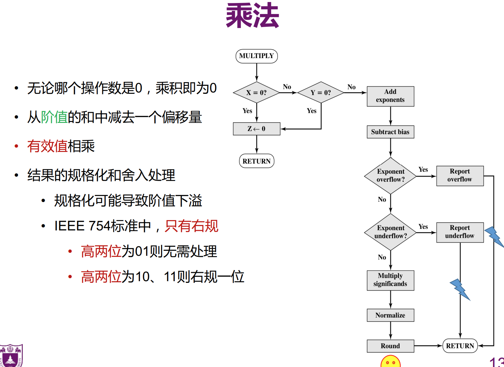

有效值乘法：尾码前面补上1，

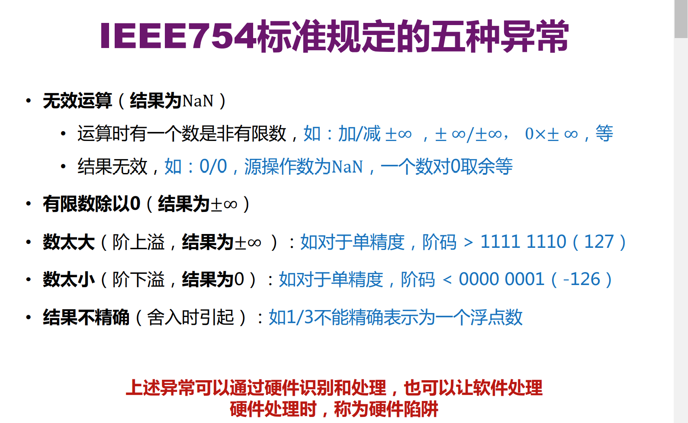

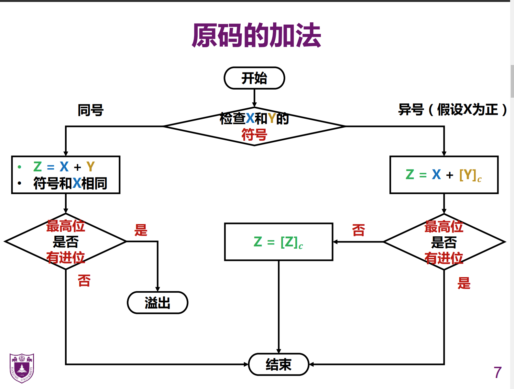

1.加法同号求和，异号求差，减法同号求差，异号求和。

（1).求和：数值位相加，根据最高位进位判断是否溢出，符号位操作数1的符号

（2).求差：操作数1的数值位加上操作数2的数值位的补码。如果结果有进位，无操作，符号是操作室1的符号，如果不进位，操作数求补，结果是操作数1的相反的符号

### 减法：

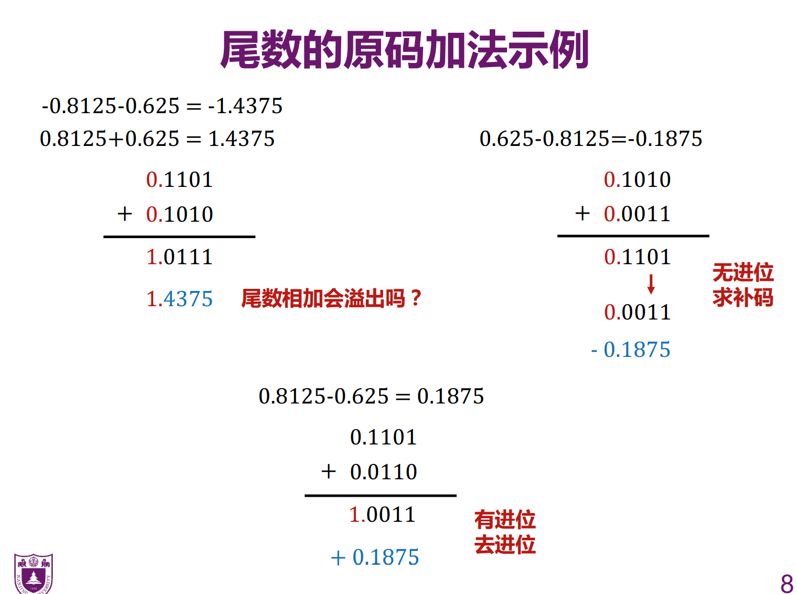

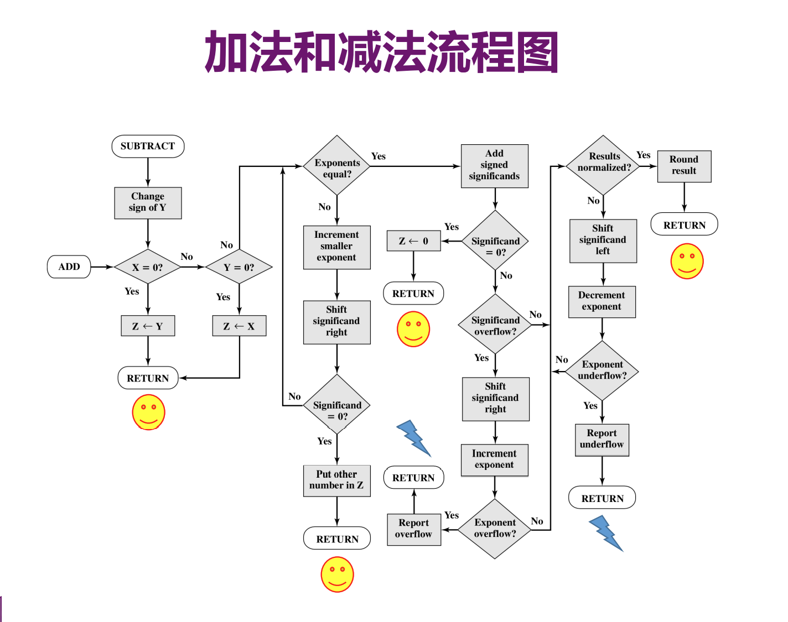

完整流程图

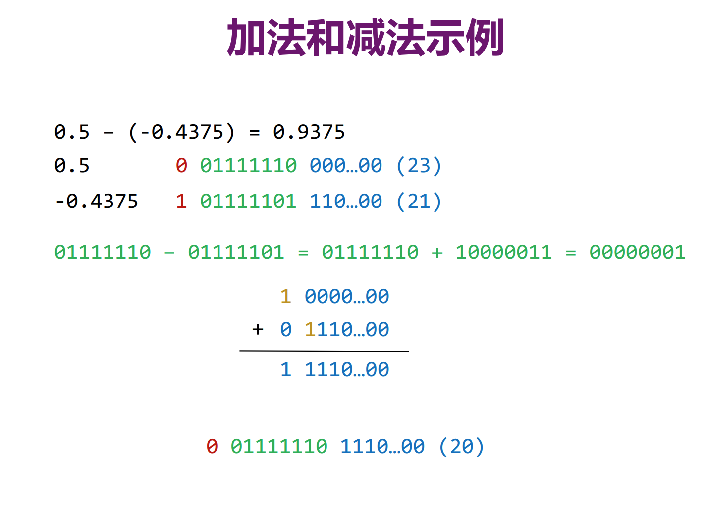

阶小的右移。

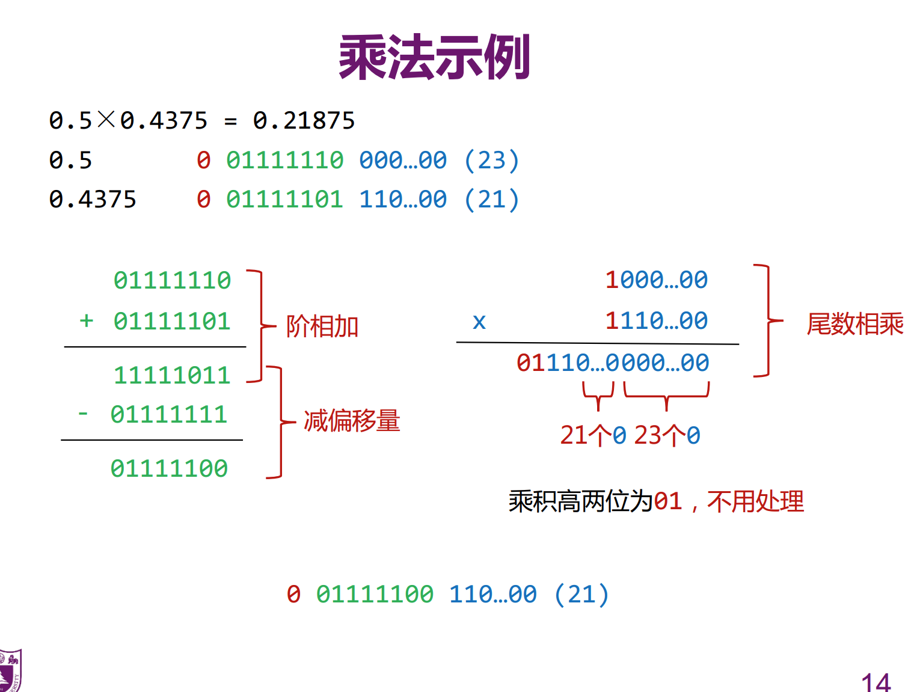

阶相加减bias，阶相减加bias

## 浮点数的精度问题

附加位

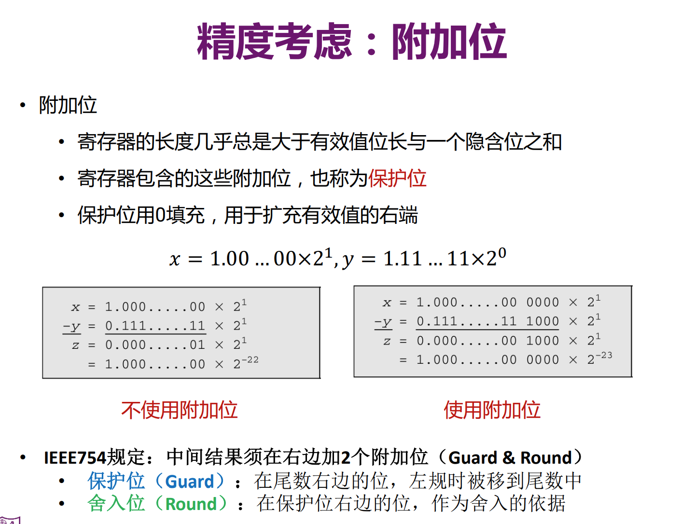

舍入

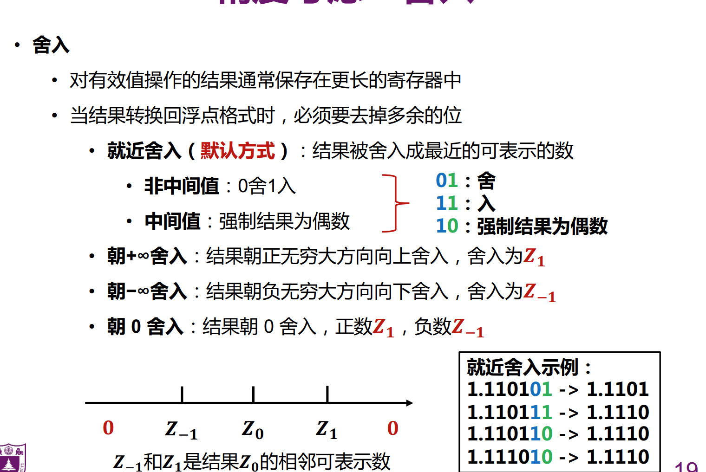

## 类型转化的规则：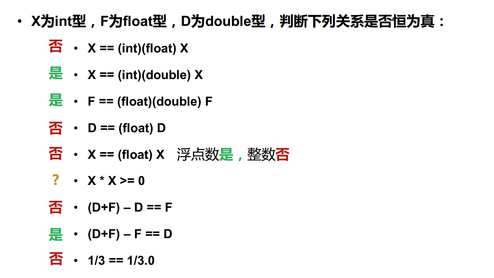